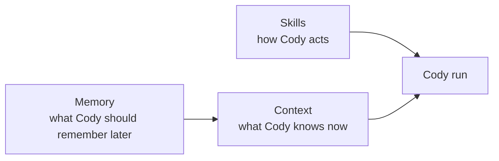
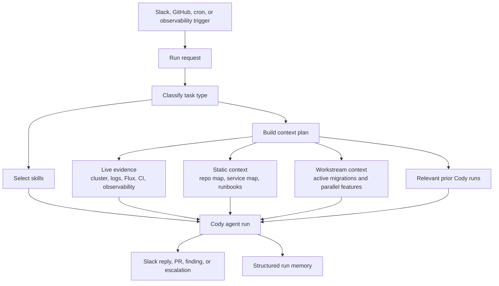
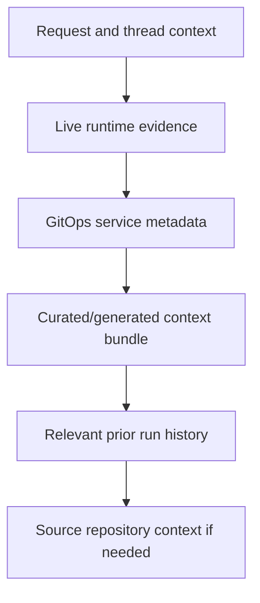
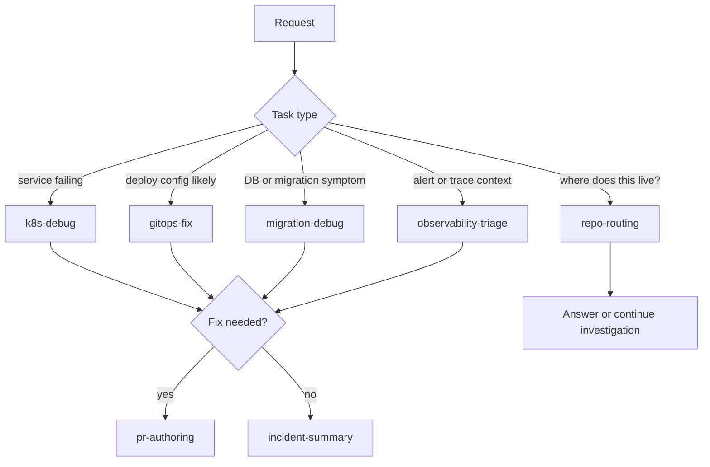
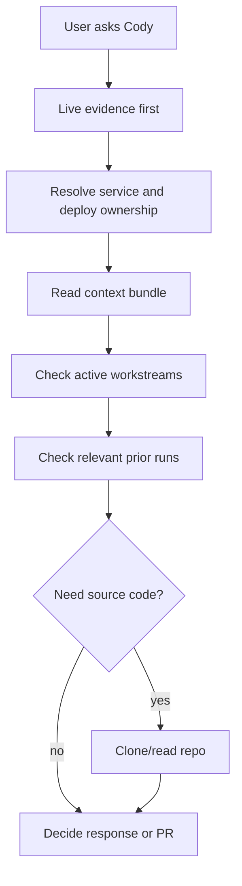
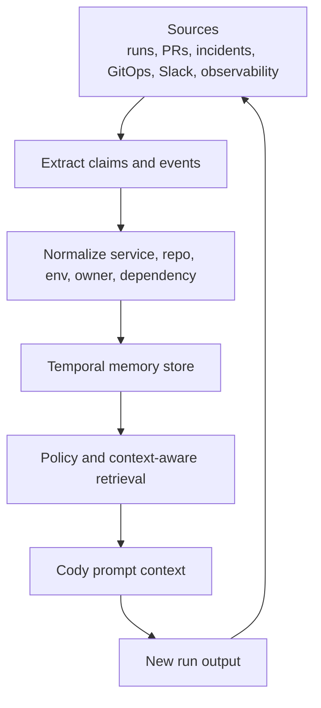
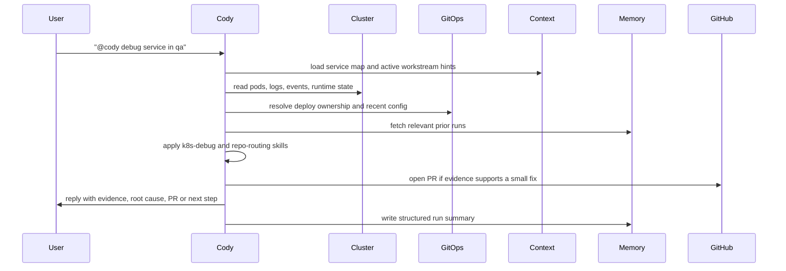
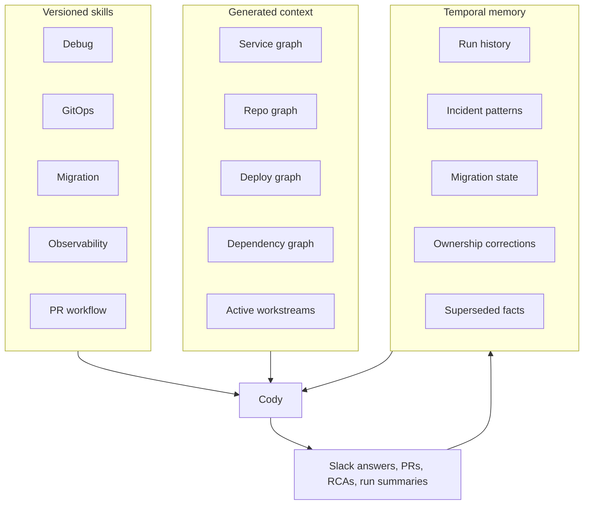

# Cody Skills, Context, and Memory Specification

## Status

Draft, product and architecture direction for Cody as of 2026-05-18.

This spec intentionally avoids code-level implementation detail. It defines how to think about Cody's skills, context, memory, MVP shape, final state, and glide path in an environment with many repositories, dependent systems, parallel features, migrations, and operational workstreams.

## Summary

Cody needs three separate but connected capabilities:

1. **Skills:** reusable procedures for how Cody should act.
2. **Context:** the current evidence and system map Cody needs for a specific run.
3. **Memory:** durable lessons and changing facts Cody can reuse later.

These should stay separate.

For MVP, Cody should use small, auditable skills and explicit file/generated context. It should not start with a complicated autonomous memory system. The first real memory should be structured run history: what Cody investigated, what evidence it found, what it changed, and what happened after.

Final state is a provenance-backed system where Cody can understand the current service graph, active workstreams, incidents, migrations, ownership, and recurring failure patterns without relying on stale giant prompts.

## Problem Context

Alpheya has a large engineering surface:

- Many repositories.
- Many deploy overlays and environments.
- Services with cross-repo dependencies.
- Parallel features in flight.
- Database and infrastructure migrations.
- GitOps-driven releases.
- Observability systems generating signals.
- Slack threads where critical operational context often lives.

That creates a risk for Cody:

1. Cody can answer with stale assumptions if it relies only on static prompts.
2. Cody can waste time cloning the wrong repo or chasing the wrong service.
3. Cody can open PRs that conflict with active migrations or parallel features.
4. Cody can miss known incident patterns because past findings are not retrievable.
5. Cody can become unsafe if "memory" is implicit and unverifiable.

The design goal is to make Cody effective in this environment without turning the agent prompt into a massive manual.

## Core Model

The rule is:

- Skills tell Cody **how to work**.
- Context tells Cody **what is true now**.
- Memory tells Cody **what changed and what we learned**.

## Design Principles

### 1. Skills Are Procedures, Not Encyclopedias

Skills should be small operating procedures. They should tell Cody what evidence to collect, what decisions to make, what to avoid, and what output shape to produce.

They should not become a giant archive of all Alpheya facts.

### 2. Live Evidence Beats Remembered Facts

If Cody can query the cluster, GitOps state, CI, or observability signal directly, it should prefer that over remembered context.

Memory is useful for orientation and pattern recognition. It is not authoritative for current state.

### 3. Context Should Be Layered

Cody should not receive every document every time. It should assemble context in layers based on the request:

### 4. Memory Requires Provenance

Every durable memory item should answer:

- What is the claim?
- Where did it come from?
- When was it observed?
- Is it still current?
- Who or what wrote it?
- What should invalidate it?

### 5. MVP Should Be Useful Without Heavy Memory Infrastructure

The MVP should work with explicit context docs, generated maps, and structured run records. Vector or graph memory can come later after the behavior is proven.

### 6. Cody Must Remain Review-Based For Mutation

Memory and context can help Cody investigate and propose fixes. They should not justify direct cluster mutation. Code and GitOps changes still flow through pull requests.

## Skills

### Skill Definition

A Cody skill is a reusable operational playbook.

A good skill defines:

| Field | Purpose |
| --- | --- |
| Trigger conditions | When Cody should use the skill. |
| Goal | What the skill is trying to accomplish. |
| Evidence checklist | What Cody must inspect before concluding. |
| Decision tree | How Cody separates likely causes. |
| Allowed actions | What Cody may do under this skill. |
| Boundaries | What Cody must not do. |
| Output contract | What Cody should return to Slack or PR. |

A bad skill is:

- Too broad.
- Full of stale facts.
- A replacement for live inspection.
- A hidden policy system.
- A prompt dump with no evidence checklist.

### MVP Skill Catalog

The MVP should focus on a small number of high-value skills.

| Skill | Purpose | MVP behavior |
| --- | --- | --- |
| `k8s-debug` | Diagnose Kubernetes service health issues. | Inspect pods, logs, events, workloads, HelmRelease, Flux status, and readiness signals before forming a hypothesis. |
| `gitops-fix` | Make small deploy-config fixes safely. | Identify the correct GitOps repo and overlay, propose minimal changes, open PR, and explain verification. |
| `repo-routing` | Map service or namespace to source repo and monorepo path. | Use live HelmRelease metadata and curated service maps before cloning source. |
| `migration-debug` | Diagnose database migration or schema failures. | Inspect migration symptoms, service logs, deploy state, and known active migrations without exposing secrets. |
| `observability-triage` | Use monitoring data as evidence. | Interpret Datadog/Grafana/OTel/Alertmanager links or payloads and connect them to service/runtime state. |
| `pr-authoring` | Create reviewable branches and PRs. | Use Cody branch naming, concise PR bodies, evidence-backed root cause, and clear verification steps. |
| `incident-summary` | Summarize operational findings. | Convert investigation into concise Slack output or RCA-style notes with evidence and next action. |

### MVP Skill Use

### Final-State Skill System

Final state should look like a versioned skill registry:

- Skills are versioned.
- Skills can be scoped by task type, repo, service family, or environment.
- Cody records which skills were used in each run.
- Skills have smoke tests or review gates before promotion.
- A bad skill can be rolled back.
- Skills can be composed, but the active skill set for a run remains visible.

Example final-state skill families:

| Family | Examples |
| --- | --- |
| Platform diagnostics | Kubernetes, Flux, ingress, ExternalSecrets, Keda, DB, Redis. |
| Service families | Portfolio services, investor services, reporting, auth, integrations. |
| Change workflows | GitOps PR, application PR, migration PR, rollback plan. |
| Evidence and reporting | Incident summary, PR summary, RCA draft, CI failure analysis. |
| Safety and governance | Secret handling, production boundaries, escalation rules. |

## Context

### Context Definition

Context is the set of information Cody uses for a specific run.

It includes:

- User request and Slack thread.
- Live cluster state.
- Live GitOps/Flux state.
- Logs, metrics, traces, alerts.
- Repo metadata and ownership.
- Active feature or migration notes.
- Relevant prior Cody runs.
- Source code only when needed.

Context is not memory. Context is assembled for a run and can include memory as one input.

### MVP Context Bundle

The MVP should maintain a small Cody context bundle that is explicit, auditable, and easy to regenerate or edit.

It should cover:

| Context area | What Cody needs |
| --- | --- |
| Service map | Service name, namespace patterns, owning repo, monorepo path when applicable. |
| GitOps map | Which repo and overlay own deploy config for each service/environment. |
| Ownership hints | Team or domain ownership where available. |
| Runtime commands | Repo-level build/test/check commands at a broad level. |
| Dependency hints | Key service dependencies such as databases, Redis, queues, external APIs. |
| Active workstreams | Current migrations, parallel features, known risky transitions. |
| Runbooks | Links or short pointers to operational playbooks. |
| Known recurring patterns | Common failure signatures and where to look first. |

The context bundle should be treated as a map, not as the full territory. Cody still verifies live state.

### Active Workstream Context

Active workstream context is especially important for Alpheya because many changes happen in parallel.

MVP should track broad workstream facts like:

- Service X is being migrated from dependency A to dependency B.
- Repo Y has active feature work touching authentication.
- Namespace Z is running a special migration branch.
- A schema migration is expected to run only after a dependency PR merges.
- A temporary workaround is active and should not be "cleaned up" by Cody.

This prevents Cody from making superficially correct but strategically wrong fixes.

### Context Retrieval Order

Cody should follow this order unless a skill says otherwise:

1. Understand the user request and Slack thread.
2. Collect live evidence for the named service/environment.
3. Resolve deploy ownership from GitOps metadata.
4. Read the curated/generated context bundle.
5. Check active workstream context.
6. Query prior Cody runs only if the symptom or service suggests reuse.
7. Clone source repo only after a hypothesis requires code context.

### Final-State Context System

Final state should be a generated service intelligence layer.

It should combine:

- GitOps manifests.
- HelmRelease labels and annotations.
- Repository metadata.
- Code ownership.
- CI/test commands.
- Observability tags.
- Dependency configuration.
- Database migration metadata.
- Incident and run history.

The final-state context system should answer:

- What service is this?
- Where is it deployed?
- Which repo owns it?
- Which GitOps overlay deploys it?
- What does it depend on?
- What recently changed?
- What active workstreams touch it?
- What failed before?
- What skill should Cody use first?

## Memory

### Memory Definition

Memory is durable context Cody can reuse across runs.

For Cody, memory should be operational and evidence-based:

- Past investigations.
- Recurring failure signatures.
- Active migrations and their status.
- Service-specific operational quirks.
- Ownership and routing corrections.
- PRs Cody opened and their outcomes.

Memory should not be free-form hidden belief. It should be inspectable.

### MVP Memory

MVP memory should be structured run history.

Each Cody run should produce a compact memory record:

| Field | Purpose |
| --- | --- |
| Trigger | Slack, GitHub, cron, observability, or manual. |
| Service and namespace | What was investigated. |
| Symptom | User-visible or alert-visible failure. |
| Evidence | Logs, events, metrics, trace links, Flux state, PRs. |
| Hypothesis | What Cody believed was happening. |
| Root cause | Final cause if known. |
| Action | Answered, escalated, opened PR, or no-op. |
| PR links | Any Cody-created PRs. |
| Verification | How the result was checked or should be checked. |
| Follow-up | Risks, blockers, unresolved questions. |

This is enough to support useful recall without building a complex memory engine.

### Memory Write Policy

MVP memory writes should be conservative:

| Memory type | Write behavior |
| --- | --- |
| Run summaries | Automatic after every Cody run. |
| Stable service facts | Suggested by Cody, reviewed or regenerated from source. |
| Active migration facts | Human-authored or synced from explicit workstream docs. |
| Recurring incident patterns | Suggested after repeated evidence, reviewable. |
| Ownership corrections | Human-reviewed unless generated from authoritative metadata. |

Cody should not silently promote a one-off observation into a stable service fact.

### Final-State Memory

Final state should support temporal, provenance-backed memory.

Final-state memory should support:

- Current facts and historical facts.
- Superseded facts rather than destructive overwrites.
- Source provenance.
- Confidence.
- Invalidation rules.
- Service/environment scoping.
- Access policy.
- Human correction.

### Memory Examples

Useful memory:

- "`order-service` in `qa` had repeated Redis env-var mismatch incidents in May 2026."
- "`portfolio-management` migrations require extension X to be present before deploy."
- "`advisor-portal` preview runs on a different node pool than lower non-prod."
- "Cody opened PR X for a probe timeout; it was superseded by PR Y."

Dangerous memory:

- "Redis is broken."
- "Always update platform GitOps."
- "This service belongs to team X" without provenance.
- "Ignore this error" without scope or expiration.

## MVP Operating Model

### MVP Capabilities

MVP should deliver:

1. A small skill set for platform debugging and PR creation.
2. A curated/generated context bundle.
3. Active workstream notes for migrations and parallel features.
4. Structured Cody run summaries.
5. Retrieval of relevant prior run summaries by service, namespace, and symptom.
6. Clear separation between evidence, hypothesis, action, and memory.

### MVP Non-Goals

MVP should not include:

- Fully autonomous long-term memory writes for stable platform facts.
- Vector-only memory as the primary recall system.
- Hidden memory that humans cannot inspect.
- Automatic remediation from observability signals without Slack/PR review.
- Direct cluster mutation justified by memory.
- Broad multi-agent orchestration.

### MVP Example Flow

### MVP Acceptance Criteria

Skills:

- Cody uses the correct broad skill for common debug, GitOps, migration, observability, and PR tasks.
- Cody can state which evidence checklist it followed.
- Cody does not treat skills as static truth.

Context:

- Cody can map a service to deploy ownership without cloning the wrong repo first.
- Cody checks active workstream context before proposing PRs.
- Cody prefers live cluster and GitOps state over stale notes.

Memory:

- Every Cody run produces a concise structured summary.
- Cody can find relevant prior runs for the same service or symptom.
- Memory outputs include provenance or links to evidence.
- Memory does not silently create stable service facts.

Safety:

- Cody still uses PRs for mutation.
- Cody avoids printing secrets.
- Cody escalates when memory and live evidence conflict.

## Final State

Final state is not "Cody has one huge memory." Final state is a platform-aware agent system with explicit skills, generated context, and auditable memory.

### Final-State Capabilities

Final state should support:

- Service-aware investigation.
- Workstream-aware PR decisions.
- Dependency-aware debugging.
- Observability-triggered diagnosis.
- Recurring-incident detection.
- Skill selection based on task and service type.
- Auditable memory corrections.
- Versioned skill rollout.
- Human review of high-impact learned facts.

## Glide Path

### Phase 1: File-Based Context and Small Skills

Goal: make Cody useful immediately.

Add:

- Small MVP skill set.
- Curated service/deploy/repo context bundle.
- Active workstream context.
- Clear retrieval order.

Avoid:

- Heavy memory infrastructure.
- Broad autonomous triggers.
- Giant prompt manuals.

### Phase 2: Structured Run History

Goal: turn Cody's own work into usable memory.

Add:

- Structured run summaries.
- Service/symptom search over prior runs.
- PR outcome tracking.
- Manual correction of run summaries when Cody is wrong.

This becomes Cody's first durable memory.

### Phase 3: Generated Service Graph

Goal: reduce manual context maintenance.

Add generated views for:

- service -> namespace -> HelmRelease
- service -> GitOps overlay
- service -> source repo
- service -> dependencies
- service -> observability tags
- service -> active migrations or workstreams

Generated context should be refreshed regularly and treated as source-derived, not manually invented.

### Phase 4: Temporal Memory

Goal: make Cody aware of changing facts.

Add:

- Temporal claims.
- Provenance.
- Supersession.
- Invalidation.
- Human correction.
- Confidence and source quality.

Use this for active migrations, recurring incidents, and operational patterns.

### Phase 5: Context-Aware Automation

Goal: expand Cody beyond Slack-only manual prompting.

Possible triggers:

- GitHub webhook events.
- Cron health checks.
- Datadog or Alertmanager events.
- Kyverno/policy violations.
- CI failure signals.

Before this phase, Cody needs enough context and memory discipline to avoid noisy or unsafe automated runs.

## Key Risks

| Risk | Mitigation |
| --- | --- |
| Skills become stale documentation dumps | Keep skills procedural and versioned. |
| Cody trusts stale memory over live state | Retrieval policy: live evidence wins. |
| Parallel feature work causes bad PRs | Active workstream context must be checked before PR creation. |
| Memory becomes unverifiable | Require provenance and human-readable summaries. |
| Context bundle drifts | Prefer generated context from authoritative sources. |
| Too many automatic triggers create noise | Start Slack-first, then add automated triggers after run quality is measurable. |
| Cody learns wrong facts | Keep stable fact writes reviewable or source-derived. |

## Open Questions

- What is the minimum service map Cody needs for MVP?
- Who owns active workstream notes for migrations and parallel features?
- Which memories can Cody write automatically, and which require human review?
- Should memory live in Git first, a database first, or both?
- How long should Cody run summaries be retained?
- How should Cody know a remembered fact is stale?
- What is the first automated trigger after Slack: GitHub, cron, or observability?
- Which teams should own skill review and promotion?
- How should Cody surface conflicts between memory, GitOps, and live cluster state?

## Research Inputs

The following copied research docs are especially relevant:

- `specs/research/20260227-161653__agent-first-product-ideas-draft.md`
- `specs/research/20260318-170536__openai-harness-engineering.md`
- `specs/research/20260319-105810__observability-feedback-loop-agent-factory-proposal.md`
- `specs/research/20260317-163200__agent-memory-systems-research.md`
- `specs/research/20260319-131200__memory-mvp-poc-spec.md`
- `specs/research/20260401-203900__timeouts-errors-retries-mental-model.md`
- `specs/research/20260220-145246__e2e-thread-scoped-agent-spec.md`
- `specs/research/20260227-160827__oss-chat-sandbox-research.md`

These docs should inform Cody's direction, but Cody should not copy their implementation shape blindly. Cody's environment is Kubernetes, GitOps, and internal platform debugging, so the abstractions should be adapted to that operating model.
