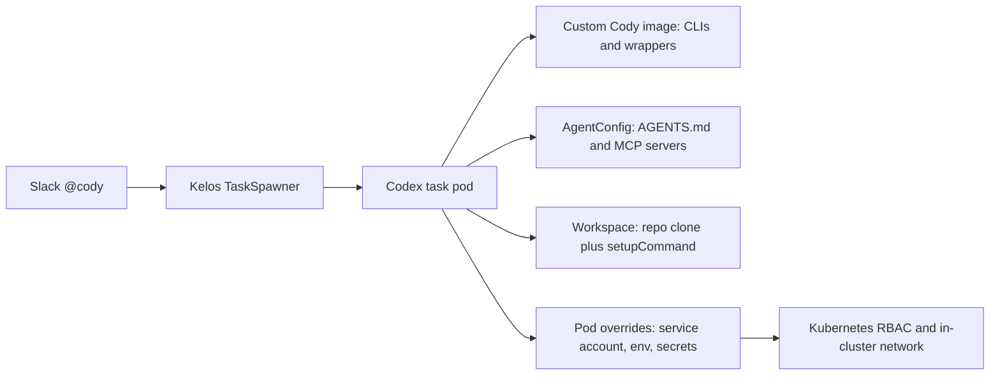

# Cody v1.0 Target

## Goal

- Cody v1.0 should be the best possible non-prod ops investigation and debugging tool across infra and application issues.
- Primary job: take a messy Slack debugging request and produce a reliable diagnosis or exact next action.
- Mutation remains secondary and review-based. Cody may open a PR only when the fix is small, clear, and evidence-backed.

## How Cody Fits Into Kelos

Kelos gives Cody five practical extension points. Every v1.0 capability below should fit into one of these instead of becoming a one-off prompt instruction.

- **Custom image**: best place for stable CLIs and wrapper binaries. Current image is `docker.io/alpheya/codex:main`, built from Kelos `codex/Dockerfile`.
- **AgentConfig**: best place for instructions and MCP servers. Current Cody config is in `quantum-wealth/k8s-platform-gitops/non-prod/kelos/agentconfig-cody-debugger.yaml`.
- **Workspace**: best place for repo context and generated files. Kelos clones one primary repo into `/workspace/repo`; additional repos should be cloned by `Workspace.spec.setupCommand` into stable paths such as `/workspace/repos/<repo>`.
- **TaskSpawner pod overrides**: best place for service account, environment variables, and secret references. Current Slack spawner is `quantum-wealth/k8s-platform-gitops/non-prod/kelos/taskspawner-cody-debug.yaml`.
- **Kubernetes RBAC**: best place for hard cluster access boundaries. Current read-only Cody roles are in `rbac-cody-debugger.yaml` and tenant-scoped secret bindings are in `rbac-cody-debugger-secrets.yaml`.

## Current Cody State

- Trigger: Slack `@cody` mention through Kelos `TaskSpawner`.
- Agent: Codex running in a custom Kelos-compatible image.
- Current external tools already in the image:
  - `kubectl` (external Kubernetes CLI)
  - `flux` (external Flux CLI)
  - `kustomize` (external Kubernetes config renderer)
  - `yq`, `jq` (external YAML/JSON tools)
  - `gh` plus in-house GitHub App helpers from `kelos/codex/scripts`
  - `psql` (external PostgreSQL client)
  - `redis-cli` (external Redis client)
  - `curl`, `dig`, `nc`, `ping`
- Current Cody-specific configuration:
  - read-only cluster inspection through service account `cody-debugger`
  - tenant namespace secret reads for DB/Redis connection discovery
  - Context7 MCP for current external docs
  - GitHub App auth for cloning repos and opening PRs
- Current gaps:
  - no service registry file or API
  - no default-deny wrapper for DB/API/Temporal calls
  - no first-class ConnectRPC tool
  - no Temporal CLI in the Cody image
  - no Prometheus/Grafana/Datadog/Tempo query tool wired into Cody
  - no structured evidence store beyond the final Slack reply

## v1.0 Must Do Well

- Resolve service, namespace, environment, repo, and GitOps overlay quickly.
- Gather live evidence before forming a conclusion.
- Connect infra symptoms to application context:
  - what is deployed
  - what changed
  - what config/secrets are involved
  - which service dependency is failing
  - whether the failure is code, deploy config, data, auth, dependency, or platform
- Use DB/API/Temporal/observability checks when the issue is application-level, not just pod/log inspection.
- Produce concise Slack replies with answer first, evidence, likely root cause, confidence if incomplete, and exact next action.
- Avoid generic guesses, raw command dumps, secret leakage, direct cluster mutation, and speculative PRs.

## Required Improvement Items

### P0: Service and Namespace Registry

- **Tool/source**:
  - In-house source of truth: `quantum-wealth/k8s-apps-gitops` HelmRelease manifests and labels such as `alpheya.com/repo`, `alpheya.com/monorepo`, and `alpheya.com/repo-url`.
  - In-house platform source: `quantum-wealth/k8s-platform-gitops` for shared infra services, Kelos, monitoring, Temporal, Flux, ESO, gateways, and platform namespaces.
  - External APIs: Kubernetes API plus Flux HelmRelease CRDs.
  - Assay reference: use the idea from Assay `gitops-discovery`, but do not copy its admin/plugin system into Cody v1.0.
- **Kelos fit**:
  - Build a small in-house generator, for example `cody-service-map`, and install it in the Cody image or run it from a cloned internal tooling repo.
  - Run it from `Workspace.spec.setupCommand` after cloning `k8s-apps-gitops` and `k8s-platform-gitops`.
  - Write `/workspace/context/service-map.json` with service -> namespace -> repo -> GitOps path -> HelmRelease -> runtime URL -> DB/Redis secret refs.
  - Tell Cody about this path in `AgentConfig.spec.agentsMD`.
- **Done when** Cody can answer "what owns this service?" without ad hoc `kubectl` and `rg` every run, and reports missing/conflicting metadata as a finding.

### P0: Workspace Context

- **Tool/source**:
  - Kelos native `Workspace.spec.repo`, `Workspace.spec.files`, and `Workspace.spec.setupCommand`.
  - GitHub App auth already provided by Kelos workspace credentials and the in-house `kelos/codex/scripts` helpers.
  - Required repos for v1.0: `k8s-apps-gitops`, `k8s-platform-gitops`, `alpheya-api`, the target service repo, and any shared package repo identified by the service registry.
- **Kelos fit**:
  - Keep one primary Kelos workspace repo, but use `setupCommand` to clone additional repos into stable paths:
    - `/workspace/repos/k8s-apps-gitops`
    - `/workspace/repos/k8s-platform-gitops`
    - `/workspace/repos/alpheya-api`
    - `/workspace/repos/<target-service-repo>`
  - Clone broad GitOps repos every debug run; clone service repos only after the registry identifies the target.
  - Prefer shallow clones for speed, then deepen only when history is needed.
- **Done when** Cody can search cross-repo context without guessing repo locations or cloning the same repo repeatedly under random paths.

### P0: Workspace-Level `AGENTS.md`

- **Tool/source**:
  - Kelos `AgentConfig.spec.agentsMD` is already used for user-level instructions.
  - Kelos `Workspace.spec.files` can write a repo-level `AGENTS.md` into `/workspace/repo`.
  - In-house docs to reference instead of embedding: this `specs/` folder, GitOps docs, platform-service `CLAUDE.md` files, and service-specific runbooks.
- **Kelos fit**:
  - Keep short Cody operating rules in `agentconfig-cody-debugger.yaml`.
  - Add workspace-level `AGENTS.md` when Cody gets a multi-repo workspace so it can describe path conventions and service-map usage.
  - Do not duplicate large repo docs in the prompt; point Cody to exact local files.
- **Done when** the prompt is a map, not a wall of copied docs.

### P0: AgentConfig / Prompt Cleanup

- **Tool/source**:
  - In-house config: `quantum-wealth/k8s-platform-gitops/non-prod/kelos/agentconfig-cody-debugger.yaml`.
  - External MCP currently wired: Context7 at `https://mcp.context7.com/mcp`.
- **Kelos fit**:
  - Keep the Slack/debug workflow in `spec.agentsMD`.
  - Add future Cody MCP servers in `spec.mcpServers` instead of asking Codex to remember shell recipes.
  - Keep capabilities explicit: cluster read, GitOps read, DB read, API read, Temporal read, observability read.
- **Done when** Cody reads like an ops investigator with tools, not a general coding agent with a long checklist.

### P0: Default-Deny Capability Guard

- **Tool/source**:
  - External enforcement already present: Kubernetes RBAC on service account `cody-debugger`.
  - In-house enforcement to add: wrapper CLIs or MCP servers for DB/API/Temporal/observability calls.
  - Assay reference: reuse the default-deny idea behind Assay `database`, `connectrpc`, `k8s`, and `otel` tools.
- **Kelos fit**:
  - Cluster reads stay bounded by Kubernetes RBAC.
  - Non-Kubernetes calls should go through Cody-owned MCP servers or wrapper CLIs installed in the Cody image.
  - Inject allowed hosts, namespaces, and credentials through `TaskSpawner.taskTemplate.podOverrides.env` from Kubernetes Secrets.
  - Do not rely on prompt text for safety once a tool can hit DBs, APIs, Temporal, or observability backends.
- **Done when** Cody cannot accidentally run a write, query an unapproved DB, call a random internal host, or print a token even if the model asks for it.

### P0: First-Class Kubernetes Investigation Tooling

- **Tool/source**:
  - External CLIs already installed: `kubectl`, `flux`, `kustomize`, `yq`, `jq`.
  - External APIs/CRDs already covered by RBAC: core Kubernetes, apps, batch, networking, metrics, Flux, External Secrets, cert-manager, KEDA, Gateway API, Kelos CRDs.
  - In-house tool to add: `cody-k8s` wrapper or MCP that summarizes allowed reads and redacts secrets.
  - Assay reference: Assay's whitelisted `kubectl` tool is the right safety pattern.
- **Kelos fit**:
  - Keep raw CLI binaries in the Cody image for emergencies.
  - Make the primary path an MCP/wrapper exposed through `AgentConfig`, with operations such as `get_workload_health`, `get_recent_logs`, `get_flux_status`, `get_external_secret_status`, and `get_route`.
  - Continue to deny `pods/exec` and all create/update/patch/delete verbs.
- **Done when** Cody returns concise workload evidence instead of dumping multiple pages of `kubectl describe`.

### P0: GitOps Discovery and Reader

- **Tool/source**:
  - In-house repos: `quantum-wealth/k8s-apps-gitops` for tenant apps and `quantum-wealth/k8s-platform-gitops` for platform components.
  - External tools already installed: `git`, `gh`, `kustomize`, `yq`, `jq`, `flux`.
  - In-house GitHub App helpers already in `kelos/codex/scripts`.
  - Assay reference: keep the GitOps discovery/read pattern; skip Assay's plugin admin UI.
- **Kelos fit**:
  - Clone GitOps repos through `Workspace.setupCommand`.
  - Use the service registry for the exact GitOps path, then use `kustomize` and `yq` for rendered and source views.
  - Keep Flux live-state checks through `kubectl`/`flux` because Git files alone do not prove what the cluster applied.
- **Done when** Cody can answer "what deploys this?", "what changed?", "which image/config/secrets are configured?", and "what does Flux think?" with links to repo paths and live objects.

### P0: GitOps Readiness and Gate Tools

- **Tool/source**:
  - In-house CLI: `quantum-wealth/k8s-apps-gitops/tools`, package name `gitops-tools`.
  - Runtime: external Node.js 22+, already present in the Cody image.
  - Commands to use:
    - `service-readiness <service> <env> --json`
    - `config-preflight <env> --json`
    - `smoke-tests --environment <env> --service <service> --json`
    - `security-tests --environment <env> --json`
    - `sre-gate --environment <env> --service <service>` when Datadog keys are available
  - External dependency for `sre-gate`: Datadog API, requiring `DD_API_KEY` and `DD_APP_KEY`.
- **Kelos fit**:
  - Clone `k8s-apps-gitops` in the workspace and run the CLI from `/workspace/repos/k8s-apps-gitops/tools`.
  - Add a thin `cody-gitops-gate` wrapper in the image to enforce `--json`, prevent mutating commands, and normalize output.
  - Inject Datadog keys only for `sre-gate` through `podOverrides.env` from a scoped secret.
  - Never run `auto-promote --apply` from Cody v1.0.
- **Done when** Cody can quickly identify missing ConfigMaps/Secrets, readiness gaps, endpoint failures, security regressions, and unhealthy Datadog monitors/SLOs without hand-written command chains.

### P0: DB Debugging Tool

- **Tool/source**:
  - External clients already installed: `psql` and `redis-cli`.
  - In-house source for credentials: tenant namespace Kubernetes Secrets, permitted by `rbac-cody-debugger-secrets.yaml`.
  - In-house tool to add: `cody-db` MCP/wrapper that resolves service -> secret -> connection and enforces read-only SQL.
  - Assay reference: Assay `query_db` is the right model.
- **Kelos fit**:
  - Keep raw `psql`/`redis-cli` available, but make Cody use `cody-db` by default.
  - Run `cody-db` as a stdio MCP server in `AgentConfig` or as a wrapper binary in the image.
  - Enforce `statement_timeout`, row cap, query timeout, redaction, no DDL/DML, allowed namespaces, and allowed DB hosts.
  - Use Kubernetes Secret reads instead of `kubectl exec` into app pods.
- **Done when** Cody can prove or disprove data-layer hypotheses safely without leaking connection strings or running arbitrary SQL.

### P0: Migration and Schema Diagnostics

- **Tool/source**:
  - External tools found in repos: `dbmate`, Drizzle migration scripts, SQLC-generated schema context.
  - In-house tools: `@quantum-wealth/migrate` from `alpheya-common-packages`, and `platform-services/modules/migrate`.
  - In-house repo configs: service `package.json` scripts and `platform-services/mise.toml`.
- **Kelos fit**:
  - Use repo inspection plus `cody-db` read-only queries against migration tracking tables.
  - Use Kubernetes job/pod reads for migration init job status and logs.
  - Install or use repo-local migration CLIs only for read/list/status behavior; do not apply, rollback, purge, or truncate.
- **Done when** Cody can distinguish migration job failure, schema drift, missing migration, wrong schema/search path, and app startup failure.

### P0: API Debugging Tools

- **Tool/source**:
  - External client already installed: `curl`.
  - External tools/libs to add: `buf` CLI and an in-house ConnectRPC caller built on `@connectrpc/connect-node` and `@bufbuild/protobuf`.
  - In-house schema source: `quantum-wealth/alpheya-api` and service-local generated ConnectRPC/protobuf code.
  - Assay reference: Assay `http_request`, `list_rpc_services`, `describe_rpc_method`, and `connectrpc_request` are the right model.
- **Kelos fit**:
  - Add `cody-api` as an MCP server or image-installed wrapper.
  - Use service registry routing to select the allowed host, namespace, and gateway/direct service path.
  - Use `alpheya-api` descriptors or generated code to list services and describe request/response schemas before calling ConnectRPC methods.
  - Enforce timeouts, response truncation, auth handling, allowed hosts, and token redaction.
- **Done when** Cody can call a health endpoint or ConnectRPC method with exact schema fields and explain whether the failure is network, auth, validation, server error, or bad data.

### P0: Temporal CLI Diagnostics

- **Tool/source**:
  - External tool to add: Temporal CLI `temporal` from `temporalio/cli`.
  - In-house evidence: `bank-ingestor` uses `mise run install` to download Temporal CLI; `third-party-connector` docs require Temporal CLI; `order-service`, `scheduler-service`, and several app manifests point to `temporal-alpheya-frontend.alpheya-shared.svc.cluster.local:7233`.
  - Platform source: Temporal deployment lives in `k8s-platform-gitops`, including `alpheya-shared` Temporal values and dashboards.
- **Kelos fit**:
  - Install `temporal` in the Cody image.
  - Add `cody-temporal` wrapper to enforce read-only commands:
    - `temporal operator namespace list`
    - `temporal task-queue describe`
    - `temporal workflow list`
    - `temporal workflow describe`
    - `temporal workflow show`
    - `temporal schedule list`
    - `temporal schedule describe`
  - Inject `TEMPORAL_ADDRESS` and namespace mappings via `podOverrides.env`.
  - Block mutating commands such as start, signal, cancel, terminate, reset, schedule create/update/delete.
- **Done when** Cody can inspect stuck workflows, failed activities, retry/backoff state, task queue health, and schedules without asking a human to run Temporal UI manually.

### P0: Auth/JWT Helper

- **Tool/source**:
  - In-house source: service auth patterns in repos such as `experience-api` token helpers, authz-service flows, and JWT usage in app services.
  - In-house tool to add: `cody-auth` MCP/wrapper for non-prod token minting.
  - Assay reference: Assay `alpheya-jwt` and `alpheya-authz` are the right conceptual reference.
- **Kelos fit**:
  - Put token creation behind `cody-auth`, not arbitrary shell scripts.
  - Inject signing keys/client secrets through `podOverrides.env` from a scoped Kubernetes Secret only when needed.
  - Return only token metadata to Cody; never print bearer tokens.
  - Let `cody-api` consume tokens internally when making allowed API calls.
- **Done when** Cody can separate "the API is broken" from "the request has no valid identity/permissions" without exposing credentials.

### P1: Observability Query Tool

- **Tool/source**:
  - Existing external/infrastructure stack: OpenTelemetry instrumentation and collectors, Prometheus, Grafana, Datadog, and Grafana/Tempo-style trace endpoints where configured.
  - In-house GitOps evidence: many app manifests already set `OTEL_EXPORTER_OTLP_*`; platform GitOps owns OTel collector, Grafana dashboards, Datadog operator/events, and PrometheusRule resources.
  - In-house CLI already available for one slice: `gitops-tools sre-gate` queries Datadog monitors and SLOs.
  - In-house tool to add: `cody-observe` MCP/wrapper for read-only Prometheus/Datadog/trace queries.
  - Assay reference: Assay `query_otel` is the right pattern if the observability Postgres mirror still exists.
- **Kelos fit**:
  - Do not "add OTel" to Cody. The platform already has instrumentation paths. Cody needs query access to the existing data.
  - First wire Datadog monitor/SLO checks through `gitops-tools sre-gate` where API keys exist.
  - Then add Prometheus HTTP API queries for service metrics and alert state.
  - Add trace lookup only after the actual query endpoint and auth path are confirmed from platform GitOps.
  - Inject API keys through scoped secrets; redact query results that contain payloads or tokens.
- **Done when** Cody can answer "are errors/latency elevated for this service or method?" using observability data, not just pod logs.

### P1: Feature Flag and Runtime Config Inspection

- **Tool/source**:
  - In-house source: `k8s-apps-gitops` deployment configs and `docs/feature-flags.md`.
  - In-house tool: `gitops-tools auto-promote` dry-run logic includes config and feature-flag diff with `<REPLACE_ME>` placeholders.
  - External/open-source system: Unleash is part of the promotion/sync contract where configured.
- **Kelos fit**:
  - Use GitOps file reads first for configured flag values.
  - Add a `cody-config` wrapper that compares source/target env values and flags unresolved `<REPLACE_ME>` placeholders.
  - Add Unleash API access later only if v1.0 needs live flag state, with credentials injected through `podOverrides.env`.
- **Done when** Cody can identify environment-specific behavior caused by flag/config drift without guessing from code defaults.

### P1: RisingWave and Streaming Pipeline Diagnostics

- **Tool/source**:
  - In-house CLI: `quantum-wealth/risingwave-pipeline` RWM CLI at `rwm/cli.py`.
  - RWM read-oriented commands: `plan`, `status`, `graph`, `apps`.
  - External system: RisingWave database, PostgreSQL wire protocol.
  - In-house MCP service: RisingWave MCP servers deployed per env from `k8s-apps-gitops` (`risingwave-mcp-dev`, `risingwave-mcp-qa`, `risingwave-mcp-integration`, `risingwave-mcp-integration-testing`).
- **Kelos fit**:
  - Clone `risingwave-pipeline` only for services that depend on RisingWave/read models.
  - Use RWM read-only commands from the repo; block `start`, `complete`, `rollback`, and license-setting flows.
  - Preferred MCP path: wire `AgentConfig.spec.mcpServers` to an in-cluster RisingWave MCP service URL if cluster DNS/network policy allows it.
  - Current access gap: the docs describe laptop access via `kubectl port-forward`; Cody does not currently have a first-class port-forward capability. Fix by exposing a safe in-cluster MCP URL or adding a narrow port-forward wrapper.
- **Done when** Cody can inspect planned vs applied streaming objects, `_next` objects, failed/stalled backfills, source/sink health, and materialized view dependencies.

### P1: Evidence Aggregator

- **Tool/source**:
  - In-house tool to add: `cody-evidence` MCP/wrapper.
  - Assay reference: Assay `report_finding` is useful, but Cody should orient it around investigation claims, evidence, confidence, and next action.
  - Kelos native output capture already records final branch/PR/commit metadata, but not investigation evidence.
- **Kelos fit**:
  - Minimal MVP: enforce a final-answer template in `AgentConfig`.
  - Better v1.0: expose `record_finding` as a local MCP tool and write `/workspace/context/evidence.json`.
  - Optional later: extend Kelos capture or Slack reporter to include structured evidence summaries.
- **Done when** Cody's Slack reply is concise because it already has structured findings, not because it omitted important evidence.

## v1.0 Non-Goals

- Production remediation.
- Direct cluster mutation.
- `kubectl exec` into application pods.
- Broad autonomous feature development.
- Automatic remediation.
- General-purpose codebase Q&A as the main product.
- Assay-style admin UI or plugin marketplace.
- Cron/JIRA/HTTP triggers as product goals for this v1.0.

## Success Criteria

- Cody consistently identifies the right service, namespace, repo, and GitOps overlay.
- Cody reduces manual first-pass debugging work.
- Cody's conclusions are evidence-backed and concise.
- Cody handles common non-prod infra and application failures without human command-by-command guidance.
- Cody safely uses DB/API/Temporal/observability evidence when logs alone are insufficient.
- Cody opens fewer, better PRs rather than speculative PRs.
- Cody escalates platform or ownership issues clearly when it cannot safely proceed.
- Engineers trust Cody's investigation output even when no fix is available.

## Research Inputs

- Kelos docs: `README.md`, `docs/reference.md`, `docs/agent-image-interface.md`, `docs/integration.md`.
- Cody deployment: `k8s-platform-gitops/non-prod/kelos/taskspawner-cody-debug.yaml`, `agentconfig-cody-debugger.yaml`, `rbac-cody-debugger.yaml`, `rbac-cody-debugger-secrets.yaml`.
- Cody image: `kelos/codex/Dockerfile`, `kelos/codex/scripts`.
- GitOps tools: `k8s-apps-gitops/tools/README.md`.
- Platform tooling: `platform-services/mise.toml`, `platform-services/modules/migrate`, scheduler-service docs.
- Temporal examples: `bank-ingestor/CLAUDE.md`, `third-party-connector/Readme.md`, `order-service/CLAUDE.md`.
- Observability/GitOps docs: `k8s-apps-gitops/docs/monitoring.md`, `alerts.md`, `dashboards.md`, `feature-flags.md`, `risingwave.md`.
- Streaming tooling: `risingwave-pipeline/CLAUDE.md`.
- Prior art: `assay/README.md` and Assay plugin docs, used only for concrete tool patterns noted inline above.
