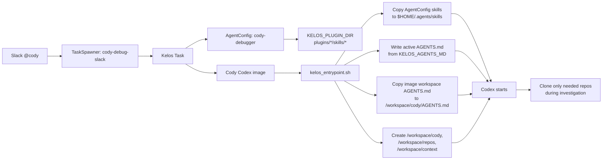

# Cody AgentConfig Skill Bootstrap Implementation Spec

## Status

Draft implementation spec for the Cody v1.0 skill/workspace bootstrap MVP.

## Goal

Give every Cody run a predictable operating context without adding a Kelos `Workspace` yet:

- keep Cody skills in GitOps-managed `AgentConfig`
- copy AgentConfig-provided skills into `$HOME/.agents/skills` before Codex starts
- bake only minimal image support:
  - the copy logic in the Codex entrypoint
  - a workspace context `AGENTS.md`
- create stable runtime folders for dynamic repo clones and evidence
- let Cody clone source/GitOps repos on demand during the investigation

This keeps skill iteration in GitOps instead of requiring an image rebuild for every skill text change.
AgentConfig remains the source of truth for active run instructions.

## Key Decision

Use AgentConfig for skills.

Do **not** bake Cody skills into the image for MVP. The image should only know how to copy skills from the Kelos AgentConfig plugin volume into Codex's discoverable skill path.



Kelos constraint still matters:

- one `Task` can reference one `workspaceRef`
- one `Workspace` has one primary `spec.repo`
- `Workspace.spec.remotes[]` does not create multiple working-tree clones

For this MVP, no Kelos `Workspace` is required. Dynamic repo clones happen inside the Codex run with normal `git clone`, using the existing GitHub App credential helper.

## What Changes

### 1. Entry Point Skill Copy

Update `codex/kelos_entrypoint.sh`.

Today it copies AgentConfig plugin skills to:

```text
$HOME/.codex/skills/<plugin>-<skill>/SKILL.md
```

Change it to copy each AgentConfig plugin skill directory to:

```text
$HOME/.agents/skills/<plugin>-<skill>/SKILL.md
```

Source path provided by Kelos:

```text
$KELOS_PLUGIN_DIR/<plugin>/skills/<skill>/SKILL.md
```

The entrypoint should not add special Cody-specific naming behavior. It should
copy the Kelos plugin skill into the existing plugin-scoped Codex skill path:
`$HOME/.agents/skills/<plugin>-<skill>`.

Examples:

| Plugin | Skill | Target directory |
| --- | --- | --- |
| `cody` | `k8s-investigation` | `$HOME/.agents/skills/cody-k8s-investigation` |

Copy the whole skill directory, not only `SKILL.md`, so later skills can include references.

### 2. Image-Baked Workspace `AGENTS.md`

Add a small workspace context file to the image:

```text
codex/cody-workspace/AGENTS.md
```

Copy it into the image:

```dockerfile
COPY codex/cody-workspace /opt/cody-workspace
```

Entry point behavior:

- create `/workspace/cody`
- copy `/opt/cody-workspace/AGENTS.md` to `/workspace/cody/AGENTS.md`
- if `KELOS_AGENTS_MD` is present, write it to `~/.codex/AGENTS.md`
- if `KELOS_AGENTS_MD` is absent, do not synthesize `~/.codex/AGENTS.md` from the image-baked file

Why:

- current Cody behavior is already GitOps-controlled through `agentconfig-cody-debugger.yaml`
- there should be one active source of truth for Cody run instructions
- the image-baked file is workspace context only, not active run instructions

### 3. Runtime Folders

Entry point should create:

```text
/workspace/cody/
/workspace/repos/
/workspace/context/
```

Do not pre-create context JSON files in this MVP. Cody, future wrappers, or
future MCP tools can create run-local files in `/workspace/context` when they
have actual evidence to persist.

### 4. Single-Skill MVP Test

Add exactly one Cody skill to `k8s-platform-gitops/non-prod/kelos/agentconfig-cody-debugger.yaml` under `spec.plugins`.

Initial test skill shape:

```yaml
plugins:
  - name: cody
    skills:
      - name: k8s-investigation
        content: |
          ---
          name: cody-k8s-investigation
          description: Use when a Cody Slack request asks about a failing, slow, unhealthy, or misconfigured Kubernetes service in non-prod.
          ---

          <existing Cody Kubernetes debug runbook content>
```

The real first skill should use the existing Cody Kubernetes debug runbook
content from `agentconfig-cody-debugger.yaml`, split out from the prior inline
`agentsMD` workflow.

This validates the full path:

```text
AgentConfig plugin skill
  -> KELOS_PLUGIN_DIR
  -> entrypoint copy
  -> $HOME/.agents/skills/cody-k8s-investigation/SKILL.md
  -> Codex skill discovery
```

After this is proven, add the rest of the Cody skills incrementally.

## Dynamic Repo Clone Strategy

Cody does not need Alpheya repos cloned at startup. Most debug requests need live Kubernetes state first, then one or two repos after the target service is known.

Default behavior:

1. Start with active instructions from `KELOS_AGENTS_MD`, workspace context in `/workspace/cody/AGENTS.md`, runtime folders, and AgentConfig skills.
2. Resolve service and namespace from the Slack request and live cluster state.
3. Read HelmRelease labels/annotations to identify source repo and monorepo path.
4. Clone only the needed repo or repos into `/workspace/repos/<name>`.
5. Optionally record each clone in `/workspace/context/repos.json` once that helper exists.

Common clone triggers:

| Trigger | Clone |
| --- | --- |
| Need deployment config, HelmRelease history, values, release gates | `k8s-apps-gitops` |
| Need platform infra, Kelos, monitoring, Temporal, Flux, RBAC | `k8s-platform-gitops` |
| Need protobuf/ConnectRPC schema | `alpheya-api` |
| Need app stack trace/source-code root cause | source repo from HelmRelease `alpheya.com/repo-url` |
| Need shared package behavior | shared package repo only after source references it |
| Need RisingWave/read-model context | `risingwave-pipeline` |

Clone rules:

- clone at task runtime
- use `--depth 50`
- clone into `/workspace/repos/<name>`
- if already cloned, fetch/reset instead of cloning again
- record repo name, path, branch, HEAD SHA, remote URL, and reason in `/workspace/context/repos.json`
- prefer the GitHub App credential helper already configured in the Cody image

Potential later helper:

```bash
cody-clone-repo k8s-apps-gitops --reason "inspect qa core-api HelmRelease"
cody-clone-repo platform-services --path modules/core-api --reason "inspect stack trace"
```

For the first test, raw `git clone` plus AgentConfig guidance is enough.

## Future Cody Skill Set

Do not create all of these at once. Add them after the single-skill path is proven.

| Skill | Purpose |
| --- | --- |
| `cody-service-routing` | Resolve service, namespace, repo, GitOps path, and runtime dependencies. |
| `cody-k8s-investigation` | Inspect live Kubernetes state safely. |
| `cody-gitops-investigation` | Connect live symptoms to GitOps config. |
| `cody-db-readonly` | Diagnose Postgres/Redis symptoms without unsafe mutation. |
| `cody-api-debugging` | Safely call HTTP/ConnectRPC APIs when logs are insufficient. |
| `cody-temporal-diagnostics` | Inspect Temporal workflows, task queues, schedules, and failures. |
| `cody-observability-triage` | Use Datadog/Prometheus/Grafana/Tempo evidence when available. |
| `cody-risingwave-diagnostics` | Inspect RisingWave/read-model issues. |
| `cody-evidence-report` | Keep Slack output concise and evidence-backed. |
| `cody-pr-authoring` | Open small reviewable PRs only when evidence supports a change. |

Reuse existing Alpheya skills where they already fit:

- `create-pr` for PR creation conventions
- `code-searcher` for source search patterns
- `review-connectrpc-only` for ConnectRPC expectations
- `review-otel-logger` for OTel/logger expectations

## MVP Acceptance Criteria

- `cody-debug-slack` does not require `workspaceRef`.
- `agentconfig-cody-debugger.yaml` defines one plugin skill: `cody/k8s-investigation`.
- Codex task startup copies that skill from `KELOS_PLUGIN_DIR` into `$HOME/.agents/skills/cody-k8s-investigation`.
- `$HOME/.agents/skills/cody-k8s-investigation/SKILL.md` exists before `codex exec`.
- `/workspace/cody/AGENTS.md` exists before `codex exec`.
- `/workspace/repos` exists and is writable.
- `/workspace/context` exists and is writable.
- Cody uses `KELOS_AGENTS_MD` as the only active `~/.codex/AGENTS.md` source.
- A Slack request about a failing service triggers the Kubernetes investigation skill behavior.
- No Cody skill content is baked into the image for this MVP.

## Rollout Plan

1. Update this spec.
2. Update `codex/kelos_entrypoint.sh` to copy AgentConfig plugin skills to `$HOME/.agents/skills`.
3. Add image-baked workspace context `codex/cody-workspace/AGENTS.md`.
4. Build and publish a test Cody image.
5. Add one `cody/k8s-investigation` skill to `agentconfig-cody-debugger.yaml`.
6. Point `taskspawner-cody-debug.yaml` at the test image.
7. Run one Slack `@cody` Kubernetes debug test.
8. Confirm skill file exists in pod logs or by inspecting a completed task pod before TTL cleanup.
9. If the skill triggers reliably, add the next skill.

## Future Follow-Up: Dedicated Workspace Repo

Option 3 remains useful later if we want to update Cody workspace assets without rebuilding the image.

Future shape:

```yaml
apiVersion: kelos.dev/v1alpha1
kind: Workspace
metadata:
  name: cody-ops-workspace
  namespace: kelos-system
spec:
  repo: https://github.com/quantum-wealth/cody-workspace.git
  ref: main
  setupCommand:
    - /usr/local/bin/cody-workspace-bootstrap
```

That repo would contain:

- `AGENTS.md`
- optional workspace docs
- optional bootstrap config

Skills should still stay in AgentConfig unless there is a strong reason to move them.

## Open Questions

- Do we want a first-class `cody-clone-repo` helper after the first test, or keep raw `git clone` plus guidance?
- Should `service-map.json` stay an on-demand cache, or eventually be precomputed in CI?
- Should `/workspace/cody/AGENTS.md` eventually move into a dedicated Cody workspace repo so workspace context can change without an image rebuild?
