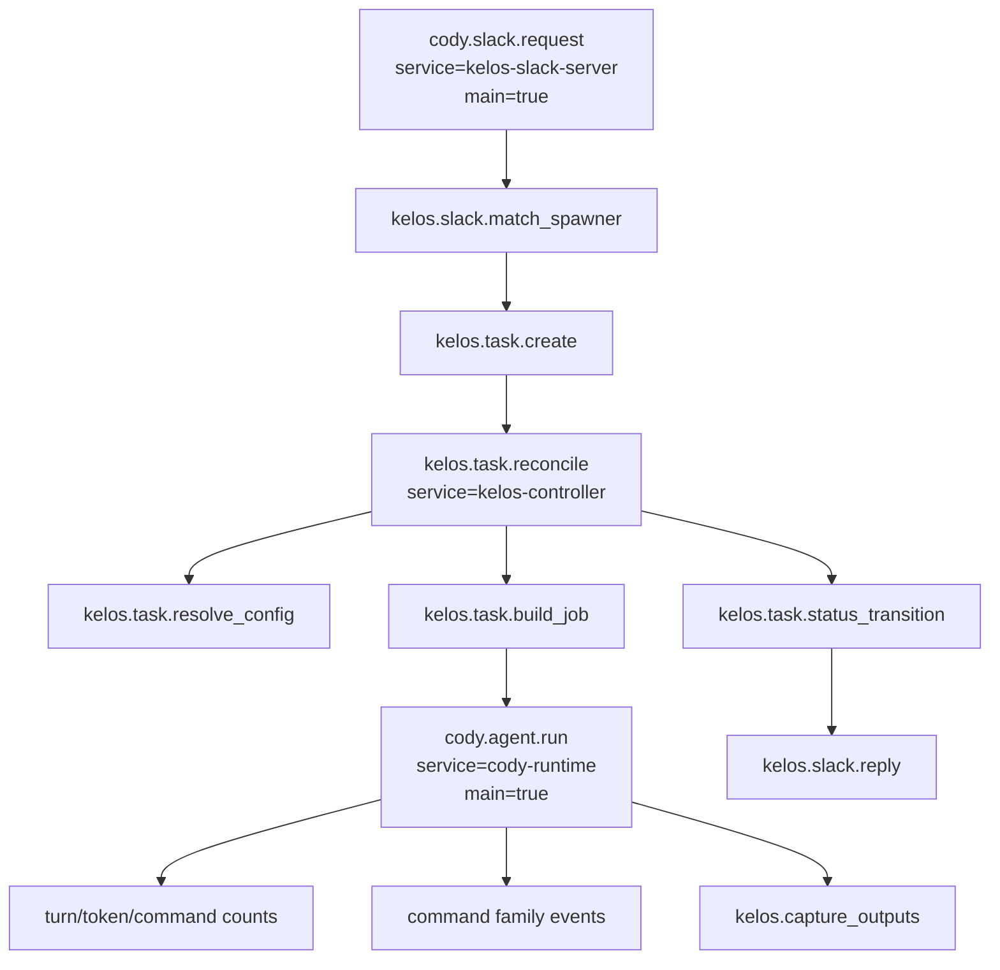

# Cody OTel Runtime Observability

## Goal

Make Cody runs traceable end to end through Kelos without depending on
Alpheya's shared TypeScript observability packages.

The first target is the Cody runtime path:

```mermaid
flowchart LR
  Slack["Slack mention"] --> SlackServer["kelos-slack-server"]
  SlackServer --> Task["Task CR"]
  Task --> Controller["kelos-controller"]
  Controller --> Job["Kubernetes Job"]
  Job --> Codex["codex agent pod"]
  Codex --> Capture["kelos-capture"]
  Capture --> Reporter["Slack reporter"]
  Reporter --> SlackReply["Slack thread reply"]
```



This spec intentionally does not cover `cody-tools` instrumentation beyond
propagating enough trace context for a later follow-up.

## Local Research

- `platform-services`, `asset-service`, `third-party-connector`, and
  `twelvedata-gateway` use `@quantum-wealth/otel` for Node.js auto
  instrumentation, `setMainSpanAttributes`, and "main span" wide-event
  enrichment.
- `template-nestjs-be/docs/OBSERVABILITY.md` captures the platform convention:
  prefer wide events/traces over scattered logs, avoid secrets and full
  request bodies, propagate existing context instead of starting new roots,
  and add spans at meaningful boundaries only.
- `k8s-apps-gitops` commonly enables pod auto instrumentation with
  `instrumentation.opentelemetry.io/inject-sdk: "pod-instrumentation"` and
  sets `OTEL_TRACES_EXPORTER=otlp`. Some workloads set explicit
  `OTEL_EXPORTER_OTLP_ENDPOINT` or `OTEL_EXPORTER_OTLP_TRACES_ENDPOINT`.
- `k8s-platform-gitops/non-prod/alpheya-system/otel-collector-values.yaml`
  routes non-prod traces through the platform collector. Important detail:
  spans with attribute `main=true` are routed to the Vector pipeline, and
  `qa` / `preview` traces are routed to Datadog.
- `eXchange-gw/pkg/observe/otel.go` is the relevant Go precedent: direct Go
  OTel SDK setup, `OTEL_TRACES_EXPORTER` / `OTEL_METRICS_EXPORTER`, OTLP HTTP
  exporters, `TraceContext` propagation, resource attributes, and no shared
  Quantum Wealth package.
- Kelos already has OTel packages in `go.sum`, but not as first-class direct
  dependencies in `go.mod`. The runtime implementation should add direct Go
  OTel dependencies explicitly.

## Non-Goals

- Do not use `@quantum-wealth/otel`; Kelos is Go and this runtime must remain
  upstreamable / self-contained.
- Do not use Datadog Lapdog in the cluster runtime. Lapdog remains useful for
  local Codex experiments, but production/non-prod Cody should emit standard
  OTel directly.
- Do not capture raw Slack message text, full prompts, final answers, secrets,
  JWTs, Atlassian headers, GitHub tokens, DB result rows, or command stdout.
- Do not make telemetry failures fail a Cody run.
- Do not instrument every line. Trace boundaries and state transitions.

## Trace Shape

Target trace:



Root span selection:

- Slack-originated Cody runs should start with `cody.slack.request`.
- Non-Slack Tasks should start at `kelos.task.reconcile`.
- Agent pod spans should join the Task trace when trace context is available.
- If an agent pod is started independently, `cody.agent.run` may be a root span.

## Span Attributes

Use stable, low-cardinality attributes:

| Attribute | Example | Notes |
| --- | --- | --- |
| `main` | `true` | Set on root request span and `cody.agent.run` so current collector routing keeps Cody wide events. |
| `kelos.task.name` | `cody-debug-slack-slack-abc123` | Safe. |
| `kelos.task.namespace` | `kelos-system` | Safe. |
| `kelos.task.type` | `codex` | Safe. |
| `kelos.task.phase` | `running` | Safe. |
| `kelos.taskspawner.name` | `cody-debug-slack` | Safe. |
| `kelos.agent.type` | `codex` | Safe. |
| `kelos.agent.model` | `gpt-5.2` | Optional; omit if absent. |
| `kelos.agent.exit_code` | `0` | Captured after agent exits. |
| `kelos.agent.input_tokens` | `12345` | Derived from JSONL; no prompt text. |
| `kelos.agent.output_tokens` | `2345` | Derived from JSONL; no response text. |
| `kelos.agent.cost_usd` | `1.23` | Only where available. |
| `kelos.mcp.server.count` | `1` | Count only, no headers. |
| `kelos.agentconfig.count` | `2` | Safe. |
| `slack.channel_id_hash` | `sha256:...` | Prefer hash if needed; avoid channel names. |
| `slack.user_id_hash` | `sha256:...` | Prefer hash if needed. |
| `slack.thread_ts_present` | `true` | Safe boolean. |

Error attributes:

- Set span status to error for failed reconciles, failed Job creation, failed
  output capture, Slack post/update errors, and non-zero agent exit.
- Record exception type and message only when it does not contain secrets.
- Prefer operation outcome attributes (`success`, `failed`, `skipped`) over
  dumping raw error context.

## Kelos Repo Changes

### 1. Add Native OTel Setup

Create a small Go package, likely `internal/otelsetup`, that:

- Initializes a tracer provider from environment variables.
- Uses direct Go OTel SDK dependencies.
- Supports at least:
  - `OTEL_TRACES_EXPORTER=otlp`
  - `OTEL_TRACES_EXPORTER=none`
  - `OTEL_EXPORTER_OTLP_ENDPOINT`
  - `OTEL_EXPORTER_OTLP_TRACES_ENDPOINT`
  - `OTEL_SERVICE_NAME`
  - `OTEL_RESOURCE_ATTRIBUTES`
- Sets W3C TraceContext and baggage propagation.
- Defaults to no-op when no exporter is configured.
- Exposes a graceful shutdown function.

This should be similar in spirit to `eXchange-gw/pkg/observe/otel.go`, but
smaller and trace-first. Metrics can stay with existing Prometheus metrics for
now.

### 2. Initialize OTel in Runtime Processes

Initialize tracing early in:

- `cmd/kelos-slack-server/main.go`
- `cmd/kelos-controller/main.go`
- `cmd/kelos-capture/main.go`

Service names:

- `kelos-slack-server`
- `kelos-controller`
- `cody-runtime` for the capture/agent-runtime span emitted from the agent pod

Do not initialize OTel in package init functions.

### 3. Propagate Trace Context Through Task Objects

When the Slack server creates a Task:

- Start `cody.slack.request`.
- Add trace context to Task annotations:
  - `kelos.dev/traceparent`
  - `kelos.dev/tracestate`
  - optional future: `kelos.dev/baggage`
- Continue the existing Slack handling and Task creation behavior.

When the controller reconciles a Task:

- Extract trace context from Task annotations.
- Start `kelos.task.reconcile` as a child when context exists.
- Preserve behavior for Tasks without trace annotations.

### 4. Propagate Trace Context Into Agent Pods

When building the Job:

- Copy Task trace annotations onto the Job and Pod template.
- Inject env vars into the main agent container:
  - `TRACEPARENT`
  - `TRACESTATE`
  - `BAGGAGE`
  - `KELOS_TASK_NAME`
  - `KELOS_TASK_NAMESPACE`
  - `KELOS_TASKSPAWNER`
  - `OTEL_SERVICE_NAME=cody-runtime` unless already set by pod overrides
- Add safe Datadog tags / labels only if they do not fight existing labels.

Do not allow `podOverrides.env` to override `TRACEPARENT`, `TRACESTATE`, or
`OTEL_SERVICE_NAME` once Kelos owns them for runtime tracing.

### 5. Add Controller Spans

Instrument the important controller boundaries:

- `kelos.task.reconcile`
- `kelos.task.resolve_workspace`
- `kelos.task.resolve_github_app_token`
- `kelos.task.resolve_agentconfig`
- `kelos.task.resolve_mcp_secrets`
- `kelos.task.resolve_prompt`
- `kelos.task.build_job`
- `kelos.task.create_job`
- `kelos.task.status_transition`
- `kelos.task.capture_outputs`

Attributes should identify the Task, type, namespace, taskspawner, phase, and
counts. Do not put prompt text, AGENTS.md, MCP headers, or generated MCP JSON
into spans.

### 6. Add Slack Server Spans

Instrument the Slack runtime boundaries:

- `cody.slack.request`
- `kelos.slack.fetch_thread_context`
- `kelos.slack.match_spawner`
- `kelos.task.create`
- `kelos.slack.reply`
- `kelos.slack.activity_update`

Slack spans should use hashed IDs or booleans. Avoid message bodies, usernames,
real names, channel names, and permalink contents as span attributes.

### 7. Add Agent Runtime Span From JSONL Capture

Extend `kelos-capture` to emit a `cody.agent.run` span after Codex exits.

Inputs:

- `/tmp/agent-output.jsonl`
- existing env vars:
  - `KELOS_AGENT_TYPE`
  - `KELOS_MODEL`
  - `KELOS_TASK_NAME`
  - `KELOS_TASK_NAMESPACE`
  - `KELOS_TASKSPAWNER`
  - `TRACEPARENT`
  - `TRACESTATE`

For Codex:

- Use existing JSONL parsers as the source of truth for token totals.
- Count `turn.completed` events as `kelos.agent.turn_count`.
- Count `item.started` / `item.completed` command executions as
  `kelos.agent.command_count`.
- Add span events for command executions with command classification only:
  - `command.family=kubectl|git|gh|psql|redis-cli|curl|other`
  - no raw command string by default

The first implementation can set the span start/end around capture time rather
than exact agent start time. The implemented version improves this by recording
`KELOS_AGENT_STARTED_AT` in `kelos_entrypoint.sh` and using it as the
`cody.agent.run` span start timestamp.

### 8. Keep Existing Prometheus Metrics

Do not replace existing Prometheus metrics in `internal/controller/metrics.go`.
They are still useful for dashboards and alerts.

The OTel work adds traces and wide events; it does not remove metrics.

## GitOps Repo Changes

Target repo: `k8s-platform-gitops`.

### 1. Kelos Controller / Slack Server Env

Add OTel environment for the Kelos HelmRelease values in
`non-prod/kelos/helmrelease-patch.yaml` or the chart values path that maps to
the controller and Slack server deployments.

Desired values:

```yaml
OTEL_SERVICE_NAME: kelos-controller
OTEL_TRACES_EXPORTER: otlp
OTEL_EXPORTER_OTLP_ENDPOINT: http://otel-collector.alpheya-system.svc.cluster.local:4318
OTEL_PROPAGATORS: tracecontext,baggage
OTEL_RESOURCE_ATTRIBUTES: deployment.environment=non-prod,k8s.cluster.name=aks-cluster-non-prod
```

Slack server should use `OTEL_SERVICE_NAME=kelos-slack-server`.

Exact chart key names need to be confirmed against the Kelos chart before
implementation. If the chart does not expose per-component env cleanly, add
chart support in Kelos first rather than using a brittle patch.

### 2. Cody Agent Pod Env

For Cody TaskSpawners:

- Do not hand-write `TRACEPARENT` / `TRACESTATE`; Kelos should inject these
  dynamically per Task.
- Prefer centralized Kelos controller injection for agent exporter config
  rather than repeating it in every TaskSpawner:

```yaml
- name: OTEL_TRACES_EXPORTER
  value: otlp
- name: OTEL_EXPORTER_OTLP_ENDPOINT
  value: http://otel-collector.alpheya-system.svc.cluster.local:4318
- name: OTEL_PROPAGATORS
  value: tracecontext,baggage
- name: OTEL_RESOURCE_ATTRIBUTES
  value: deployment.environment=non-prod,k8s.cluster.name=aks-cluster-non-prod
```

`OTEL_SERVICE_NAME` should be `cody-runtime` for the spawned agent pod. Prefer
Kelos injection over repeating this in every TaskSpawner.

### 3. Pod Instrumentation Annotation

Do not rely on auto-injection for Cody runtime traces.

Reason:

- The key runtime spans are process-level Go spans from Kelos and
  `kelos-capture`, not generic HTTP server spans inside the Codex CLI.
- The agent pod runs shell + Codex CLI; auto-instrumentation is unlikely to
  understand the interesting Cody semantics.

It is acceptable to add platform annotations later for generic dependency
spans, but the MVP should be explicit runtime spans.

### 4. Collector Routing

No collector change should be required for the MVP if Cody spans set
`main=true` and are sent to the existing OTLP endpoint.

After deploying, verify:

- traces arrive in Tempo for `service.name=cody-runtime`,
  `kelos-controller`, and `kelos-slack-server`.
- main Cody spans route through the existing Vector path because they set
  `main=true`.
- if Datadog visibility is required outside `qa` / `preview`, either run Cody
  in a routed namespace or make an explicit collector routing decision in a
  follow-up PR.

## MVP Acceptance Criteria

- A Slack-triggered Cody task produces one trace that links:
  Slack request -> Task creation -> controller reconcile -> Job creation ->
  agent run -> Slack reply.
- The trace contains no raw prompt, Slack body, final answer, token, secret,
  or MCP header.
- `cody.agent.run` includes task name, namespace, taskspawner, agent type,
  model, token totals, turn count, command count, and exit outcome.
- Failed tasks set error status on the relevant span.
- Existing Cody Slack behavior is unchanged.
- If the OTLP endpoint is down, Cody still runs and replies normally.
- Targeted Go tests for observability, capture, controller, Slack, reporting,
  command entrypoints, and chart rendering pass.
- `kubectl kustomize non-prod/kelos` renders successfully after GitOps changes.

## Implementation Order

1. Kelos: add native OTel setup package with tests.
2. Kelos: add Task annotation constants and trace context injection/extraction.
3. Kelos: instrument Slack handler and Task controller.
4. Kelos: inject trace env into agent Jobs.
5. Kelos: emit `cody.agent.run` from `kelos-capture`.
6. GitOps: configure Kelos controller/slack server/agent pod OTel env.
7. Deploy to non-prod with Cody stable route first.
8. Verify one real Slack run in Tempo/Datadog and confirm no sensitive span
   attributes are present.

## Follow-Ups

- Instrument `cody-tools` MCP proxy as a child of `cody.agent.run`.
- Add safe MCP call spans:
  - server name
  - method/tool name
  - status code / error class
  - duration
  - no request body, response body, or Authorization header
- Add dashboards for Cody run duration, failure rate, token usage, and command
  mix.
- Add a sampling policy if Cody runs become high-volume.
