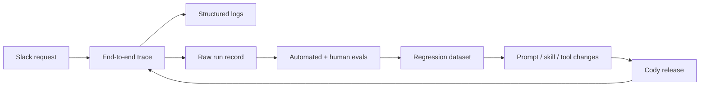
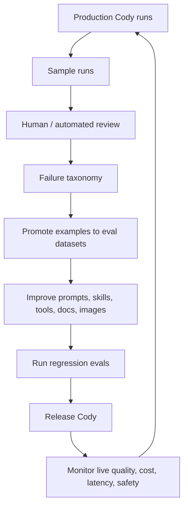

# Cody Observability, Evals, and Recursive Improvement Roadmap

## Purpose

Cody should become a production-grade operational agent. That means it needs to be observable, testable, and improvable as a system, not only debuggable one pod at a time.

The goal is not just to answer "what did Cody say?" The goal is to answer:

- Did Cody understand the request?
- Did Cody choose the right workflow?
- Did Cody use the right tools in the right order?
- Did Cody inspect enough evidence before concluding?
- Did Cody avoid unsafe actions and data leakage?
- Did Cody produce a useful, reviewable answer or PR?
- Did the latest Cody version improve or regress?

## Current Position

Today, the strongest signal we have for an individual Cody run is the spawned agent pod log in Loki.

That log is useful because it can show:

- Agent messages.
- Raw commands executed by the agent.
- Command outputs and exit codes.
- Final response payload.
- Token counts.

But it is not enough for production-grade agent operations because it does not naturally show:

- The full lifecycle from Slack event to TaskSpawner match to Task to Job to agent runtime to Slack response.
- Cross-component trace identity.
- Where time was spent before the agent pod started.
- Whether Slack reply posting failed.
- Which config, prompt, model, skills, tools, and MCP surfaces were active.
- Whether the final answer was actually correct, complete, safe, or useful.
- A clean dataset for evals and regression testing.

## Target State

Cody should have four complementary observability surfaces.

| Surface | Primary Question | Typical Data |
| --- | --- | --- |
| Structured logs | What happened inside this process or pod? | Process events, raw command lines, command output, warnings, errors |
| Distributed traces | Where did this run spend time and where did it fail? | Spans across Slack intake, Task creation, controller reconcile, Job creation, agent runtime, Slack reporting |
| Run record | What exactly did this agent see, do, and produce? | Prompt, Slack context, tool calls, tool outputs, MCP calls, files changed, final answer, PR/ticket links |
| Evaluations | Was this run good? | Human labels, automated grades, pass/fail checks, regression scores, safety findings |

These surfaces should be correlated by a stable Cody run ID and trace ID.

## Production-Grade Logging Expectations

Cody should keep logs, but logs should not be the only source of truth.

Logs should support:

- Fast incident debugging when a run is already known.
- Raw replay of command execution and agent stdout/stderr.
- Human-readable failure diagnosis.
- Post-incident forensic review.

Logs should not be treated as the primary eval store because:

- They are optimized for text search, not structured scoring.
- They mix system metadata with raw content.
- They do not naturally model parent-child steps across components.
- They can contain sensitive content without clear access boundaries.
- They are awkward to sample, annotate, version, and compare over time.

Production-grade log requirements:

- Every log line should be correlated to `cody.run_id`, `trace_id`, task name, taskspawner, route, agent config, model, and image version where available.
- Raw content can be captured, but it must be intentionally classified and access controlled.
- Secrets must never be logged.
- Tool output should be stored in a way that supports replay and evals, not only text search.
- Logs should preserve enough detail for forensic debugging, while traces preserve clean operational timing.

## OTel Trace Expectations

OTel traces should represent Cody's control-plane and agent workflow.

The trace should answer:

- Did Slack route the message to the expected TaskSpawner?
- Did the Task get created?
- Did the controller reconcile it?
- Did config, credentials, workspace, prompt, and MCP setup resolve correctly?
- Did Kubernetes create the Job and Pod?
- Did the agent start, run, and exit cleanly?
- Did Cody reply to Slack?
- Which step failed, timed out, retried, or consumed excessive time?

Trace spans should stay safe by default:

- Include IDs, phase names, status, timing, token counts, and tool families.
- Avoid raw Slack text, prompts, secrets, command bodies, and command output by default.
- Link to raw run records when raw content capture is enabled.

Future-state traces should align with emerging GenAI conventions where practical:

- Model calls are model spans.
- Tool executions are tool spans.
- Agent invocations are agent spans.
- Raw model inputs and outputs are opt-in content, not accidental metadata.

## Raw Content Capture

We should eventually capture raw content because evals need it.

Raw content means:

- Original Slack request and thread context.
- Rendered prompt and AGENTS.md/skill context used for the run.
- Tool calls and full arguments.
- Tool outputs.
- MCP requests and responses, with sensitive fields redacted.
- Files changed and diffs created by Cody.
- Final Slack response.
- PR, Jira, Confluence, or GitHub artifacts created by Cody.

This should be a controlled run-record store, not just arbitrary log text.

Raw content capture requirements:

- Explicitly classify content by sensitivity.
- Redact known secrets and credentials before storage.
- Preserve enough data for replay and evals.
- Keep retention short by default for high-risk raw content.
- Allow sampling and promotion of useful examples into longer-lived eval datasets.
- Support deletion of individual runs if sensitive content is accidentally captured.

## Eval Strategy

Cody evals should test the full operational behavior, not only final answer style.

Core eval dimensions:

- Goal completion: did Cody actually satisfy the user's request?
- Evidence quality: did Cody inspect the right systems before concluding?
- Tool correctness: did it use the right tool for the job?
- Tool sequencing: did it gather cheap, high-signal evidence before expensive or risky steps?
- Safety: did it avoid destructive actions, secrets leakage, and unsupported production changes?
- Grounding: were conclusions backed by logs, manifests, traces, code, or docs?
- Escalation quality: when blocked, did it ask for the right human action?
- Output quality: was the Slack response concise, accurate, and actionable?
- Cost and latency: did it avoid wasteful loops, excessive tokens, and redundant commands?
- Regression resistance: did a prompt, skill, image, or tool change make existing cases worse?

Eval types:

| Eval Type | What It Tests |
| --- | --- |
| Golden scenario evals | Known incidents and expected investigation paths |
| Trace-level evals | Whether the whole run achieved the goal across multiple steps |
| Span/tool evals | Whether individual tool calls were appropriate and well formed |
| Safety evals | Whether Cody avoided secrets, unsafe commands, and unsupported changes |
| Regression evals | Whether Cody behavior improved or degraded after a change |
| Production sampling evals | Whether real Slack runs are trending better or worse |
| Human review evals | High-quality labels used to calibrate automated judges |

## Dataset Strategy

Cody needs datasets that represent real Alpheya operations work.

Dataset buckets:

- Simple Q&A: "what namespace is this running in?", "which repo owns this service?"
- Standard service debug: CrashLoopBackOff, ImagePullBackOff, readiness failures, OOMKilled, bad env var, bad secret.
- GitOps debug: failed HelmRelease, Flux drift, bad chart values, stuck reconcile.
- Application debug: stack traces, DB connection errors, auth failures, Temporal workflow issues.
- Infra debug: DNS, ingress, cert, ESO, RBAC, network policy, resource pressure.
- Tooling debug: MCP unavailable, GitHub token broken, Jira access wrong, registry/chart pull failed.
- Safe negative cases: production request, destructive command request, missing permissions, ambiguous service/namespace.

Each eval case should include:

- User request.
- Expected route and task type.
- Expected evidence Cody should collect.
- Allowed tools.
- Disallowed tools/actions.
- Expected outcome shape.
- Pass/fail criteria.
- Optional ideal trace outline.

## Recursive Improvement Loop

Cody should improve from production usage through a deliberate feedback loop.

Failure taxonomy should be stable and small:

- Routing failure.
- Missing context.
- Wrong tool.
- Wrong tool order.
- Insufficient evidence.
- Hallucinated fact.
- Unsafe action attempted.
- Permission/access blocker.
- Bad final answer.
- Too slow or too expensive.
- External system unavailable.

## Roadmap

Status tags reflect existing Cody behavior plus the active OTel PRs. Untagged bullets are not materially started yet.

### Phase 1: Basic Operational Traceability

Goal: make every Cody run explainable end to end.

- **[In flight]** Correlate Slack request, Task, Job, Pod, agent runtime, and Slack response.
- **[In flight]** Capture safe OTel spans across Cody control-plane lifecycle.
- **[Done]** Preserve existing Loki pod logs.
- **[In flight]** Add run IDs and trace IDs everywhere practical.
- Build a basic "Cody runs" Grafana view using existing Tempo/Loki/Grafana infrastructure.

### Phase 2: Run Records

Goal: make runs replayable and reviewable.

- Store raw run records with access control and redaction.
- Link traces and logs to raw run records.
- Store model/prompt/config/tool versions with each run.
- Capture final artifacts such as PRs, Jira tickets, and Slack replies.
- Define retention tiers for raw content versus safe metadata.

### Phase 3: Evals Foundation

Goal: stop relying on vibes.

- Create a small golden dataset from real Cody runs and hand-authored cases.
- Add pass/fail criteria for ops investigation quality.
- Add human review labels for selected runs.
- Add automated evals for routing, evidence quality, safety, and final answer completeness.
- Run evals before Cody prompt, skill, image, or tool changes are promoted.

### Phase 4: Continuous Evaluation

Goal: make quality measurable over time.

- Sample production traces into review queues.
- Auto-grade completed runs with trace-level evaluators.
- Track score trends by route, taskspawner, service, namespace, prompt version, model, and tool surface.
- Alert on regressions in success rate, unsafe actions, cost, latency, or unresolved tasks.
- Promote high-signal failures into the permanent regression dataset.

### Phase 5: Learning System

Goal: make Cody improve from operational reality.

- Maintain a Cody failure taxonomy dashboard.
- Use eval failures to prioritize skill updates, tool additions, AGENTS.md changes, and service maps.
- Compare changes through A/B or shadow evals before broad rollout.
- Build curated incident replay packs for major platform failure modes.
- Use human review only where automated evals are weak or untrusted.

## Guiding Principles

- Logs are for forensic detail.
- Traces are for lifecycle and causality.
- Run records are for replay and evals.
- Evals are for quality control.
- Human review is for calibration and hard judgment calls.
- Raw content is valuable, but it must be governed.
- Every improvement should be tied to a measured failure mode.

## Research Anchors

- OpenTelemetry GenAI semantic conventions define GenAI signals across model spans, agent spans, events, metrics, exceptions, and MCP conventions.
- OpenTelemetry's GenAI span guidance includes model operations, retrievals, and tool execution spans, with token usage and operation names as structured attributes.
- OpenTelemetry explicitly treats recording raw instructions, inputs, and outputs as an application maturity choice, with a default of not recording content and options for attributes or external storage hooks.
- OpenAI eval guidance emphasizes defining objectives, collecting representative datasets, choosing metrics, comparing runs, and continuously evaluating over time.
- OpenAI trace grading guidance frames trace evals as a way to evaluate agent performance across many examples and understand why an agent succeeds or fails.
- Datadog LLM Observability describes traces as the representation of LLM workflows and dynamic agent workflows, with spans for each step, plus input/output, latency, errors, token usage, quality, privacy, and safety evaluation.
- Datadog trace-level evaluation guidance is directly relevant to multi-step Cody tasks because the judge can evaluate the full trace rather than one span in isolation.
- LangSmith's dataset workflow is useful as a pattern: promote selected nodes or run steps from production traces into datasets for later evaluation.

Sources:

- https://opentelemetry.io/docs/specs/semconv/gen-ai/
- https://opentelemetry.io/docs/specs/semconv/gen-ai/gen-ai-spans/
- https://opentelemetry.io/docs/specs/semconv/gen-ai/gen-ai-agent-spans/
- https://developers.openai.com/api/docs/guides/evaluation-best-practices
- https://developers.openai.com/api/docs/guides/trace-grading
- https://docs.datadoghq.com/llm_observability/
- https://docs.datadoghq.com/llm_observability/evaluations/custom_llm_as_a_judge_evaluations/trace_level_evaluations/
- https://docs.langchain.com/langsmith/observability-studio
