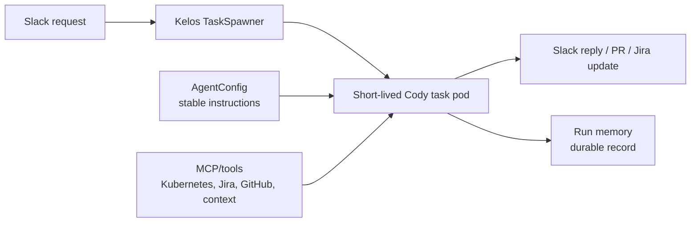
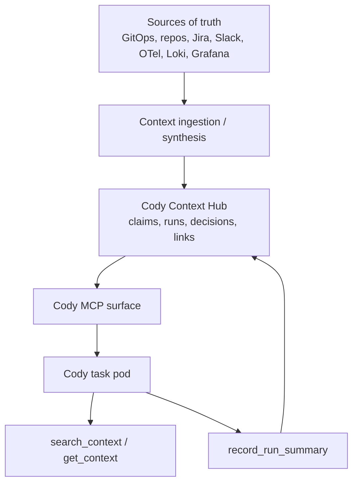
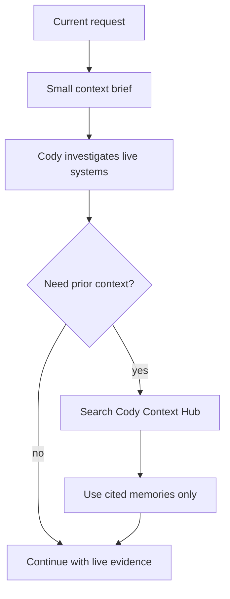
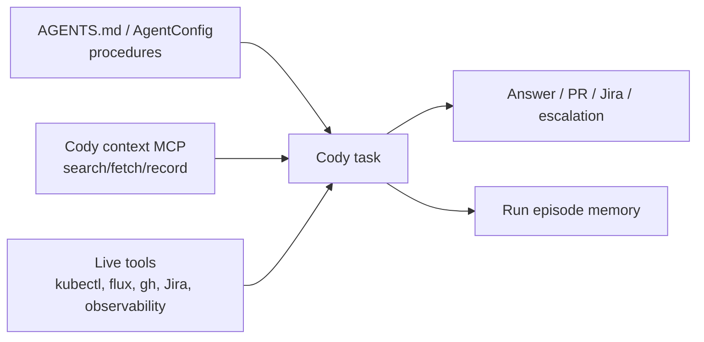

# Cody Shared Context and Memory Spec

## Status

Draft, product and architecture direction for Cody shared context and memory as of 2026-05-21.

This spec avoids code-level implementation detail. It proposes the simplest useful memory architecture for Cody while leaving room for a stronger final state.

## Purpose

Cody needs durable organizational context across short-lived sandbox runs:

- Product knowledge: what Alpheya products, tenants, apps, and service families do.
- Architecture knowledge: service dependencies, data flows, authz/authn patterns, deploy topology, and repo ownership.
- Decision memory: why specific operational or architecture decisions were made.
- Investigation memory: recurring symptoms, likely root causes, useful commands, and past outcomes.
- Change memory: migrations, parallel workstreams, known risky services, recent PRs, and incidents.
- Evaluation memory: golden investigations, expected behaviors, and lessons from failures.

The goal is not to make Cody "remember everything." The goal is to give Cody the right prior context, with provenance, at the moment it needs it.

## Cody Constraints

Cody is not a long-lived assistant process. Each Slack request creates a Kelos task that runs in a pod, uses AgentConfig instructions and MCP servers, gathers live evidence, then exits.

That means:

- Pod-local files are not durable memory.
- The Slack thread and prompt are only the current run context.
- AgentConfig should hold stable operating instructions, not a growing encyclopedia.
- Live systems remain authoritative for current state.
- Shared memory must live outside the task pod and be reachable through a tool/API surface.

## Research Takeaways

Public and internal research points to five practical rules.

1. **Use progressive disclosure.** OpenAI's sandbox memory docs describe a small startup summary plus on-demand search into detailed prior summaries. LangChain Deep Agents makes the same distinction between prompt-loaded memory and on-demand skills/files. This fits Cody because Slack runs must stay fast and focused.

2. **Separate memory types.** LangChain frames memory by duration, information type, scope, update strategy, retrieval mode, and permissions. For Cody, the useful types are semantic memory (facts), episodic memory (past runs), procedural memory (skills/runbooks), and decision memory (why something changed).

3. **Keep temporal truth and provenance.** Zep and Graphiti are strong examples of temporal knowledge graph patterns: facts change, are superseded, and need historical context. Cody needs that even if MVP storage is simpler than a graph.

4. **Expose memory through MCP.** MCP exists to connect LLM apps to context, tools, and workflows through a standard protocol. Cody already uses AgentConfig MCP wiring and `cody-tools`; shared context should use that path instead of custom prompt stuffing.

5. **Treat memory as a security boundary.** OWASP's Agentic AI guidance calls out memory and context poisoning as a core risk. Cody memory must therefore be auditable, source-linked, scoped, and easy to supersede or delete.

## Design Principles

1. **Live evidence wins.** If Kubernetes, Flux, GitHub, Jira, Datadog, Grafana, or the repo can answer the question directly, Cody should query the live source.

2. **Memory orients; it does not decide.** Memory should help Cody choose the right repo, hypothesis, or investigation path. It should not override current logs, configs, code, or user intent.

3. **Every durable fact needs a source.** Cody should never store an opaque "fact" without a source artifact, observed time, writer, and validity status.

4. **Small context beats giant prompts.** Cody should receive a concise context brief at startup and use memory search only when needed.

5. **Procedures belong in skills and AGENTS.md.** Product and architecture facts belong in the context/memory system. Avoid mixing these.

6. **Human-readable by default.** Engineers should be able to inspect, correct, supersede, or delete memory without reverse-engineering embeddings.

## Memory Types

| Type | Examples | Source of truth | Cody use |
| --- | --- | --- | --- |
| Pinned context | "experience-api is GraphQL aggregation, not advisor-portal-bff" | Curated docs, repo docs, GitOps metadata | Startup orientation and disambiguation |
| Service architecture | Service dependencies, upstream/downstream APIs, DBs, queues, Temporal workers | GitOps, repo manifests, code analysis, curated corrections | Route investigations quickly |
| Decision memory | "We chose cody-tools as MCP proxy to constrain Atlassian site and avoid credential leaks" | PRs, specs, Jira/Confluence, Slack decisions | Explain why current shape exists |
| Episodic run memory | Prior Cody task, symptom, evidence, outcome, PR/Jira links | Cody task summaries, OTel trace IDs, Loki logs, PRs | Avoid repeating investigations |
| Investigation playbooks | Known symptom routing and evidence checklists | Skills, runbooks, validated prior runs | Guide debug sequence |
| Active context | Migrations, large refactors, incident follow-ups | Jira, PRs, Slack, GitHub, GitOps | Warn about parallel work and likely causes |
| Eval memory | Golden incidents, expected answer shape, failed agent behaviors | Evaluation harness and review notes | Improve Cody safely |

## Recommended Shape

Build a **Cody Context Hub**: a small Cody-owned shared context service exposed through MCP, backed by an auditable store.

For MVP, the hub should be boring:

- Canonical store: Postgres or another internal relational store.
- Retrieval: structured filters first, semantic search optional.
- Interface: MCP tools exposed through `cody-tools` or a sibling Cody MCP server.
- Startup context: a short generated "context brief" only.
- Detailed recall: on-demand search and fetch tools.
- Writes: automatic for run summaries; controlled for durable claims.

The store should contain two classes of records:

1. **Facts and decisions:** durable claims with provenance, status, validity, tags, and source links.
2. **Episodes:** Cody run records with request, service/namespace, evidence links, conclusion, PR/Jira links, and follow-up status.

Raw logs, traces, Slack threads, and PR diffs should stay in their native systems. Cody memory should store summaries and pointers, not duplicate every byte.

## Retrieval Model

At task start, Cody should get a concise context brief:

- Relevant service/product hints if the request names a known service.
- Known dependency or ownership hints.
- Recent related Cody runs or incidents.
- Relevant decision notes.
- Warnings about stale or superseded facts.

During the task, Cody should call memory tools only when useful:

Retrieval should rank by:

- Scope match: service, namespace, repo, environment, tenant, product.
- Currentness: active facts before superseded facts.
- Source quality: GitOps/repo/Jira/spec > Slack recollection > inferred summary.
- Recency: recent investigations before old ones.
- Semantic relevance: useful, but not the only signal.

Every memory item returned to Cody should include a stable ID and source reference. If Cody uses memory in a Slack answer or PR, it should cite the source type in plain language.

## Write Model

Start with two write paths.

### Automatic Run Memory

At the end of each meaningful Cody task, record:

- Trigger and Slack thread URL.
- Kelos Task name, pod name, trace/run ID when available.
- Service, namespace, repo, and environment if identified.
- Evidence inspected.
- Root cause or hypothesis.
- Action taken: answered, PR opened, Jira updated, escalated, no-op.
- Follow-up outcome if later available.

This is low-risk because it is a traceable episode, not a new organizational truth.

### Controlled Durable Memory

Durable facts and decisions should be proposed, not silently trusted.

Examples:

- "advisor-portal-bff orchestrates advisor portal backend calls."
- "Service X commonly fails readiness during migration Y."
- "For ExternalSecret failures, first check Key Vault key existence and ESO status."

Each durable memory needs:

- Claim text.
- Type: fact, decision, playbook, warning, dependency, owner, eval lesson.
- Scope: org, product, repo, service, namespace, environment, tenant.
- Source links.
- Observed time.
- Validity status: active, superseded, deleted, stale.
- Confidence.
- Invalidators: repo change, GitOps change, date, Jira status, human correction.

Human review is preferred for broad org facts and decisions. Automatic promotion can come later for low-risk memories after evals prove quality.

## Options Considered

### Option A: Git/Markdown Context Pack Only

Shape:

- Keep curated context in Markdown files or generated YAML/JSON.
- Mount or inject concise context into Cody.
- Commit changes through PRs.

Pros:

- Simple, transparent, reviewable, cheap.
- Excellent for stable product and architecture context.
- Easy to diff and roll back.

Cons:

- Weak for run history and high-volume episodic memory.
- Search is primitive unless paired with an index.
- Can become stale if generation is not automated.

Verdict:

- Use as MVP input, not the whole memory system.

### Option B: Managed Memory Platform

Examples:

- Mem0/OpenMemory: MCP memory tools with add/search/get/update/delete.
- Supermemory: MCP-backed persistent memory across tools.
- Zep: managed context engineering and temporal graph memory.

Pros:

- Fastest path to proof of concept.
- Existing MCP surfaces and semantic retrieval.
- Useful API patterns to learn from.

Cons:

- Org memory is sensitive operational data.
- Access rules, provenance, staleness, and source-of-truth semantics are Cody-specific.
- Managed memory may optimize for personal assistant memory, not platform operations.

Verdict:

- Evaluate for patterns or limited prototype only. Do not make a third-party service the canonical Cody memory store.

### Option C: In-House Context Hub on Postgres

Shape:

- Store claims, decisions, run episodes, and source links in an internal service.
- Expose read/write/search through MCP.
- Add pgvector or a separate vector index later if needed.

Pros:

- Simple operational fit with Alpheya infrastructure.
- Strong auditability, access control, temporal fields, and source references.
- Easy to connect to Cody's Kelos/MCP shape.
- Can start structured and add semantic retrieval later.

Cons:

- More initial work than Markdown-only.
- Requires a small service/API and ingestion jobs.
- Search quality starts basic unless semantic retrieval is added.

Verdict:

- Recommended core path.

### Option D: Hybrid In-House Store + External Adapters

Shape:

- In-house store remains canonical.
- Optional adapters call Mem0, Zep/Graphiti, Supermemory, LlamaIndex, or similar tools for retrieval experiments.

Pros:

- Lets Cody learn from strong existing memory tooling without losing control.
- Keeps sensitive org memory governance internal.
- Leaves room for graph retrieval once dependency questions become complex.

Cons:

- More moving pieces.
- Requires strict boundaries so external adapters do not become hidden sources of truth.

Verdict:

- Good final-state extension, not required for MVP.

## Recommended Roadmap

### Phase 0: Keep Current Cody Shape Clean

- Keep AgentConfig focused on role, boundaries, and investigation workflow.
- Keep skills/procedures separate from factual memory.
- Keep live GitOps and Kubernetes lookup as Cody's primary service map.

### Phase 1: Manual Read-Only Context Store

- Initialize a small Cody memory/context store with manually authored entries.
- Make the store available to Cody as read-only context through an MCP search/fetch surface.
- Keep write/manage operations human-owned at this stage: engineers create, edit, supersede, or delete entries directly through the chosen management path.
- Use this phase to validate the record shape, source fields, tags, and retrieval ergonomics before allowing Cody to write memory.

This is the lowest-risk first step: Cody can benefit from shared context, but cannot yet pollute or mutate it.

### Phase 2: Context Pack + Run Memory MVP

- Create a small generated/curated context pack for stable org knowledge:
  - product/app glossary
  - service family overview
  - common authz/authn and data-flow patterns
  - known repo/service naming clarifications
  - approved investigation routing rules
- Record Cody run summaries after each task.
- Add a memory search/fetch MCP surface that can retrieve run history and curated notes.
- Require source references for every retrieved item.

This is the first version that should materially improve Cody.

### Phase 3: Structured Claim Store

- Promote selected context pack and run lessons into structured memory records.
- Add explicit status and validity fields.
- Add supersession instead of destructive overwrite.
- Add review workflow for broad org facts and decisions.

### Phase 4: Semantic and Temporal Retrieval

- Add embeddings for fuzzy recall across incidents, services, and decisions.
- Add temporal scoring so "current active truth" beats older facts.
- Consider pgvector first if Postgres remains the store.
- Evaluate Zep/Graphiti-style graph patterns for service dependencies and changing relationships.

### Phase 5: Feedback and Evals

- Build golden Cody investigation cases.
- Track whether memory helped Cody choose the right repo, service, query, and next action.
- Track stale-memory failures and memory poisoning attempts.
- Promote only memory behavior that improves evals without increasing unsafe actions.

## What Not To Store

Do not store:

- Secrets, tokens, credentials, private keys, or raw secret values.
- Unredacted customer data or sensitive personal data.
- Full raw logs by default.
- Speculation without source and confidence.
- Current cluster state without TTL or invalidation.
- Private human context that Cody is not authorized to reuse.

Store links and summaries instead.

## How This Fits Cody

The clean Cody integration is:

- AgentConfig says: "Use Cody context tools when prior org memory may help."
- `cody-tools` or a dedicated Cody MCP server exposes memory tools.
- The memory service returns compact, source-linked records.
- Cody still uses live tools for the actual investigation.
- Cody writes run memory at the end of the task.

This keeps Cody's prompts small, its memory inspectable, and its operational facts grounded in source systems.

## Existing Tools To Track

| Tool | Useful idea | Cody fit |
| --- | --- | --- |
| OpenAI sandbox memory | Startup summary plus on-demand detailed memory lookup | Strong pattern for Cody context brief + search |
| LangChain Deep Agents / LangGraph memory | Scope, memory type, update strategy, read-only vs writable memory | Strong taxonomy for Cody policy |
| Letta / MemGPT | Core memory vs archival memory | Useful mental model for pinned context vs searchable store |
| Mem0 / OpenMemory | MCP memory CRUD/search surface | Good prototype/API reference |
| Supermemory | Cross-client MCP memory and project scoping | Useful ergonomics; not preferred canonical store |
| Zep / Graphiti | Temporal graph, changing facts, context assembly | Best reference for later dependency/decision graph |
| LlamaIndex memory | Short-term to long-term memory blocks | Useful ingestion/retrieval pattern, not core store |

## Acceptance Criteria

Cody shared memory is working when:

- Cody can answer "have we seen this failure before?" with cited prior runs.
- Cody can distinguish current live state from remembered context.
- Cody can route from a symptom to the right repo/service faster than static prompts alone.
- Engineers can inspect and correct memory records.
- Broad org facts are source-linked and supersedable.
- A poisoned or stale memory can be identified, ignored, and cleaned up.
- Memory use improves investigation evals without increasing unsafe actions.

## Sources

Internal docs reviewed:

- `specs/2026-05-18-13-33-cody-skills-context-memory.md`
- `specs/research/20260317-163200__agent-memory-systems-research.md`
- `specs/research/20260319-131200__memory-mvp-poc-spec.md`
- `docs/reference.md`

Public research inputs:

- [OpenAI Agents SDK sandbox memory](https://openai.github.io/openai-agents-js/guides/sandbox-agents/memory/)
- [LangChain Deep Agents memory](https://docs.langchain.com/oss/javascript/deepagents/memory)
- [Zep key concepts](https://help.getzep.com/v2/concepts)
- [Graphiti repository](https://github.com/getzep/graphiti)
- [Mem0 MCP docs](https://docs.mem0.ai/platform/mem0-mcp)
- [Supermemory MCP docs](https://supermemory.ai/docs/supermemory-mcp/introduction)
- [Model Context Protocol specification](https://modelcontextprotocol.io/specification/2025-11-25)
- [OWASP Top 10 for Agentic Applications, ASI06 Memory and Context Poisoning](https://genai.owasp.org/download/52117/)
- [LlamaIndex memory docs](https://developers.llamaindex.ai/python/examples/memory/memory/)
- [Letta archival memory docs](https://docs.letta.com/guides/ade/archival-memory/)
