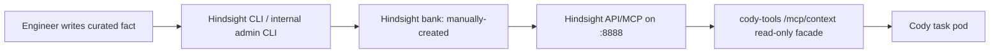
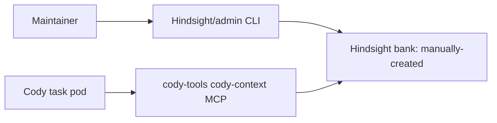

# Cody Phase 1 Read-Only Context Store Implementation Spec

## Status

Draft implementation spec for Phase 1 of Cody shared context and memory.
Validated against upstream Hindsight OSS/docs on 2026-05-21.

This builds on [2026-05-21-12-15-cody-shared-context-memory-spec.md](./2026-05-21-12-15-cody-shared-context-memory-spec.md).

## Goal

Phase 1 gives Cody a small, manually managed, read-only organizational context store.

Cody should be able to use Hindsight's read tools to recall curated context about Alpheya products, architecture, decisions, service relationships, and investigation guidance. Cody must not be able to create, update, delete, or silently mutate this context.

This phase is intentionally simple from Cody's point of view:

- No automatic memory writes.
- No run-summary ingestion.
- No autonomous memory management.
- No Cody-visible write tools.

The selected memory backend may use its own database, indexes, embeddings,
or queues internally. That does not change the Phase 1 product contract:
humans curate the facts, Cody reads them, and Cody cannot mutate them.

The purpose is to prove the record shape, retrieval ergonomics, operational wiring, and Cody behavior before introducing writable or generated memory.

## Phase 1 Invariants

Using Hindsight must not weaken the original Phase 1 outcomes:

- humans manually curate every fact Cody can read;
- Cody can recall and read memory;
- Cody cannot create, update, delete, retain, reflect, or otherwise mutate
  memory;
- Cody cannot access Hindsight directly;
- Hindsight write credentials are available only to maintainer/admin tooling;
- live Kubernetes, GitOps, source code, Jira, and logs override stored memory.

## Functional Requirements

### FR-001: Manual Source Of Truth

The context store must be authored and managed manually by engineers.

Phase 1 source of truth should be manually curated records stored in
Hindsight, not Cody-generated memory and not raw source ingestion.

Humans should write records through one of these admin paths:

- the upstream Hindsight CLI (`hindsight memory retain ...`) for the first
  spike;
- a thin internal CLI wrapper around Hindsight's API;
- a one-off admin script used by platform maintainers.

Cody must not have credentials, MCP tools, or API access that allow writes to
the curated memory bank.

Rationale:

- Hindsight gives us an OSS memory backend with retention, recall, and later
  reflection/evaluation paths.
- Manual writes preserve the original Phase 1 product goal: curated facts only.
- A CLI/admin path is faster than building an admin UI.
- Hindsight has native MCP tool allowlisting; keeping Cody behind `cody-tools`
  gives us a second policy boundary and keeps credentials out of task pods.

Recommended initial Hindsight bank:

```text
manually-created
```

Recommended later banks:

```text
cody-generated      # Cody-generated run memories, disabled in Phase 1
machine-candidates  # unreviewed generated/imported memories, later phase
manually-created    # manually approved facts Cody may read in Phase 1
```

If a curated record is wrong, a human updates or supersedes it through the
admin path. Cody can point out stale or conflicting context in its answer, but
cannot update the memory itself.

### FR-002: Read-Only Runtime Store

At runtime, the curated records must be available to Cody through a read-only
MCP surface.

Recommended deployment shape:

- Hindsight runs in `kelos-system`.
- Hindsight is deployed with the upstream Helm chart
  `oci://ghcr.io/vectorize-io/charts/hindsight`.
- Hindsight API/MCP listens on port `8888`; the control-plane UI is separate
  and should not be exposed for Phase 1.
- For the non-prod spike, use the chart-managed PostgreSQL unless we decide to
  move directly to CNPG/external PostgreSQL.
- A maintainer writes curated facts through the upstream Hindsight CLI or a
  small admin wrapper.
- `cody-tools` exposes a narrow `cody-context` MCP facade that queries
  Hindsight but does not expose Hindsight write tools.
- Cody never talks to Hindsight directly.



For the very first spike, the admin path can be a manual CLI command run by a
platform maintainer. The important Phase 1 invariant is that humans write the
facts and Cody only receives read tools.

### FR-003: Cody Read Access Through MCP

Cody must access context through MCP, not by loading a giant static prompt.

Add a new MCP route to `cody-tools`:

```text
http://cody-tools.kelos-system.svc.cluster.local:8080/mcp/context
```

Add a dedicated Cody AgentConfig in `k8s-platform-gitops`:

```yaml
apiVersion: kelos.dev/v1alpha1
kind: AgentConfig
metadata:
  name: cody-context
  namespace: kelos-system
spec:
  agentsMD: |
    ## Cody Context

    Use the `cody-context` MCP server when prior Alpheya product,
    architecture, decision, or investigation context may help.

    Treat context records as orientation, not source of truth. Live
    cluster state, GitOps, source code, Jira, and logs override stored
    context.

    Do not attempt to write memory. Phase 1 context is read-only.
  mcpServers:
    - name: cody-context
      type: http
      url: http://cody-tools.kelos-system.svc.cluster.local:8080/mcp/context
```

Attach this AgentConfig only to the alpha Cody TaskSpawner for Phase 1. Normal
Cody should keep its current behavior until the Hindsight read path is proven
in Slack.

### FR-004: No Write Tools Exposed To Cody

The MCP server should mirror Hindsight's MCP protocol as closely as possible,
but expose only an allowlisted read surface.

Use Hindsight single-bank mode against the `manually-created` bank. Cody should
not receive a generic multi-bank endpoint and should not be able to select
arbitrary banks.

Hindsight single-bank mode removes multi-bank tools such as `list_banks`,
`create_bank`, and `get_bank_stats`, but it still exposes write/admin tools by
default. Phase 1 must therefore use Hindsight's native MCP tool allowlist and
`cody-tools` defense-in-depth filtering.

Native Hindsight server allowlist:

```text
HINDSIGHT_API_MCP_ENABLED_TOOLS=recall,list_memories,get_memory,list_tags,get_bank
```

Allowed Hindsight tools:

- `recall`
- `list_memories`
- `get_memory`
- `list_tags`
- `get_bank`

Optional later read-only tool:

- `reflect`, after we explicitly accept the cost/behavior tradeoff.

Disallowed tools:

- `retain`
- `delete_memory`
- `delete_document`
- `cancel_operation`
- `create_mental_model`
- `update_mental_model`
- `delete_mental_model`
- `refresh_mental_model`
- `create_directive`
- `delete_directive`
- `update_bank`
- `delete_bank`
- `clear_memories`
- `list_banks`
- `create_bank`
- any other Hindsight write/admin/bank-management tool

If Cody asks to store something, it should reply that Phase 1 memory is manually managed and read-only.

### FR-005: Hindsight-Compatible Proxy

Do not invent a Cody-specific memory API unless Hindsight's tool shape makes it
necessary.

`cody-tools` should be a restricted Hindsight MCP proxy:

- `tools/list` returns only the allowed Hindsight tools.
- `tools/call` forwards only allowed tool calls.
- All forwarded calls are forced to the `manually-created` bank.
- Requests for disallowed tools return a clear "not available in Phase 1" error.
- Tool names and schemas should remain Hindsight-compatible where practical.
- It strips caller-provided `Authorization` / `Cookie` headers and injects the
  server-side Hindsight MCP token, matching the existing Atlassian proxy
  pattern.

This keeps future portability high: if we later choose to expose Hindsight
directly, Cody's learned tool usage still maps to Hindsight's native surface.

### FR-006: Phase 1 Cody Behavior Contract

Cody should use Hindsight memory like this:

1. Use live evidence first for runtime state.
2. Use Hindsight `recall` when prior product, architecture, decision, or
   investigation context may help.
3. Use `get_memory` only when recall returns a relevant memory ID.
4. Treat memories as orientation, not proof.
5. Mention when a conclusion depends on stored memory rather than live evidence.
6. Never claim to have updated memory.

## Operational Guardrails

Keep the Phase 1 guardrails lightweight. We do not need a full custom NFR
section while Hindsight owns storage, indexing, and retrieval behavior.

Guardrails:

- Hindsight is deployed in `kelos-system`.
- Hindsight MCP is protected with `HINDSIGHT_API_MCP_AUTH_TOKEN`.
- Hindsight MCP globally exposes only the Phase 1 read allowlist through
  `HINDSIGHT_API_MCP_ENABLED_TOOLS`.
- `cody-tools` remains healthy if Hindsight is missing or unavailable.
- `/mcp/atlassian` remains unaffected by `/mcp/context` failures.
- Hindsight write credentials are not mounted into Cody task pods.
- Cody task pods cannot reach Hindsight directly.
- Manual memories must not contain secrets, private keys, credentials, raw
  customer PII, or unredacted logs.
- Prefer summaries and source links over raw incident or Slack dumps.
- If manual write audit becomes important, add periodic export or a
  `cody-memory` wrapper that records change metadata.

## Hindsight Data Model

Do not define a separate Cody memory schema in Phase 1. Use Hindsight's native
memory model and metadata fields.

Recommended convention for manually retained memories:

- bank: `manually-created`
- tags: product/service/repo/environment keywords Cody should recall by
- metadata: owner, source reference, confidence, status, and review timestamp
  if Hindsight supports these fields cleanly
- content: concise human-written fact or runbook note, with links to native
  systems rather than pasted raw evidence

If Hindsight's metadata model is too loose for the fields we care about, solve
that in the admin write path, not the Cody read path. The internal
`cody-memory` wrapper can validate required metadata before calling Hindsight
without changing what Cody sees.

## Open-Source Backend Decision

Use Hindsight as the Phase 1 memory backend, but do not expose Hindsight
directly to Cody.

### Why Hindsight First

Hindsight is the best first backend for this phase because it is already shaped
as an agent memory service:

- it has a memory-bank model that can isolate curated org facts from Cody run
  memories;
- it has retain/recall style APIs that can be used by humans, CLIs,
  automation, and later Cody write paths;
- it can run as a standalone service in Kubernetes;
- it can be wrapped by `cody-tools`, so Cody sees only our approved MCP
  read tools;
- it gives us a path from Phase 1 manual memory to later Cody-generated
  candidate memories without changing the Cody-facing interface.

### Phase 1 Bank Model

Use only one active bank in Phase 1:

| Bank | Writer | Cody access | Purpose |
| --- | --- | --- | --- |
| `manually-created` | Human/admin CLI only | Read-only | Manually curated product, architecture, service, decision, and investigation facts. |

Define but do not enable these later banks yet:

| Bank | Writer | Cody access | Future purpose |
| --- | --- | --- | --- |
| `cody-generated` | Cody or Kelos post-run automation | No Phase 1 access | Cody's own investigation summaries and run learnings. |
| `machine-candidates` | Cody, import jobs, or source crawlers | Optional read later | Unreviewed/generated facts awaiting human promotion. |

### Manual Write Path

Phase 1 writes should be explicitly human-initiated.

Allowed write paths:

- an upstream Hindsight CLI command run by a platform maintainer;
- an internal `cody-memory` CLI wrapper that validates required metadata before
  calling Hindsight;
- a small admin-only script for initial seeding.

Disallowed write paths:

- Cody writing through MCP;
- Cody calling Hindsight directly;
- automatic Slack/Jira/log ingestion;
- automatic post-run memory capture;
- broad repo/doc crawlers.

Recommended upstream CLI spike:

```text
hindsight configure --api-url http://<port-forwarded-hindsight-api>:8888 --api-key <admin-api-key>
hindsight memory retain manually-created "Curated context body..." --context "owner=shan status=active source=..."
```

The upstream CLI is enough for the first manual-write spike. Build
`cody-memory` only when we need stronger local validation, required metadata,
or audit/export behavior.

Recommended future CLI wrapper behavior:

- require `type`, `title`, `summary`, `body`, `owner`, `status`, `scope`,
  `tags`, and at least one source reference;
- write only to `manually-created`;
- support superseding an existing record instead of silent overwrite;
- print the Hindsight memory ID after writing;
- avoid exposing the admin write token to Cody pods.

Example operator flow:

```text
cody-memory retain \
  --bank manually-created \
  --type architecture \
  --title "Advisor Portal BFF ownership" \
  --scope service=advisor-portal-bff \
  --scope product=advisor-portal \
  --tag advisor-portal \
  --tag bff \
  --source spec:2026-05-18-intro-to-cody \
  --owner shan \
  --body ./advisor-portal-bff-note.md
```

The exact command shape can change after the Hindsight spike. The functional
requirement is the important part: humans can manually add curated facts, and
Cody cannot.

### Cody Read-Only Path

Cody reads through `cody-tools` only:



`cody-tools` must enforce:

- only `manually-created` is queried in Phase 1;
- only read tools are listed to Cody;
- no Hindsight write/admin tools are proxied;
- the Hindsight read token is mounted only into `cody-tools`, not Cody task
  pods.

### Fork Decision

Do not fork Hindsight for Phase 1.

Use upstream Hindsight unless the spike proves we need code changes for:

- bank-level authorization;
- hiding write tools;
- Kubernetes/runtime bugs;
- provenance fields that cannot be represented;
- audit/export requirements;
- performance or reliability fixes.

This differs from Kelos. Kelos is Cody's runtime/control plane, so we forked it
because Cody-specific behavior belongs close to task creation, pod wiring,
agent config, credentials, and `cody-tools`. Hindsight should start as a
replaceable backend service behind `cody-tools`.

### Backend Decision Matrix

| Option | Phase 1 fit | Long-term fit | Recommendation |
| --- | --- | --- | --- |
| Hindsight | High | High for Cody run memory and curated engineering facts | Use first, no fork initially |
| Cognee | Medium | High for org-wide engineering knowledge graph | Appendix alternative / later spike |
| Graphiti | Low for Phase 1 | High for temporal service graph | Later temporal graph layer |
| Mem0 | Medium | Medium-high as mature generic memory | Fallback if Hindsight fails |
| Onyx | Low | Medium for broad source retrieval | Later source-search layer |
| Pyrite/Engram/QMD | Medium for file-backed memory | Lower for org-wide agent memory | Keep as design references |

## Implementation Shape

The implementation should preserve Hindsight's native MCP contract wherever
possible.

Do not create custom Cody memory tools unless Hindsight's native tools prove
unworkable. The Cody-facing MCP server can still be named `cody-context`, but
the tools it exposes should be Hindsight tools:

- `recall`
- `list_memories`
- `get_memory`
- `list_tags`
- `get_bank`

`cody-tools` is the policy boundary. It should behave like a filtered Hindsight
MCP proxy:

- Forward `initialize`, `notifications/initialized`, allowed `tools/list`, and
  allowed `tools/call` traffic.
- Filter `tools/list` so Cody never sees write/admin tools.
- Reject `tools/call` for any tool outside the allowlist.
- Use Hindsight single-bank mode for `manually-created`, so Cody cannot choose
  another bank.

### Hindsight Runtime Configuration

Validated upstream runtime facts:

| Item | Validated value |
| --- | --- |
| Helm chart | `oci://ghcr.io/vectorize-io/charts/hindsight` |
| Chart version checked | `0.6.2` in upstream repo at validation time |
| API image | `ghcr.io/vectorize-io/hindsight-api` |
| Standalone image | `ghcr.io/vectorize-io/hindsight` |
| API/MCP port | `8888` |
| MCP root path | `/mcp` |
| Single-bank MCP path | `/mcp/{bank_id}/` |
| Phase 1 bank path | `/mcp/manually-created/` |
| Control-plane UI | separate service; do not expose for Phase 1 |

Recommended Hindsight env for Phase 1:

| Env var | Purpose |
| --- | --- |
| `HINDSIGHT_API_MCP_ENABLED` | Keep MCP enabled; default is already `true`. |
| `HINDSIGHT_API_MCP_AUTH_TOKEN` | Bearer token expected by Hindsight MCP. |
| `HINDSIGHT_API_MCP_ENABLED_TOOLS` | Native read-only tool allowlist: `recall,list_memories,get_memory,list_tags,get_bank`. |
| `HINDSIGHT_API_TENANT_EXTENSION` | Optional but recommended for API auth: `hindsight_api.extensions.builtin.tenant:ApiKeyTenantExtension`. |
| `HINDSIGHT_API_TENANT_API_KEY` | Admin/API key for maintainer CLI and API calls. |
| `HINDSIGHT_API_DATABASE_URL` | Only needed if using external PostgreSQL instead of the chart-managed PostgreSQL. |
| `HINDSIGHT_API_LLM_PROVIDER` / `HINDSIGHT_API_LLM_API_KEY` | Model provider configuration required by Hindsight retain/reflect processing. |

Auth model:

- Cody never receives a Hindsight token.
- `cody-tools` receives only the MCP token and forwards it to Hindsight.
- Maintainer/admin tooling receives the API/admin key outside Cody task pods.
- If the Hindsight API key extension is enabled, maintainer CLI uses that key.
- If Hindsight's MCP token and API key are different, keep them as separate
  secrets.

### Kelos Repo: `cody-tools` Hindsight Proxy

Add a restricted Hindsight MCP proxy to `cmd/cody-tools`.

Recommended internal split:

- `internal/mcpproxy`: generic HTTP MCP proxying and tool filtering.
- `internal/hindsight`: Hindsight endpoint/auth config.
- `cmd/cody-tools`: route `/mcp/context` to the restricted proxy.

Environment variables:

| Env var | Purpose | Default |
| --- | --- | --- |
| `HINDSIGHT_MCP_URL` | Internal single-bank Hindsight MCP URL for `manually-created`. | empty means context disabled |
| `HINDSIGHT_AUTHORIZATION` | Full `Authorization` header value for Hindsight MCP, normally `Bearer <token>`. | deployment-specific |
| `HINDSIGHT_ALLOWED_TOOLS` | Comma-separated MCP tool allowlist. | `recall,list_memories,get_memory,list_tags,get_bank` |
| `CODY_TOOLS_CONTEXT_TIMEOUT` | Per-request timeout to Hindsight. | `10s` |

Behavior:

- If `HINDSIGHT_MCP_URL` is empty, `/mcp/context` should report context disabled.
- Proxy only to the configured single-bank URL.
- Expose only allowed read tools, even though Hindsight should already be
  configured with the same native allowlist.
- Preserve Hindsight tool names and schemas where possible.
- Do not normalize Hindsight memories into a custom Cody schema in Phase 1.
- Return a clear unavailable/error result if Hindsight is down.

MCP protocol:

- Support `initialize`.
- Support `notifications/initialized`.
- Support `tools/list`.
- Support `tools/call`.
- Return JSON content in MCP tool responses.

### GitOps Repo

Add runtime wiring in `k8s-platform-gitops`.

Required resources:

- Hindsight HelmRepository/HelmRelease or direct OCI HelmRelease.
- Hindsight values for namespace, API service, backing store, model provider,
  MCP auth token, and native MCP tool allowlist.
- Hindsight admin/API credential for maintainers only.
- Hindsight MCP credential for `cody-tools`.
- `HINDSIGHT_MCP_URL`, tool allowlist, and read credential wiring on
  `cody-tools`.
- AgentConfig `cody-context`.
- Add `cody-context` to the alpha Cody TaskSpawner `agentConfigRefs` only.

Recommended file additions:

```text
k8s-platform-gitops/non-prod/kelos/
  helmrelease-hindsight.yaml
  externalsecret-hindsight.yaml
  networkpolicy-hindsight.yaml
  agentconfig-cody-context.yaml
```

Recommended Hindsight Helm values:

```yaml
# `hindsight-secrets` is created by ExternalSecret and mounted into the API pod
# via envFrom. It should contain HINDSIGHT_API_MCP_AUTH_TOKEN,
# HINDSIGHT_API_TENANT_API_KEY, and HINDSIGHT_API_LLM_API_KEY.
existingSecret: hindsight-secrets
api:
  env:
    HINDSIGHT_API_MCP_ENABLED: "true"
    HINDSIGHT_API_MCP_ENABLED_TOOLS: recall,list_memories,get_memory,list_tags,get_bank
    HINDSIGHT_API_TENANT_EXTENSION: hindsight_api.extensions.builtin.tenant:ApiKeyTenantExtension
postgresql:
  enabled: true
ingress:
  enabled: false
controlPlane:
  enabled: false
```

If chart-managed PostgreSQL is used, ensure `postgresql.auth.password` is
provided through Flux secret-backed values, not as a literal committed value.
If that wiring is awkward, use external/CNPG PostgreSQL for the first deployed
version instead.

Recommended `cody-tools` env:

```yaml
- name: HINDSIGHT_MCP_URL
  value: http://hindsight-api.kelos-system.svc.cluster.local:8888/mcp/manually-created/
- name: HINDSIGHT_AUTHORIZATION
  valueFrom:
    secretKeyRef:
      name: cody-hindsight-mcp
      key: Authorization
- name: HINDSIGHT_ALLOWED_TOOLS
  value: recall,list_memories,get_memory,list_tags,get_bank
```

Key Vault should store the bare MCP token if possible. The ExternalSecret can
template the Kubernetes secret key as `Authorization: Bearer {{ .token }}` so
callers never hand-compose the header in manifests.

## User Workflows

### Add A Manual Context Record To Hindsight

1. Write the context body in a local Markdown file or directly in the CLI.
2. Run the upstream Hindsight CLI or internal `cody-memory` wrapper.
3. Provide required metadata: type, status, owner, scope, tags, and source refs.
4. The CLI writes to the `manually-created` Hindsight bank.
5. Cody can recall/read the record through `cody-tools` MCP.

The write credential is only available to maintainers/admin tooling, not Cody.

### Update Or Supersede A Record

1. For small corrections, edit the record and update `updated_at`.
2. For meaningfully changed facts, mark old record `superseded` and add a new record.
3. Set `superseded_by` on the old record.
4. Keep sources on both records.
5. Re-run the admin CLI/write path.

### Ask Cody To Use Context

Example Slack prompt:

```text
@cody what do we know about auth failures in advisor portal?
```

Expected Cody behavior:

1. Use Hindsight `recall` for `auth advisor portal`.
2. Use `get_memory` if a returned memory needs more detail.
3. Explain that stored context suggests likely auth/Cerbos/token-claim paths.
4. If the question is about a live issue, inspect live logs/config before concluding.

### Ask Cody To Write Memory

Example Slack prompt:

```text
@cody remember that broker-service depends on asset-service
```

Expected Cody behavior:

```text
I can't write Cody memory directly yet. Phase 1 context is manually managed by
platform maintainers through the Hindsight admin path. Ask a maintainer to add
this as a curated context record if it should become shared Cody context.
```

## Testing Requirements

### Unit Tests

Kelos repo:

- Hindsight proxy forwards `initialize` and `notifications/initialized`.
- Hindsight proxy filters `tools/list` to the allowlist.
- Hindsight proxy forwards allowed `tools/call` requests.
- Hindsight proxy rejects disallowed `tools/call` requests.
- Hindsight proxy always targets the configured `manually-created` single-bank
  endpoint.
- Hindsight proxy handles unavailable/timeout/error responses.
- Existing `/mcp/atlassian` tests continue to pass.

### GitOps Validation

GitOps repo:

- `kubectl kustomize non-prod/kelos` renders successfully.
- Rendered Hindsight resources exist.
- Rendered `cody-tools` Deployment includes Hindsight MCP URL, tool allowlist, and
  read credential wiring.
- Rendered AgentConfig includes the `cody-context` MCP server.
- Rendered alpha TaskSpawner includes `cody-context` in `agentConfigRefs`.
- Rendered normal TaskSpawner does not include `cody-context`.

### Manual Smoke Test

1. Add a record to Hindsight through the admin CLI:

```text
hindsight memory retain manually-created \
  "Cody Phase 1 context smoke test: this record proves Cody can read the manual context store." \
  --context "type=glossary status=active owner=shan source=human_note:smoke-test"
```

2. Deploy.
3. Ask:

```text
@cody what does Cody context say about the phase 1 smoke test?
```

4. Expected answer:

- Cody finds the record.
- Cody cites that it came from Cody context.
- Cody does not claim live evidence.
- Cody does not try to write memory.

## Acceptance Criteria

Phase 1 is complete when:

- A human can add a curated context record to Hindsight through an admin
  CLI/API path.
- Hindsight direct MCP `tools/list` exposes only the Phase 1 read allowlist.
- Cody can use Hindsight `recall` and `get_memory` through MCP.
- Cody has no MCP write tools for context.
- Cody's AgentConfig clearly says context is read-only and non-authoritative.
- Existing Atlassian MCP proxy behavior is unchanged.
- Invalid/manual records are caught by CLI validation or rejected before they
  enter the curated bank.
- If context is unavailable, Cody can still operate using live tools and report that context lookup is unavailable.

## Rollout Plan

### Step 1: Hindsight Runtime

- Deploy upstream Hindsight in non-prod using the upstream OCI Helm chart.
- Configure chart-managed PostgreSQL for the first spike, or external
  PostgreSQL if platform owners prefer that from day one.
- Configure `HINDSIGHT_API_MCP_ENABLED_TOOLS` to the Phase 1 read allowlist.
- Configure `HINDSIGHT_API_MCP_AUTH_TOKEN` for MCP access.
- Configure an admin/API key for maintainer CLI access.
- Seed the `manually-created` bank through the upstream Hindsight CLI.
- Add network policy so Cody task pods cannot call Hindsight directly.

### Step 2: Kelos / cody-tools

- Add Hindsight MCP proxy support.
- Add `/mcp/context` read-only facade.
- Add tool allowlist.
- Force the configured single-bank Hindsight MCP URL.
- Add failure handling for Hindsight downtime.
- Add tests.
- Build and push `docker.io/alpheya/cody-tools:main`.

### Step 3: GitOps Wiring

- Add Hindsight runtime resources.
- Add Hindsight MCP URL, defense-in-depth allowlist, and credential wiring to
  `cody-tools`.
- Add `cody-context` AgentConfig.
- Add `cody-context` to the alpha Cody TaskSpawner only.

### Step 4: Seed Records

Start with fewer than 20 records:

- Product/app glossary.
- BFF/API clarifications.
- Auth/Cerbos investigation note.
- GitOps/source repo routing note.
- Cody/cody-tools decision notes.
- A smoke-test record.

Seed through the admin CLI/API path, not through Cody.

### Step 5: Validate In Slack

- Ask a direct context question.
- Ask a live debug question where context is helpful but not sufficient.
- Ask Cody to write memory and verify it refuses.

## Rollback

Rollback should be simple:

- Remove `cody-context` from the alpha TaskSpawner `agentConfigRefs`.
- Remove or disable `HINDSIGHT_MCP_URL` on `cody-tools`.
- Leave Hindsight running if it is not causing issues; otherwise scale it down.
- Keep the curated bank for later correction/export.

This should not require rolling back the Atlassian MCP proxy.

## Risks And Mitigations

| Risk | Mitigation |
| --- | --- |
| Stale manual context misleads Cody | Status, review dates, sources, and AgentConfig instruction that live evidence wins. |
| Manual memory entry errors mislead Cody | CLI validation, required source/owner/status fields, and supersession workflow. |
| Hindsight outage breaks context lookup | `cody-tools` returns context unavailable; Cody continues using live tools. |
| Cody obtains write credentials | Keep write token out of Cody task pods; expose only read facade through `cody-tools`; add NetworkPolicy. |
| Prompt injection inside context body | Treat records as context, not instructions; do not let records override AgentConfig. |
| Cody overuses context instead of live evidence | AgentConfig explicitly says context is orientation only. |
| Context store becomes an unreviewed wiki | Require source, owner, scope, status, and keep Phase 1 writes limited to maintainers. |
| Hindsight metadata does not cover everything we want | Use an internal CLI wrapper for admin writes; avoid changing Cody's read surface. |

## Out Of Scope

- Cody writing memory.
- Automatic run summary capture.
- UI for context management.
- Cross-environment context synchronization.
- Fine-grained per-user read permissions.
- Importing raw Slack, Jira, logs, or Confluence content.
- Treating Hindsight as the canonical source for all organizational knowledge.
- Forking Hindsight.

## Resolved Defaults And Open Decisions

Resolved defaults:

- Use upstream Hindsight for Phase 1; do not fork it.
- Use the upstream Hindsight CLI for the first manual-write spike.
- Deploy Hindsight in `kelos-system` with the upstream OCI Helm chart.
- Use Hindsight single-bank MCP mode at `/mcp/manually-created/`.
- Use Hindsight native MCP allowlisting plus `cody-tools` filtering.
- Keep `cody-context` as a separate AgentConfig for modular rollout/rollback.
- Attach `cody-context` only to alpha Cody initially.

Still open:

1. Whether to keep chart-managed PostgreSQL beyond the first non-prod spike or
   move to CNPG/external PostgreSQL immediately.
2. Whether to add a small internal `cody-memory` wrapper after the CLI smoke
   test, if upstream CLI validation is not strict enough.
3. How to export/backup curated memories for audit and rollback.

## Appendix: Cognee Alternative

Cognee remains the best alternative if the target shifts from "Cody-readable
curated memory" to a broader org-wide engineering knowledge graph.

Use Cognee instead of Hindsight if the first product goal becomes:

- ingest and connect many source systems;
- build an explicit engineering knowledge graph over repos, specs, docs,
  services, and decisions;
- reason over project/code/document context as the primary workflow;
- make Cody one consumer of a larger company memory platform.

Hindsight is still the better first Phase 1 choice because:

- the immediate workflow is manual memory entry plus read-only Cody recall;
- later Cody-run memories map naturally to Hindsight's agent-memory shape;
- it can be deployed as a backend service behind `cody-tools`;
- we can avoid forking initially.

Cognee should be revisited when we move from curated Cody context to broad
organizational engineering memory ingestion. At that point, the likely shape is:

```text
Cognee: canonical org engineering graph / source ingestion
Hindsight: Cody experiential memory and candidate learnings
cody-tools: stable MCP facade and policy boundary
```

## Public Research Sources

- [Hindsight GitHub](https://github.com/vectorize-io/hindsight)
- [Hindsight docs](https://docs.hindsight.vectorize.io/)
- [Hindsight benchmark](https://benchmarks.hindsight.vectorize.io/)
- [Cognee GitHub](https://github.com/topoteretes/cognee)
- [Cognee docs](https://docs.cognee.ai/)
- [Cognee MCP overview](https://docs.cognee.ai/cognee-mcp/mcp-overview)
- [Pyrite GitHub](https://github.com/markramm/pyrite)
- [Pyrite overview](https://pyrite.wiki/)
- [Engram GitHub](https://github.com/cylian-org/engram)
- [Engram overview](https://engram-kb.org/)
- [QMD GitHub](https://github.com/ehc-io/qmd)
- [Graphiti GitHub](https://github.com/getzep/graphiti)
- [Zep Knowledge Graph MCP](https://www.getzep.com/product/knowledge-graph-mcp/)
- [Mem0 MCP GitHub](https://github.com/mem0ai/mem0-mcp)
- [LangMem GitHub](https://github.com/langchain-ai/langmem)
- [Onyx RAG and Search docs](https://docs.onyx.app/overview/core_features/internal_search)
- [Onyx connector docs](https://docs.onyx.app/admins/connectors/overview)
- [Khoj docs](https://docs.khoj.dev/)
- [Khoj GitHub](https://github.com/khoj-ai/khoj)
