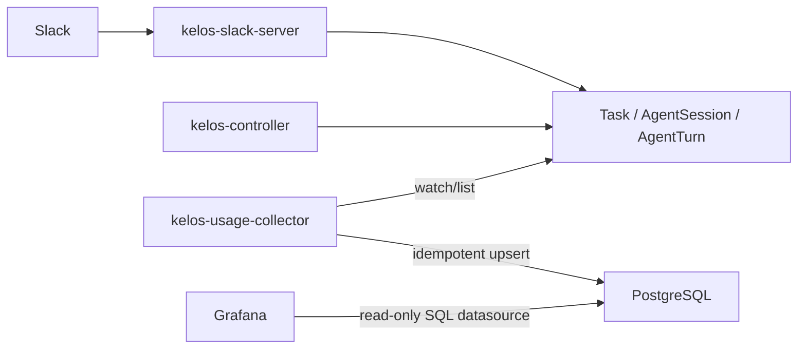

# Cody Usage Dashboard - PostgreSQL Implementation Spec

## Status

Draft implementation spec.

This spec covers a read-only Cody usage dashboard backed by ordinary
PostgreSQL. Grafana remains the UI. Prometheus, Loki, and Kubernetes resources
are useful for operational views and short backfills, but they are not the
durable product-analytics store for all-time Cody usage.

## Problem

Cody usage is currently observable only through short-retention systems:

- Prometheus metrics retain about 7 days in non-prod.
- Loki logs retain about 10 days in non-prod.
- Cody `Task` objects are deleted roughly 1 hour after completion.

That is not enough to answer product and adoption questions such as:

- How many Cody sessions have happened since launch?
- How many people have used Cody?
- Which personas are used most?
- How often does Cody fail?
- How long do Cody tasks take?
- How much token/cost volume does Cody consume over time?

The dashboard needs to be view-only and durable. It does not need controls,
mutation, replay, or workflow management.

## Decision

Add an optional `kelos-usage-collector` component that watches Kelos resources
and writes usage facts to plain PostgreSQL.

Use Grafana with a PostgreSQL datasource for dashboards.

Do not use TimescaleDB, ClickHouse, Loki, or Prometheus remote storage as the
durable analytics database. Loki is allowed only as a bounded backfill source.
Plain PostgreSQL is enough for the expected Cody event volume and is
operationally simpler.

## Goals

- Persist Cody usage history beyond observability retention windows.
- Support all-time counts, daily/weekly/monthly trends, and unique-user counts.
- Keep the dashboard read-only.
- Keep Cody runtime behavior independent from analytics writes.
- Avoid storing Slack message bodies or prompts.
- Avoid requiring TimescaleDB extensions.
- Use idempotent writes so restarts and watch reconnects do not duplicate data.
- Ship enough chart wiring for GitOps deployment.
- Make backfill explicit and bounded instead of pretending logs provide full
  history.
- Ship a one-off Loki backfill command for the currently retained log window.

## Non-Goals

- No custom dashboard web app.
- No dashboard-driven actions.
- No user-level permissions model inside Kelos.
- No Slack message text retention.
- No full audit log of agent output.
- No attempt to reconstruct usage before available logs/resources.
- No dependency on TimescaleDB.
- No billing-grade accounting in phase 1. Token and cost numbers are best-effort
  based on Kelos task results.

## Existing Signals

Kelos already exposes useful runtime data:

- `Task` metadata and status.
- `Task` Slack annotations:
  - `kelos.dev/slack-reporting`
  - `kelos.dev/slack-channel`
  - `kelos.dev/slack-thread-ts`
  - `kelos.dev/slack-user-id`
- `Task` labels:
  - `kelos.dev/taskspawner`
  - `kelos.dev/slack-reporting`
- `Task.status.results`:
  - response
  - PR URL when present
  - token and cost fields when the agent image emits them.
- `AgentSession` and `AgentTurn` resources for session-enabled Slack threads.
- Controller Prometheus counters and histograms for recent operational views.

The durable collector should prefer Kelos resources over logs because resources
are structured and less brittle.

Current non-prod log path from `k8s-platform-gitops` `main`:

- `bases/alpheya-system/logging/logging.yaml` installs `alpheya-loki` and
  `alpheya-promtail`.
- `non-prod/alpheya-system/promtail-values.yaml` configures Promtail to push
  Kubernetes container logs to `http://alpheya-loki-gateway/loki/api/v1/push`.
- `non-prod/alpheya-system/loki-values.yaml` sets Loki retention to `10d`.
- Kelos agent output is ordinary pod stdout/stderr. Kelos also reads those pod
  logs itself to extract `---KELOS_OUTPUTS_START---` blocks into
  `Task.status.outputs` and `Task.status.results`.

So yes: current Kelos controller, Slack server, Cody tool, and Cody agent pod
logs should be available in Loki while they are inside the Loki retention
window. Loki is not durable enough for all-time usage history.

## Existing Platform PostgreSQL Patterns

`k8s-platform-gitops` `main` currently uses two relevant Postgres patterns:

1. **Small app-owned CNPG clusters** for platform tools and shared apps.
   Examples:
   - `non-prod/auth/pg-cluster.yaml`: `postgresql.cnpg.io/v1` `Cluster`,
     `instances: 1`, `bootstrap.initdb`, `managed-premium` storage,
     `monitoring.enablePodMonitor: true`, and a `pg-cluster` secret that
     exposes `DATABASE_URL`.
   - `non-prod/umami/pg-cluster.yaml`: same pattern with a smaller 10 GiB
     database.
   - `non-prod/platform-tools/assay/pg-cluster.yaml`: newer pattern with
     `pg-standard-trixie` `ImageCatalog`, `managed.roles`, separate
     `Database` CRs, `pg_stat_statements`, and app credentials from a secret.
   - `non-prod/alpheya-shared/temporal-psql/pg-cluster.yaml` and
     `non-prod/alpheya-shared/marquez-psql/pg-cluster.yaml`: larger CNPG
     clusters with Azure workload identity and Barman object-store backups.
2. **Azure Flexible Server / tenant database patterns** for tenant-facing
   application data. Those appear in `k8s-apps-gitops` and RisingWave configs,
   usually with credentials sourced from Azure Key Vault via ExternalSecrets.

`k8s-apps-gitops` `main` adds useful production patterns:

- Secrets are chosen by lifecycle: SealedSecrets for static values and
  ExternalSecrets for rotating credentials. Database URLs are moving toward
  ExternalSecrets with Key Vault keys shaped like
  `<env>--<service>--DATABASE-URL`.
- Tenant templates provision CNPG `Cluster`, separate CNPG `Database` CRs,
  PgBouncer `Pooler` resources, and a `pg-cluster-ca` certificate for clients
  using `sslmode=verify-full`.
- Some services use direct in-cluster `pg-cluster-rw` URLs. Grafana datasources
  in `k8s-platform-gitops/non-prod/alpheya-shared/grafana-values.yaml` already
  use the built-in Postgres datasource with `secureJsonData.password` and
  `jsonData.timescaledb: false`.

Recommendation for Cody phase 1:

- Use a **dedicated small CNPG cluster in `kelos-system`** for Cody usage.
  Cody usage is a platform-tool analytics store, not tenant application state,
  and the expected write volume is small. A dedicated cluster avoids coupling
  the dashboard to tenant databases or existing shared app databases.
- Use normal PostgreSQL only. Do not use TimescaleDB or pgvector.
- Use `pg_stat_statements` because the platform commonly enables it and it
  helps diagnose dashboard query cost.
- Use one app owner credential for `kelos-usage-collector` and one read-only
  credential for Grafana. Do not point Grafana at the owner credential.
- Source credentials from ExternalSecrets if the credentials are managed in
  Azure Key Vault. Use SealedSecrets only if this environment has not moved
  this class of secret to Key Vault yet.
- Start without PgBouncer. Add a Pooler later only if Grafana query fan-out or
  collector write concurrency creates connection pressure.
- Start without object-store backups if this remains non-prod and can be
  rebuilt from live collection plus bounded Loki retention. If Cody usage is
  treated as durable business history, add the same Barman/Azure workload
  identity backup pattern used by Temporal and Marquez before calling the data
  durable.

## Proposed Architecture



`kelos-usage-collector` is a separate binary and deployment. It should not live
inside `kelos-controller` or `kelos-slack-server` because analytics persistence
must not block task creation, Slack routing, or task reconciliation.

## Component: kelos-usage-collector

Add a new Go binary:

```text
cmd/kelos-usage-collector/main.go
```

The binary should support two command modes:

```text
kelos-usage-collector run
kelos-usage-collector backfill-loki
```

Responsibilities:

1. Connect to Kubernetes using in-cluster config.
2. Connect to PostgreSQL using `DATABASE_URL`.
3. Apply embedded idempotent migrations on startup by default.
4. List existing Kelos resources once on startup.
5. Watch `Task`, `AgentSession`, and `AgentTurn` resources.
6. Upsert sessions and turns into PostgreSQL.
7. Expose Prometheus metrics for collector health.

Recommended libraries:

- `sigs.k8s.io/controller-runtime` for manager/cache/client.
- `github.com/jackc/pgx/v5/pgxpool` for PostgreSQL.
- Existing Kelos API types for typed watches.

### Collector Runtime Flags

```text
--metrics-bind-address=:8080
--health-probe-bind-address=:8081
--leader-elect=false
--migrate=true
--namespace=
```

Environment:

```text
DATABASE_URL=postgres://...
KELOS_USAGE_CLUSTER=non-prod
KELOS_USAGE_INSTANCE=cody
```

Behavior:

- `--namespace` empty means watch all namespaces.
- `--migrate=true` runs embedded SQL migrations at startup.
- Missing `DATABASE_URL` is fatal.
- PostgreSQL write failure should mark readiness unhealthy and retry, but must
  not affect Cody runtime components.

## PostgreSQL Schema

Use ordinary tables, indexes, and views. Do not require extensions.

### `cody_usage_sessions`

One row per logical Cody Slack thread per TaskSpawner.

For one-shot Cody tasks, derive the logical session from Slack channel and
thread timestamp. For session-enabled Cody, use `AgentSession` when present.

```sql
CREATE TABLE IF NOT EXISTS cody_usage_sessions (
  session_id TEXT PRIMARY KEY,
  cluster TEXT NOT NULL,
  namespace TEXT NOT NULL,
  taskspawner_name TEXT NOT NULL,
  persona TEXT NOT NULL DEFAULT 'unknown',
  source TEXT NOT NULL DEFAULT 'slack',
  slack_team_id TEXT,
  slack_channel_id TEXT,
  slack_root_ts TEXT,
  first_user_id TEXT,
  first_seen_at TIMESTAMPTZ NOT NULL,
  last_activity_at TIMESTAMPTZ NOT NULL,
  first_task_name TEXT,
  agent_session_name TEXT,
  status TEXT NOT NULL DEFAULT 'active',
  created_at TIMESTAMPTZ NOT NULL DEFAULT now(),
  updated_at TIMESTAMPTZ NOT NULL DEFAULT now()
);
```

Indexes:

```sql
CREATE INDEX IF NOT EXISTS cody_usage_sessions_seen_idx
  ON cody_usage_sessions (first_seen_at);

CREATE INDEX IF NOT EXISTS cody_usage_sessions_taskspawner_idx
  ON cody_usage_sessions (taskspawner_name, first_seen_at);

CREATE INDEX IF NOT EXISTS cody_usage_sessions_user_idx
  ON cody_usage_sessions (first_user_id, first_seen_at);
```

### `cody_usage_turns`

One row per explicit Cody request/turn.

For one-shot tasks, a `Task` maps to one turn. For session-enabled threads,
`AgentTurn` maps to one turn and may also reference the task/job that executed
it.

```sql
CREATE TABLE IF NOT EXISTS cody_usage_turns (
  turn_id TEXT PRIMARY KEY,
  session_id TEXT NOT NULL REFERENCES cody_usage_sessions(session_id),
  cluster TEXT NOT NULL,
  namespace TEXT NOT NULL,
  taskspawner_name TEXT NOT NULL,
  persona TEXT NOT NULL DEFAULT 'unknown',
  source TEXT NOT NULL DEFAULT 'slack',
  slack_user_id TEXT,
  slack_channel_id TEXT,
  slack_thread_ts TEXT,
  slack_message_ts TEXT,
  task_name TEXT,
  task_uid TEXT,
  agent_turn_name TEXT,
  agent_turn_uid TEXT,
  agent_type TEXT,
  model TEXT,
  phase TEXT NOT NULL DEFAULT 'Pending',
  started_at TIMESTAMPTZ,
  completed_at TIMESTAMPTZ,
  duration_seconds DOUBLE PRECISION,
  input_tokens BIGINT,
  output_tokens BIGINT,
  total_tokens BIGINT,
  cost_usd NUMERIC(18, 8),
  pr_url TEXT,
  error_message TEXT,
  created_at TIMESTAMPTZ NOT NULL DEFAULT now(),
  updated_at TIMESTAMPTZ NOT NULL DEFAULT now()
);
```

Indexes:

```sql
CREATE INDEX IF NOT EXISTS cody_usage_turns_completed_idx
  ON cody_usage_turns (completed_at);

CREATE INDEX IF NOT EXISTS cody_usage_turns_started_idx
  ON cody_usage_turns (started_at);

CREATE INDEX IF NOT EXISTS cody_usage_turns_user_idx
  ON cody_usage_turns (slack_user_id, started_at);

CREATE INDEX IF NOT EXISTS cody_usage_turns_taskspawner_idx
  ON cody_usage_turns (taskspawner_name, started_at);

CREATE INDEX IF NOT EXISTS cody_usage_turns_phase_idx
  ON cody_usage_turns (phase, started_at);
```

### `cody_usage_collector_offsets`

Store collector bookkeeping and backfill progress.

```sql
CREATE TABLE IF NOT EXISTS cody_usage_collector_offsets (
  source TEXT PRIMARY KEY,
  cursor TEXT,
  updated_at TIMESTAMPTZ NOT NULL DEFAULT now()
);
```

### Views for Grafana

Provide stable query surfaces so dashboards are not coupled to every raw column.

```sql
CREATE OR REPLACE VIEW cody_usage_daily AS
SELECT
  date_trunc('day', COALESCE(started_at, created_at)) AS day,
  taskspawner_name,
  persona,
  count(*) AS turns,
  count(DISTINCT session_id) AS sessions,
  count(DISTINCT slack_user_id) FILTER (WHERE slack_user_id IS NOT NULL) AS users,
  count(*) FILTER (WHERE phase = 'Succeeded') AS succeeded,
  count(*) FILTER (WHERE phase = 'Failed') AS failed,
  avg(duration_seconds) FILTER (WHERE duration_seconds IS NOT NULL) AS avg_duration_seconds,
  percentile_disc(0.95) WITHIN GROUP (ORDER BY duration_seconds)
    FILTER (WHERE duration_seconds IS NOT NULL) AS p95_duration_seconds,
  sum(input_tokens) AS input_tokens,
  sum(output_tokens) AS output_tokens,
  sum(cost_usd) AS cost_usd
FROM cody_usage_turns
GROUP BY 1, 2, 3;
```

This uses PostgreSQL built-ins only.

## ID and Upsert Rules

### Session ID

For Slack-backed usage:

```text
sha256(cluster + "\n" + namespace + "\n" + taskspawner + "\n" + channel_id + "\n" + root_thread_ts)
```

Use the first 24 hex characters as the stored ID prefix:

```text
slack-<sha24>
```

If Slack annotations are missing, fall back to:

```text
task-<task-uid>
```

### Turn ID

Preferred order:

1. `agentturn-<agent_turn_uid>` for `AgentTurn`.
2. `task-<task_uid>` for one-shot `Task`.
3. `task-<namespace>-<task_name>` only if UID is missing.

### Upserts

All writes must be idempotent:

```sql
INSERT ... ON CONFLICT (turn_id) DO UPDATE SET ...
```

The collector may see the same resource many times as status changes. It should
update the same row, not append duplicates.

## Field Mapping

### Persona

Derive from `taskspawner_name` initially:

| TaskSpawner pattern | Persona |
| --- | --- |
| contains `debug-alpha` | `debug-alpha` |
| contains `debug` | `debug` |
| contains `dev` | `dev` |
| contains `review` | `review` |
| contains `ticket` | `ticket` |
| otherwise | `unknown` |

Later, add an optional label on `TaskSpawner`:

```yaml
metadata:
  labels:
    kelos.dev/persona: debug
```

The collector should prefer the label when present and fall back to the name
heuristic.

### Timing

For `Task`:

- `started_at` = `Task.status.startTime`
- `completed_at` = `Task.status.completionTime`
- `duration_seconds` = completion minus start when both exist.

For `AgentTurn`:

- Use `AgentTurn.status.startTime` and `completionTime` if present.
- If the current API lacks one of those fields, leave null and rely on the
  associated `Task` when available.

### Tokens and Cost

Read from `Task.status.results` using a tolerant parser. Accept these keys if
present:

```text
input_tokens
output_tokens
total_tokens
cost_usd
```

Also accept camelCase variants if existing agent images emit them:

```text
inputTokens
outputTokens
totalTokens
costUSD
```

Invalid numeric values should be ignored and counted as collector parse errors.
Do not fail the entire reconcile.

### Content Exclusion

Do not store:

- Slack message text.
- Prompt text.
- Agent response text.
- Thread transcript.
- Secret names or secret values.

Store only stable identifiers and aggregate-friendly metadata.

## Migrations

Place migrations under:

```text
internal/usage/migrations/
```

Embed them in the collector binary.

Add a small migration table:

```sql
CREATE TABLE IF NOT EXISTS cody_usage_schema_migrations (
  version TEXT PRIMARY KEY,
  applied_at TIMESTAMPTZ NOT NULL DEFAULT now()
);
```

Migration behavior:

- Run in lexical order.
- Wrap each migration in a transaction.
- Insert version after success.
- Fail fast if a migration fails.
- Allow `--migrate=false` for environments that require DBAs to apply SQL.

## Kubernetes and Helm Changes

Add image build target:

```text
cmd/kelos-usage-collector
```

Update `IMAGE_DIRS` in the Makefile.

Add chart values:

```yaml
usageCollector:
  enabled: false
  image: ghcr.io/kelos-dev/kelos-usage-collector
  replicas: 1
  databaseSecretName: ""
  databaseURLKey: DATABASE_URL
  clusterName: ""
  instanceName: cody
  migrate: true
  resources:
    requests:
      cpu: 20m
      memory: 64Mi
    limits:
      cpu: 250m
      memory: 256Mi
```

Add templates:

```text
internal/manifests/charts/kelos/templates/usage-collector.yaml
internal/manifests/charts/kelos/templates/usage-collector-rbac.yaml
```

RBAC should be read-only:

- `get`, `list`, `watch` on `tasks`, `taskspawners`, `agentsessions`,
  `agentturns`.

No secret access is needed except the deployment's own `DATABASE_URL` secret
mount through `env.valueFrom.secretKeyRef`.

## Grafana Dashboard

Grafana should query PostgreSQL directly.

Recommended dashboard panels:

1. All-time sessions.
2. All-time unique users.
3. Sessions per day.
4. Turns per day.
5. DAU / WAU / MAU.
6. Usage by persona.
7. Usage by Slack channel.
8. Success and failure rate.
9. P50 / p95 duration.
10. Token usage by day.
11. Estimated cost by day.
12. Recent failures table.

Example SQL:

```sql
SELECT count(*) FROM cody_usage_sessions;
```

```sql
SELECT count(DISTINCT slack_user_id)
FROM cody_usage_turns
WHERE slack_user_id IS NOT NULL;
```

```sql
SELECT
  date_trunc('day', started_at) AS day,
  count(DISTINCT slack_user_id) AS active_users
FROM cody_usage_turns
WHERE started_at IS NOT NULL
GROUP BY 1
ORDER BY 1;
```

```sql
SELECT
  date_trunc('day', started_at) AS day,
  persona,
  count(*) AS turns
FROM cody_usage_turns
WHERE started_at IS NOT NULL
GROUP BY 1, 2
ORDER BY 1, 2;
```

The dashboard JSON likely belongs in the GitOps repo that owns Grafana
provisioning for Alpheya. Kelos should document and optionally ship a generic
dashboard artifact, but Alpheya-specific datasource UID, folder, and access
control should live in `k8s-platform-gitops`.

## Alpheya GitOps Rollout

Expected `k8s-platform-gitops` changes:

1. Add a dedicated CNPG cluster manifest for Cody usage under
   `non-prod/kelos`.
2. Add app and read-only database credentials using ExternalSecret or
   SealedSecret, matching the environment's current secret source.
3. Enable `usageCollector` in the Kelos HelmRelease values.
4. Add a Grafana PostgreSQL datasource using the read-only credential.
5. Add a read-only Cody usage dashboard.
6. Restrict dashboard write access through Grafana folder permissions.

Example CNPG manifest:

```yaml
apiVersion: postgresql.cnpg.io/v1
kind: Cluster
metadata:
  name: cody-usage-pg
  namespace: kelos-system
spec:
  instances: 1
  imageCatalogRef:
    apiGroup: postgresql.cnpg.io
    kind: ImageCatalog
    name: pg-standard-trixie
    major: 17
  affinity:
    nodeSelector:
      dedicated: alpheyaplatform
  postgresql:
    shared_preload_libraries:
      - pg_stat_statements
    parameters:
      shared_buffers: 128MB
      maintenance_work_mem: 128MB
      effective_cache_size: 512MB
      work_mem: 8MB
      max_connections: "100"
  bootstrap:
    initdb:
      database: cody_usage
      owner: cody_usage
      secret:
        name: cody-usage-postgres
      postInitApplicationSQL:
        - "CREATE EXTENSION IF NOT EXISTS pg_stat_statements;"
  managed:
    roles:
      - name: cody_usage
        ensure: present
        login: true
        passwordSecret:
          name: cody-usage-postgres
      - name: cody_usage_readonly
        ensure: present
        login: true
        passwordSecret:
          name: cody-usage-postgres-readonly
  storage:
    storageClass: managed-premium
    size: 20Gi
  resources:
    requests:
      memory: 256Mi
      cpu: 100m
    limits:
      memory: 1Gi
      cpu: 500m
  monitoring:
    enablePodMonitor: true
  enablePDB: false
```

If `pg-standard-trixie` is not available in the target cluster, either add the
same `ImageCatalog` pattern already used by `platform-tools/assay` or omit
`imageCatalogRef` and use the CNPG default image.

The application secret should expose:

```text
username
password
DATABASE_URL=postgres://cody_usage:<password>@cody-usage-pg-rw.kelos-system.svc.cluster.local:5432/cody_usage?sslmode=disable
```

The Grafana read-only secret should expose:

```text
username
password
DATABASE_URL=postgres://cody_usage_readonly:<password>@cody-usage-pg-rw.kelos-system.svc.cluster.local:5432/cody_usage?sslmode=disable
```

The first migration should grant Grafana read-only access:

```sql
GRANT CONNECT ON DATABASE cody_usage TO cody_usage_readonly;
GRANT USAGE ON SCHEMA public TO cody_usage_readonly;
GRANT SELECT ON ALL TABLES IN SCHEMA public TO cody_usage_readonly;
GRANT SELECT ON ALL SEQUENCES IN SCHEMA public TO cody_usage_readonly;
ALTER DEFAULT PRIVILEGES IN SCHEMA public
  GRANT SELECT ON TABLES TO cody_usage_readonly;
```

If the platform requires TLS for this datasource, switch the connection strings
to `sslmode=require` or `sslmode=verify-full` and mount the CNPG CA secret in
the same style used by the `k8s-apps-gitops` tenant templates. For phase 1,
`sslmode=disable` matches the existing in-cluster Grafana Postgres datasources
in `k8s-platform-gitops`.

Example Grafana datasource:

```yaml
- name: cody_usage
  type: postgres
  uid: cody_usage
  url: cody-usage-pg-rw.kelos-system.svc.cluster.local:5432
  user: cody_usage_readonly
  secureJsonData:
    password: $cody_usage_readonly_password
  jsonData:
    database: cody_usage
    sslmode: "disable"
    maxOpenConns: 10
    maxIdleConns: 2
    maxIdleConnsAuto: true
    connMaxLifetime: 14400
    postgresVersion: 1700
    timescaledb: false
```

Example values patch:

```yaml
spec:
  values:
    usageCollector:
      enabled: true
      databaseSecretName: cody-usage-postgres
      databaseURLKey: DATABASE_URL
      clusterName: non-prod
      instanceName: cody
```

## Backfill

Phase 1 should start collecting from deployment time onward.

The first implementation should also include a bounded Loki backfill command.

Example:

```bash
kelos-usage-collector backfill-loki \
  --database-url "$DATABASE_URL" \
  --loki-url "http://alpheya-loki-gateway.alpheya-system.svc.cluster.local" \
  --loki-tenant-id "1" \
  --cluster non-prod \
  --instance cody \
  --namespace kelos-system \
  --from 2026-05-01T00:00:00Z \
  --to 2026-05-23T00:00:00Z \
  --dry-run
```

Required flags:

- `--database-url` or `DATABASE_URL`.
- `--loki-url`.
- `--cluster`.
- `--instance`.
- `--namespace`.
- `--from`.
- `--to`.

Optional flags:

- `--loki-tenant-id`: sends `X-Scope-OrgID` when configured.
- `--agent-query`: override the agent-pod LogQL selector.
- `--slack-query`: override the Slack server LogQL selector.
- `--controller-query`: override the Kelos controller LogQL selector.
- `--limit`: Loki page size, default `5000`.
- `--parallelism`: number of query workers, default `2`.
- `--checkpoint-key`: key in `cody_usage_collector_offsets`.
- `--dry-run`: parse and summarize without writing to PostgreSQL.

Default LogQL selectors:

```logql
{namespace="kelos-system", container=~"codex|claude-code|gemini|opencode|cursor"}
{namespace="kelos-system", container="slack-server"}
{namespace="kelos-system", container="manager"}
```

Backfill behavior:

- Query existing `Task` objects at collector startup. This only covers objects
  not yet deleted by TTL.
- Query Loki using `/loki/api/v1/query_range` in forward time order.
- Page through the requested range without loading the full response into
  memory.
- Group agent log entries by stream labels such as `namespace`, `pod`, and
  `container`.
- Infer `task_name` from a Kelos task label when present; otherwise use the pod
  name fallback by stripping the final Kubernetes Job pod suffix.
- Parse `---KELOS_OUTPUTS_START---` blocks with the existing Kelos output
  parser and map values through the same `Task.status.results` parser.
- Parse Codex-style summary lines such as `[usage]` and `[result]` only as a
  fallback when a Kelos outputs block is missing.
- Parse `slack-server` structured logs for channel, user, spawner, and
  thread fields only when they are present in the same event or can be
  correlated with high confidence.
- Upsert with deterministic IDs prefixed with `loki-` when the original
  Kubernetes UID is not available.
- Set `source='loki'` for rows created only from logs.
- Do not overwrite richer rows already created from live Kubernetes resources
  unless the Loki row fills a null metric field such as token counts, cost, or
  PR URL.
- Store no raw log lines, prompts, Slack message bodies, or agent response text.

Current non-prod Loki log shapes verified on 2026-05-23:

- Loki labels available on Kelos streams include `namespace`, `pod`,
  `container`, `job`, `app`, `component`, `service_name`, `stream`,
  `filename`, `node_name`, and parsed `level` for JSON logs.
- One-shot Cody agent logs use `container="codex"` and labels where `app`,
  `service_name`, and `job` contain the task/job name, for example
  `cody-debug-slack-slack-<hash>`.
- One-shot agent stdout contains the existing Kelos output markers:
  `---KELOS_OUTPUTS_START---` and `---KELOS_OUTPUTS_END---`.
- One-shot agent stdout currently includes structured output lines such as
  `input-tokens: <n>` and `output-tokens: <n>`. Other `Task.status.results`
  keys should still be parsed when present.
- Slack routing logs use `container="slack-server"` and JSON log lines.
  Useful messages:
  - `Message matches TaskSpawner - creating task` with `spawner`,
    `namespace`, `channel`, and `user`.
  - `Created task from Slack message` with `task` and `spawner`.
  - `Message matches session-enabled TaskSpawner - creating AgentSession turn`
    with `spawner`, `namespace`, `channel`, and `user`.
  - `Posting Slack accepted reply for AgentTurn`, `Updating Slack accepted
    reply with AgentTurn terminal result`, and `Posting Slack terminal reply
    for AgentTurn` with `turn` and `channel`.
- Controller logs use `container="manager"` and JSON log lines. Useful
  messages include `created Job`, with the `Task` object name and job name.
- Treat the `msg` strings above as examples. Match stable message prefixes and
  required JSON fields instead of depending on the exact dash character or full
  prose.

Backfill correlation rules from those shapes:

- For one-shot tasks, prefer live `Task` CRs when they still exist; they carry
  Slack annotations and exact phase/timing. If the `Task` was TTL-deleted, use
  the Loki agent stream labels to recover `task_name` and parse output metrics
  from stdout.
- Correlate one-shot Slack metadata by matching `Created task from Slack
  message` to the nearest preceding `Message matches TaskSpawner - creating
  task` log on the same Slack server pod and same spawner within a small
  window, such as 5 seconds. If there are multiple distinct channel/user
  candidates, leave Slack fields null and count the row as partial.
- For session-enabled Cody, derive `turn_id` from Slack turn reporter logs,
  for example `cody-session-slack-sess-<hash>-t-0001`. Derive `session_id`
  from the turn-name prefix before `-t-`.
- Use `Posting Slack accepted reply for AgentTurn` as the best available
  Loki-only turn start time, and terminal Slack turn reporter logs as the best
  available Loki-only completion time.
- Correlate session turn users by matching the accepted-turn log to the nearest
  preceding `Message matches session-enabled TaskSpawner - creating
  AgentSession turn` log on the same Slack server pod and channel. If ambiguous,
  leave `slack_user_id` null.
- Current session-runner logs do not expose token/cost fields in Loki. Session
  token/cost backfill should come from live `AgentTurn` resources when present,
  or remain null for Loki-only rows.
- Do not infer Slack root thread timestamp from current Loki logs. It is not
  present in the sampled routing/reporter log lines. Use the live CR annotation
  when available; otherwise leave `slack_thread_ts` null for Loki-only rows.

Expected limitations:

- Loki can only backfill the current retention window. In non-prod that is
  currently `10d`.
- Deleted `Task` CRs cannot contribute exact Kubernetes UIDs.
- If Slack user/channel/thread annotations are not present in log lines, the
  backfill must leave those columns null instead of guessing.
- User-count panels should distinguish exact live-collector data from partial
  Loki-backfilled rows when `slack_user_id` is null.

Do not call this "entire history" until the collector has been running since
the beginning of the measured period.

## Privacy and Data Handling

The first implementation stores Slack IDs, not display names.

Rationale:

- Counting unique users only requires `slack_user_id`.
- Display names and emails are not necessary for adoption metrics.
- Slack user IDs can be joined externally by an authorized operator when needed.

If a named leaderboard is ever requested, add a separate opt-in dimension table:

```sql
cody_usage_users(slack_user_id, display_name, last_seen_at)
```

That is intentionally out of scope for phase 1.

## Collector Metrics

Expose these Prometheus metrics:

```text
kelos_usage_collector_events_processed_total{resource,result}
kelos_usage_collector_db_writes_total{table,result}
kelos_usage_collector_parse_errors_total{field}
kelos_usage_collector_last_successful_write_timestamp_seconds
```

These are operational health metrics only. They are not the long-term usage
store.

## Failure Modes

| Failure | Behavior |
| --- | --- |
| PostgreSQL unavailable | Collector retries, readiness fails, Cody runtime unaffected |
| Migration fails | Collector exits non-zero |
| Missing Slack annotations | Store task-level fallback session and count parse warning |
| Duplicate watch events | Upsert same row |
| Collector restart | Startup list reconciles current resources |
| Old resources already TTL-deleted | Cannot recover without log backfill |
| Invalid token/cost values | Ignore value, increment parse-error metric |

## Testing Plan

Unit tests:

- Session ID derivation from Slack annotations.
- Turn ID derivation from `Task` and `AgentTurn`.
- Persona derivation from label and fallback name heuristic.
- Token/cost parsing.
- Loki stream grouping and task-name inference.
- Loki outputs block parsing without storing raw log lines.
- SQL upsert statements are idempotent.
- No prompt/message/response content is written.

Integration tests:

- Use a real PostgreSQL container when available.
- Apply migrations twice.
- Upsert a pending task, then update it to succeeded.
- Verify one turn row exists and terminal fields were updated.
- Upsert two tasks in one Slack thread and verify one session with two turns.

Controller-runtime fake client tests:

- Startup list handles existing tasks.
- Watch/reconcile handles status updates.
- Missing database URL fails startup.

E2E:

- Optional and not required for the first PR. Local e2e needs a cluster,
  PostgreSQL, and a Slack-like task fixture.

## Implementation Steps

1. Add `internal/usage` package with schema migrations, ID derivation, mappers,
   and repository interface.
2. Add `cmd/kelos-usage-collector`.
3. Add unit tests for mapping and parsing.
4. Add `backfill-loki` command mode using Loki `query_range`.
5. Add PostgreSQL integration tests behind the existing test tooling.
6. Add Dockerfile and Makefile image target.
7. Add Helm values and templates.
8. Add chart render tests for disabled/enabled collector modes.
9. Add docs in the Helm chart README.
10. Add an example Grafana dashboard JSON or SQL query reference.
11. Create the Alpheya GitOps rollout PR separately.

## Acceptance Criteria

- A cluster can run Kelos with `usageCollector.enabled=false` with no behavior
  change.
- When enabled with a valid `DATABASE_URL`, the collector creates or migrates
  the schema.
- A Slack-triggered Cody `Task` creates one session row and one turn row.
- A second Cody `Task` in the same Slack thread creates a second turn under the
  same session.
- Completed tasks update phase, completion time, duration, tokens, cost, and PR
  URL when available.
- Collector restarts do not duplicate rows.
- `kelos-usage-collector backfill-loki --dry-run` reports parsed sessions,
  turns, skipped streams, and rows that would be upserted.
- `kelos-usage-collector backfill-loki` can populate rows from retained Loki
  logs without storing raw log content.
- The dashboard can answer all-time sessions and all-time unique users from
  PostgreSQL alone.
- No Slack message body, prompt body, or agent response body is stored.

## Open Questions

- Should the first non-prod Cody usage CNPG cluster include object-store
  backups from day one, or is live collection plus bounded Loki backfill enough
  until this is treated as durable business history?
- Should Cody usage be retained forever, or should there be a product-defined
  retention window such as 1 year?
- Should Slack channel IDs be mapped to readable channel names in phase 1, or
  left as IDs?
- Should production Cody, if introduced later, write to the same database with
  `cluster=prod`, or to a separate database?
