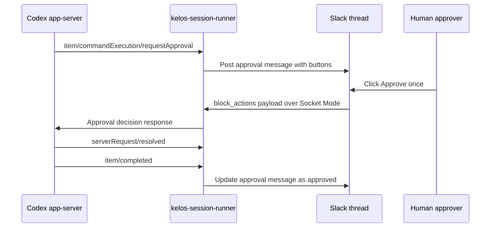
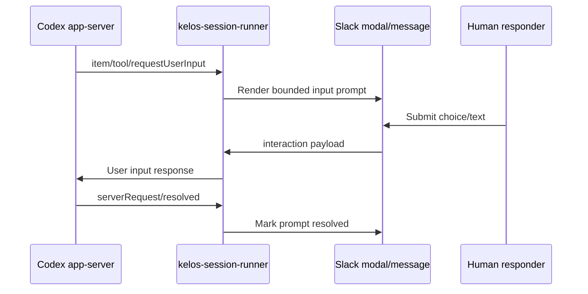

# Cody Slack Human-in-the-Loop Bridge

Date: 2026-05-25

Status: future design spec

Worktree: `cody/session-runtime-improvements-spec`

## Context

Cody Slack sessions currently treat Slack as a request and response surface:

1. a user explicitly mentions Cody;
2. Kelos starts or resumes a Codex app-server-backed session;
3. Cody eventually replies in Slack.

That model works for normal conversational turns, but it does not give Cody a
native way to pause for human decisions while a turn is running. Two cases would
benefit from a human-in-the-loop bridge:

- Codex permission prompts, if Cody stops running with broad/full permissions
  and instead asks before command execution, network access, or file changes.
- Bounded interactive prompts, where a command or tool needs one explicit input
  value or selection.

This spec is intentionally separate from the session runtime reliability spec.
It should not change the current reliability work or become a dependency for
that PR.

## Public Documentation Basis

- Slack interactive messages support Block Kit interactive components such as
  buttons and select menus in messages, and Slack delivers interaction payloads
  back to the app.
- Slack Socket Mode lets an app receive Events API and interactive payloads over
  WebSocket without exposing a public HTTP Request URL.
- Codex app-server exposes server-initiated requests for approvals and user
  input:
  - `item/commandExecution/requestApproval`
  - `item/fileChange/requestApproval`
  - `item/tool/requestUserInput`
  - `serverRequest/resolved`
- Codex app-server approval requests include `threadId` and `turnId`, which
  should be used to scope pending UI state to the active Cody session/turn.

References:

- <https://docs.slack.dev/messaging/creating-interactive-messages/>
- <https://docs.slack.dev/apis/events-api/using-socket-mode/>
- <https://developers.openai.com/codex/app-server>

## Goal

Allow Cody to pause a running Slack session turn, ask a human for a bounded
decision in Slack, send that decision back to Codex app-server, and then resume
the same turn.

## Non-Goals

- Do not turn Slack into a full terminal emulator.
- Do not support arbitrary long-running PTY sessions through Slack.
- Do not collect secrets through Slack modals or messages.
- Do not change the current `!session` UX by default.
- Do not enable approvals for normal Cody runs until the bridge is explicitly
  configured and tested.
- Do not add a dry-run mode or fallback execution path. If Cody asks for a
  decision and no valid decision arrives, the pending action should time out or
  be declined explicitly.

## Functional Requirements

### FR-001: Approval Prompt Rendering

When Codex app-server sends a command or file-change approval request, Kelos
must post a Slack message in the originating session thread with:

- action type: command execution, file change, or network access;
- Cody session and turn identity;
- sanitized command/file/network summary;
- optional Codex-provided reason;
- available decisions from the app-server request, when present;
- explicit action buttons.

Example Slack message:

```text
Cody is asking for approval

Action: command execution
Command: kubectl get pods -n kelos-system
Working directory: /workspace/repo
Reason: inspect current pod status

[Approve once] [Approve for this session] [Decline] [Cancel turn]
```

### FR-002: Decision Routing

When a user clicks a Slack action button, Kelos must:

- acknowledge the Slack interaction promptly;
- verify the pending request is still active;
- verify the Slack interaction belongs to the same channel/thread/session;
- map the Slack action to the Codex app-server decision payload;
- send the decision back on the same app-server connection;
- update the Slack prompt message with the final decision and approver.

### FR-003: File Change Approvals

For file-change approval requests, Kelos must show only a safe summary by
default:

- changed file count;
- file path list with truncation;
- root/grant information if present;
- Codex reason if present.

Kelos must not paste large diffs into Slack. A future enhancement can attach or
link a sanitized diff artifact, but Phase 1 should keep file-change prompts
bounded.

### FR-004: Command and Network Approvals

For command approval requests, Kelos must distinguish:

- normal shell command approval;
- network approval, when Codex provides network-specific context.

Network approval prompts should render host/protocol/port information rather
than pretending the request is a shell command preview.

### FR-005: Bounded User Input

When Codex app-server sends `item/tool/requestUserInput`, Kelos may render a
Slack prompt only if the request can be represented as one of:

- 1-3 short questions with fixed choices;
- one short free-form text response;
- a select menu with bounded options.

If the requested input is unbounded, secret-like, or terminal-like, Kelos must
decline or cancel the request with a clear Slack explanation.

### FR-006: Timeout Behavior

Every pending Slack human decision must have a timeout.

Recommended defaults:

- command/file approval: 15 minutes;
- user-input prompt: 30 minutes;
- session-level max pending prompt time: 30 minutes.

On timeout, Kelos must send a decline/cancel decision to Codex app-server and
update the Slack prompt message. It must not leave Codex blocked indefinitely.

### FR-007: Authorization

Phase 1 authorization should be conservative:

- the user who started the Cody session can approve/decline;
- optionally allow configured admin users or groups later;
- bot users cannot approve;
- decisions must record Slack user id, channel id, thread ts, session, turn,
  request id, and decision.

The authorization policy should be explicit configuration on the Slack/session
TaskSpawner path, not hard-coded.

### FR-008: Audit Trail

Kelos must persist a safe audit summary on the `AgentTurn` status and in
structured logs:

- request id;
- app-server event type;
- sanitized action summary;
- Slack message ts;
- approving/declining user id;
- decision;
- resolved timestamp;
- timeout/cancel reason when applicable.

Do not persist raw command output, full diffs, secrets, or Slack modal text for
secret-like fields.

## Runtime Flow

### Command Approval Flow



### Bounded User Input Flow



## Proposed Kelos Implementation Shape

### Controller and CRD Surface

Introduce explicit status for pending human prompts. This can live on
`AgentTurn.status` initially:

```yaml
status:
  pendingHumanInput:
    requestId: "..."
    codexThreadId: "..."
    codexTurnId: "..."
    eventType: "item/commandExecution/requestApproval"
    slackMessageTs: "..."
    expiresAt: "..."
    state: "pending"
```

If this grows beyond one prompt per turn, promote it to a dedicated
`AgentTurnHumanPrompt` resource. Phase 1 can support one active pending prompt
per turn because Codex approval prompts should be resolved before the blocked
item can continue.

### Session Runner

The session runner must:

- keep reading app-server events while waiting for Slack interaction;
- create a pending prompt record when approval/input is requested;
- block only the Codex response path, not the whole controller process;
- respond to Codex once Kelos receives a valid Slack decision;
- cancel/decline when the prompt expires;
- handle `serverRequest/resolved` by clearing pending state.

### Slack Server

The existing Kelos Slack server should handle interactive payloads in the same
Socket Mode connection used for Slack events.

It must route interaction payloads by a stable encoded action value containing:

- namespace;
- AgentSession name;
- AgentTurn name;
- Codex request id;
- decision/action id.

The encoded value must not contain secrets or raw commands.

### Slack Rendering

Use Block Kit messages for approvals:

- `section` blocks for summary;
- `context` block for Cody session/turn identity;
- `actions` block for buttons.

Use Slack modals only for bounded user input that needs text or a select menu.
Buttons are preferred for approvals because they keep the decision in the
thread and are easier to audit.

## Security Requirements

- Never render secrets, bearer tokens, private keys, kubeconfigs, or raw env
  vars into Slack.
- Redact command previews using the same redaction rules as session event logs.
- Treat approval buttons as privileged actions; verify the Slack user before
  sending a Codex decision.
- Never approve by default.
- On ambiguous state, expired prompt, missing turn, or unauthorized user,
  decline/cancel rather than continuing.
- Include enough audit metadata for incident review.

## Rollout Plan

1. Add passive event detection only:
   - log and status-record approval/user-input request events;
   - do not enable non-`never` approvals yet.
2. Add Slack rendering and interaction handling behind an explicit feature flag.
3. Enable bounded approval bridge for `!session` only in a non-prod route.
4. Move one approval category at a time:
   - command approvals;
   - file-change approvals;
   - network approvals;
   - bounded user input.
5. Only after successful session testing, consider replacing broad/full Cody
   permissions with approval-gated permissions.

## Acceptance Criteria

- Cody can pause a running session turn for a command approval.
- A valid Slack user can approve or decline from the thread.
- Unauthorized Slack users cannot approve.
- Timeout declines/cancels the pending request and unblocks the turn.
- The same Cody turn resumes after approval without starting a new session.
- The Slack prompt is updated with the final decision.
- `AgentTurn.status` and structured logs contain an audit-safe decision record.
- No raw secrets, full command output, or large diffs are posted to Slack.

## Explicit Design Decision

Slack should become a human decision surface, not a terminal surface.

The bridge should support approvals and bounded inputs. It should not attempt
to proxy arbitrary PTY sessions, shell REPLs, editors, database consoles, or
multi-step terminal wizards through Slack. When Cody needs a real terminal, it
should either run the command correctly with an interactive session inside
Codex, or ask the user to run the terminal workflow manually and return with
the result.
