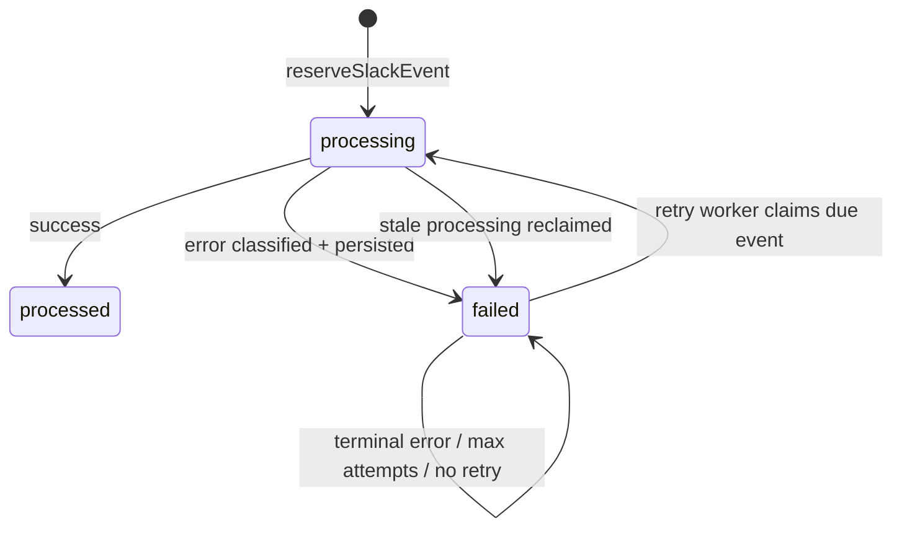
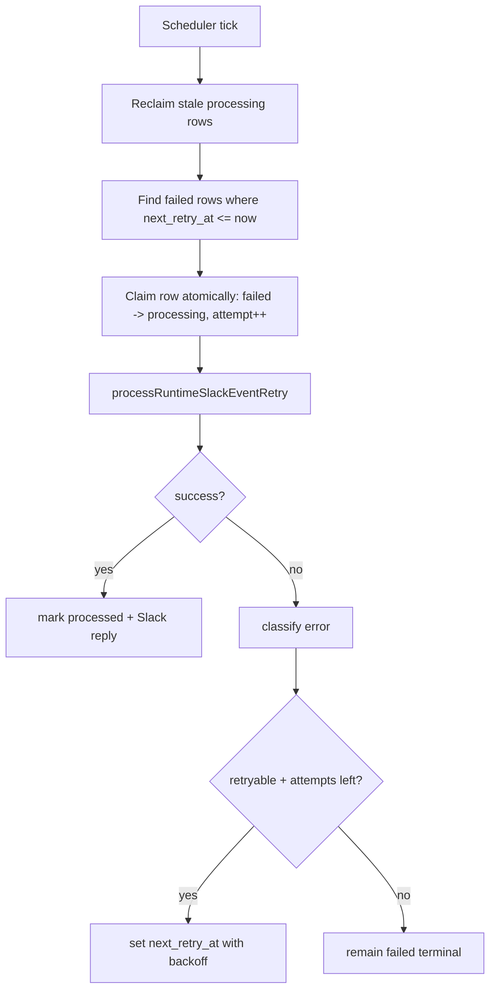
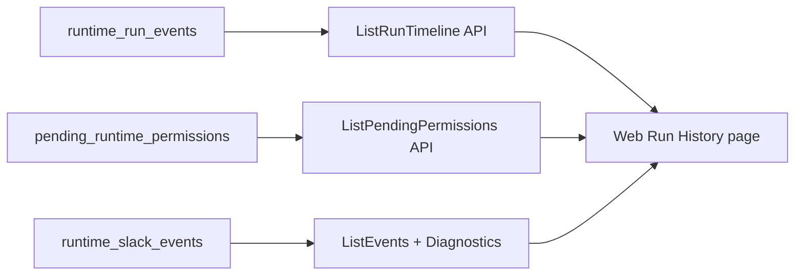

# Runtime Hardening Mental Model

## 1) Core Idea

Runtime correctness is now driven by **durable database state + deterministic workers + per-thread DB locks**.

There are 5 control planes:

1. Ingress/Dedupe plane (`runtime_slack_events`)
2. Session serialization plane (advisory lock per `session_key`)
3. Retry/Reclaim plane (periodic retry worker)
4. Permission lifecycle plane (`pending_runtime_permissions`)
5. Observability plane (`runtime_run_events` + ops APIs/UI)

---

## 2) End-to-End Processing Flow

```mermaid
flowchart TD
  A[Slack event] --> B[/webhooks/slack/events]
  B --> C[Fast ACK to Slack]
  C --> D[processSlackEventCallback]
  D --> E[Derive session_key from workspace/channel/thread]
  E --> F[withSessionLock(session_key)]
  F --> G[reserveSlackEvent in runtime_slack_events]
  G --> H{duplicate?}
  H -- yes --> I[Return stored response / ignore]
  H -- no --> J[startOrReuseSession]
  J --> K[Run OpenCode in E2B]
  K --> L[Persist runtime_messages + session state]
  L --> M[Mark slack event processed]
  M --> N[Post/update Slack reply]
```

---

## 3) Dedupe + Failure State Machine



Rules:

1. Insert collision is treated as duplicate only on Postgres unique violation (`23505`).
2. Any other insert failure is treated as storage error.
3. Failed events store `last_error_code`, `last_error_message`, `next_retry_at`.

---

## 4) Retry/Reclaim Worker



---

## 5) Permission Lifecycle Is Durable

```mermaid
flowchart TD
  A[OpenCode emits permission.asked] --> B[upsert pending_runtime_permissions]
  B --> C[User sends @App approve/deny in thread]
  C --> D[Load latest pending row from DB]
  D --> E[replyToOpenCodePermission]
  E --> F[resolve row -> approved/denied]
  G[@App terminate or session completion] --> H[expire pending rows]
```

What this fixes:

1. Restart-safe permission handling
2. No in-memory permission loss
3. Explicit TTL and status transitions

---

## 6) Session/Sandbox Model

1. A Slack thread maps to one `session_key`.
2. One active run at a time per `session_key` via DB advisory lock.
3. Session stores sandbox/runtime IDs in `runtime_sessions`.
4. `@App terminate` kills sandbox, ends session, expires pending permissions.

---

## 7) Timeout Hardening

1. Startup policy enforces:
   - `E2B_SANDBOX_TIMEOUT_MS >= AGENT_SESSION_IDLE_MINUTES * 60000`
2. Retry policy sanity checks are also enforced.
3. During long runs, sandbox TTL is extended via `sandbox.setTimeout(...)`.

---

## 8) Visibility/Ops Model



Operators can now inspect:

1. Pending permission queue
2. Run timeline events
3. Failed events and retry actions
4. Diagnostics snapshot for copy/share

---

## 9) One-Line Mental Model

Each Slack turn is a durable event record, processed under a per-thread DB lock, retried by a worker when transiently failed, with permission state and run timeline persisted so critical behavior is not in-memory-only.
