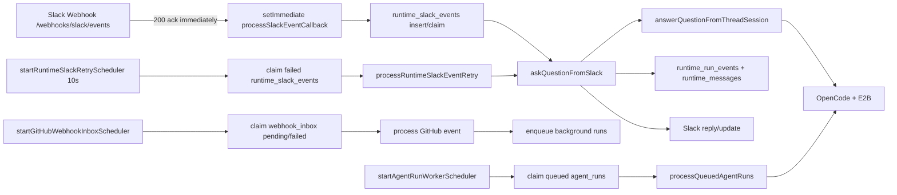
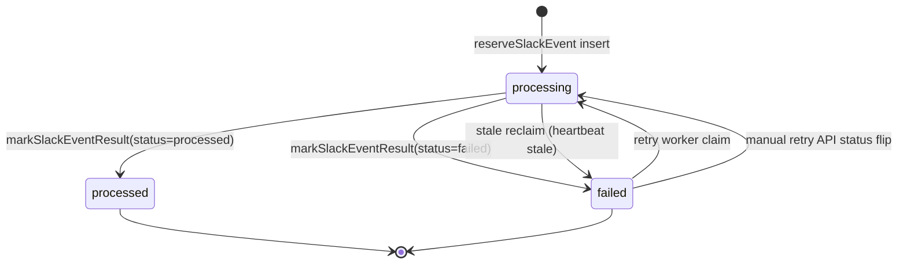
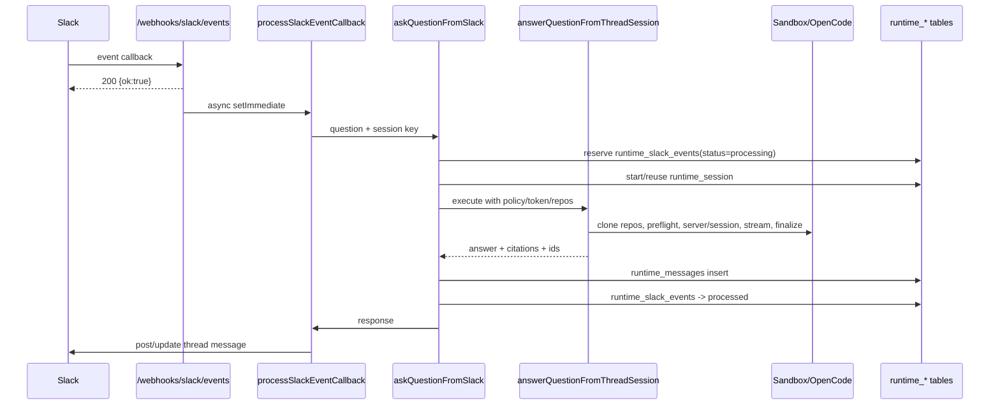
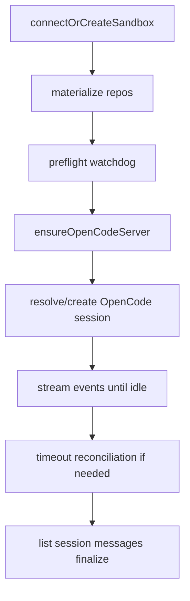
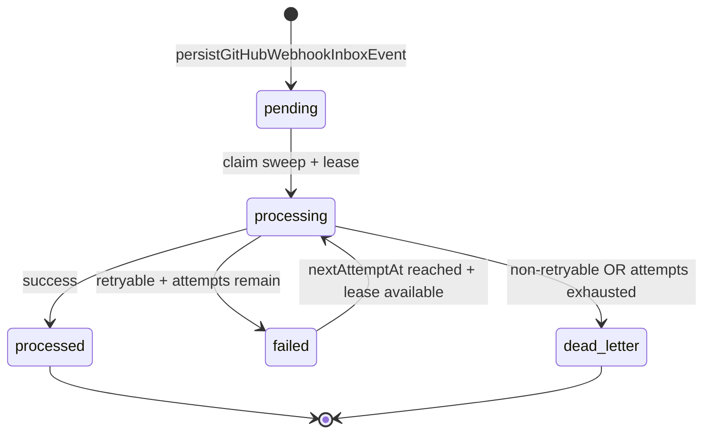
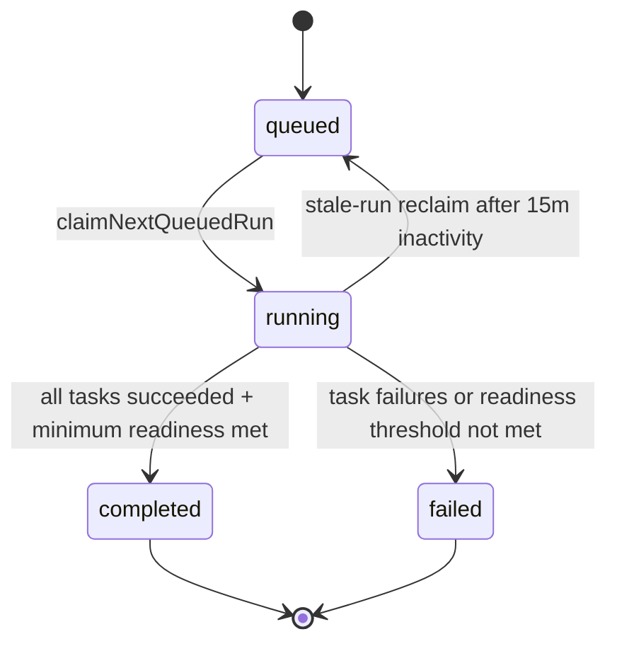

# Timeouts, Error Paths, and Retry Behavior: Current-State Mental Model

Date: 2026-04-01  
Status: Current-state reference (implementation-aligned)  
Audience: Product + engineering planning and reliability design

## 1) Why this doc exists

This document explains how the current BFF runtime behaves end-to-end under normal execution, slowdowns, timeouts, provider failures, and retries.

The goal is not to propose fixes yet. The goal is to provide a precise mental model of what happens today.

## 2) Scope covered

This doc covers these production paths:

1. Slack event ingress to thread runtime execution.
2. OpenCode/E2B sandbox lifecycle and stage-level timeout behavior.
3. Runtime event persistence (`runtime_slack_events`, `runtime_run_events`) and automatic retry flow.
4. Runtime manual retry/terminate operations from Runtime Visibility APIs.
5. Background agent run queue/lock/termination behavior.
6. GitHub webhook inbox claim/retry/dead-letter behavior.
7. Onboarding bootstrap worker stale-run reclaim and retry-related behavior.

## 3) Big-picture execution loops

## 4) Core timeout budgets and cadence knobs

## 4.1 Environment-configurable defaults

| Knob | Default | Used for |
|---|---:|---|
| `OPENCODE_RUN_TIMEOUT_MS` | `240000` | Max stream run window for thread/background OpenCode run stage |
| `OPENCODE_PREFLIGHT_HARD_TIMEOUT_MS` | `180000` | Preflight watchdog hard stop |
| `OPENCODE_PREFLIGHT_PROGRESS_GRACE_MS` | `20000` | Allow continued wait if preflight progress observed |
| `OPENCODE_HEALTHCHECK_INTERVAL_MS` | `500` | Preflight/server health polling cadence |
| `OPENCODE_HEALTHCHECK_TIMEOUT_MS` | `2000` | `/global/health` fetch timeout |
| `OPENCODE_STREAM_IDLE_GRACE_MS` | `20000` | Timeout reconciliation reconnect window |
| `OPENCODE_STREAM_RECONNECT_ATTEMPTS` | `1` | Number of reconnect attempts after stream timeout |
| `E2B_SANDBOX_TIMEOUT_MS` | `300000` | Sandbox lifetime timeout set at create/connect |
| `E2B_DEBUG_KEEPALIVE_MINUTES` | `0` | Optional keepalive extension for debugging |
| `RUNTIME_PROCESSING_HEARTBEAT_SECONDS` | `10` | Heartbeat tick for processing events/sessions |
| `RUNTIME_PROCESSING_STALE_SECONDS` | `420` | Stale-processing reclaim threshold |
| `RUNTIME_RETRY_INTERVAL_SECONDS` | `10` | Retry worker sweep interval |
| `RUNTIME_RETRY_MAX_ATTEMPTS` | `5` | Max automatic retries per slack event |
| `RUNTIME_RETRY_BASE_DELAY_SECONDS` | `5` | Exponential retry base delay |
| `RUNTIME_RETRY_MAX_DELAY_SECONDS` | `120` | Exponential retry cap |
| `RUNTIME_PERMISSION_TTL_MINUTES` | `30` | Pending runtime permission expiration |
| `GITHUB_WEBHOOK_INBOX_INTERVAL_SECONDS` | `5` | GitHub inbox sweep interval |
| `GITHUB_WEBHOOK_INBOX_MAX_ATTEMPTS` | `8` | GitHub inbox max processing attempts |
| `GITHUB_WEBHOOK_INBOX_LEASE_SECONDS` | `120` | GitHub inbox row lease |
| `AGENT_RUN_WORKER_INTERVAL_SECONDS` | `5` | Background run worker cadence |
| `AGENT_RUN_LOCK_LEASE_SECONDS` | `900` | Background run lock heartbeat lease window |

## 4.2 Hardcoded request/command timeouts in code paths

| Path | Timeout |
|---|---:|
| Generic OpenCode JSON request (`fetchOpenCodeJson`) | `20000ms` default if caller does not override |
| OpenCode no-body request (`fetchOpenCodeNoBody`) | `20000ms` |
| OpenCode SSE connect | `60000ms` |
| Repo clone in sandbox | `180000ms` |
| Repo `git rev-parse` | `20000ms` |
| OpenCode config write | `10000ms` |
| Slack OAuth exchange | `10000ms` |
| Slack `users.conversations` | `10000ms` |
| Slack `chat.postMessage` | `10000ms` |
| Slack `chat.update` | `10000ms` |
| GitHub API requests | `15000ms` |

## 5) Thread runtime: state machine and failure paths

## 5.1 `runtime_slack_events` state machine (implemented behavior)

Notes:

1. Dedupe key is `(workspace_id, event_id)` unique.
2. Duplicate delivery with existing `response_json` returns deduped response.
3. Duplicate delivery without result returns `ignoredReason=duplicate_event_without_result`.
4. Manual retry API currently flips row state to `processing`; it does not itself execute the run inline.

## 5.2 Thread runtime sequence (normal path)

## 5.3 Thread runtime failure classes and what happens

| Failure site | Example error | Classification | Event status | Auto retry? | User-facing message path |
|---|---|---|---|---|---|
| OpenCode/E2B run stage | `deadline_exceeded`, `timed out` | `timeout` (transient) | `failed` with `nextRetryAt` | Yes until `attemptCount < RUNTIME_RETRY_MAX_ATTEMPTS` | Slack thread gets formatted error text |
| OpenCode message fetch path | `opencode /session/.../message timed out after 20000ms` | `timeout` (transient) | `failed` | Yes | Slack thread gets raw error string (except preflight-special handling) |
| Preflight stuck | `[preflight_stuck] ...` | `timeout` (transient) | `failed` | Yes | Special friendly message: startup taking longer, retry suggested |
| `terminated` message | `terminated` | `unknown` (non-transient) | `failed` | No | Slack thread shows raw `terminated` |
| Missing definition/allowlist/etc | precondition messages | often non-transient | `failed` | Usually no | Slack thread shows error text |

## 6) Automatic retry flow (Slack runtime)

## 6.1 Worker logic

Retry scheduler runs every `RUNTIME_RETRY_INTERVAL_SECONDS` (default 10s):

1. Reclaim stale `processing` events older than `RUNTIME_PROCESSING_STALE_SECONDS`.
2. Mark reclaimed rows as `failed` with `lastErrorCode=timeout` and `lastErrorMessage=processing heartbeat stale`.
3. Claim due failed events where `nextRetryAt < now` and attempts below max.
4. Set claimed row to `processing`, increment `attemptCount`, clear `nextRetryAt`.
5. Re-run via `processRuntimeSlackEventRetry`.
6. On retry failure, reclassify and reschedule backoff if transient.

## 6.2 Backoff model

Delay = `min(base * 2^(attempt-1), max)`, where base/max are env knobs.

Default sequence (seconds): `5, 10, 20, 40, 80, 120...` (capped at 120).

## 6.3 Why retries can feel like loops in Slack

1. Original user message can fail and post an error.
2. Retry run can fail again and post another error in same thread.
3. This repeats until max attempts or non-transient classification.

## 7) OpenCode/E2B stage-level timeout model

## 7.1 Stage flow

## 7.2 Key timeout/error branches

1. Preflight watchdog hard timeout without progress throws `OpenCodePreflightError(preflight_stuck)`.
2. Stream phase times out at `OPENCODE_RUN_TIMEOUT_MS`, then tries reconciliation (`fetch session`, `fetch messages`, reconnect attempts).
3. Final message-list fetch uses OpenCode request default timeout (`20000ms`) when not explicitly overridden.
4. Any unhandled timeout bubbles up as runtime failure and is classified by `classifyRuntimeError`.

## 8) Background run path (non-thread)

## 8.1 Queue and lock behavior

1. Runs are inserted as `queued` with dedupe on `(agent_definition_id, trigger_rule_id, trigger_key)`.
2. Worker claims queued rows -> `starting`.
3. Worker tries per-agent lock (`agent_run_locks`) with lease heartbeat.
4. If lock unavailable, run is put back to `queued`.
5. On success path run transitions: `starting` -> `running` -> `completed`.
6. On failure path run transitions to `failed`.
7. User termination sets run to `terminated` and kills sandbox if present.

## 8.2 Retry behavior

1. There is no automatic retry loop for `agent_runs` similar to `runtime_slack_events`.
2. Retry is manual via `retryAgentRun` API, which creates a new queued run.

## 9) GitHub webhook inbox path

## 9.1 State machine

## 9.2 Retry model

1. Uses same runtime error classifier and backoff helper.
2. Retry only when code is retryable and attempts below `GITHUB_WEBHOOK_INBOX_MAX_ATTEMPTS`.
3. Otherwise event moves to `dead_letter`.

## 10) Onboarding bootstrap worker reliability model

## 10.1 Bootstrap run state

## 10.2 Stale reclaim

1. Running bootstrap runs stale for >15 minutes are requeued.
2. Running tasks for that run are reset to `queued`.
3. Onboarding state is pushed back to `bootstrap_queued`.
4. Worker loops every 10 seconds.

## 11) Error-code mapping layers

## 11.1 Runtime classification (`classifyRuntimeError`)

1. `preflight_stuck`, `preflight_health_unreachable`, `deadline_exceeded`, `timed out` -> `timeout` (transient).
2. `429`, `rate limit` -> `rate_limit` (transient).
3. network connection errors -> `network` (transient).
4. auth/permission/bad request/storage patterns -> non-transient typed codes.
5. unknown -> `unknown` (non-transient).

## 11.2 Connect API mapping examples

1. Onboarding: `OnboardingStateError` usually maps to `FailedPrecondition` unless invalid/notfound patterns are detected.
2. Codebase runtime connect API: unknown runtime exceptions map to `Code.Internal`.
3. Runtime visibility APIs: retry endpoints are rate-limited and throw `ResourceExhausted` when exceeded.

## 12) Where to inspect in production/debug sessions

## 12.1 Primary DB tables

1. `runtime_slack_events` for event status, attempts, next retry, last error.
2. `runtime_run_events` for coarse stage markers (`ingest`, `session`, `opencode_run`, `failure`, etc.).
3. `runtime_sessions` for active session/sandbox state and expiry.
4. `pending_runtime_permissions` for blocked/awaiting approvals.
5. `agent_runs`, `agent_run_events` for background workers.
6. `webhook_inbox` for GitHub webhook queue and dead-letter behavior.
7. `org_memory_bootstrap_runs`, `org_memory_bootstrap_tasks` for onboarding bootstrap reliability.

## 12.2 Log prefixes

1. `[slack-webhook]` ingress acceptance/rejection.
2. `[slack-runtime]` session, heartbeat, queue, policy, and post-processing events.
3. `[code-runtime]` OpenCode/E2B stage logs.
4. `[runtime-worker]` retry sweep and stale reclaim logs.
5. `[github-webhook]` inbox processing logs.
6. `[onboarding-bootstrap-worker]` bootstrap scheduler and stale reclaim logs.

## 13) Current-state caveats that affect reliability perception

1. Slack webhook is acknowledged before runtime execution, so provider retries are not relied on; internal retry loop becomes primary recovery path.
2. Some user-facing runtime errors are passed through with raw provider text, which can appear noisy.
3. `runtime_run_events` captures coarse milestones, but not all internal OpenCode stage failures as structured DB events.
4. OpenCode request helper default is 20s for certain API calls, including finalize-related message fetches when not overridden.
5. Automatic runtime retries can produce repeated thread error messages, perceived as loops.
6. Manual retry currently behaves as a state transition (`failed` -> `processing`) rather than an immediate direct execution call, which can make outcomes feel non-intuitive.

## 14) Mental model summary

Use this simplified model when reasoning about improvements:

1. Ingress is decoupled from execution (fast ack, async process).
2. Execution durability is event-row centric (`runtime_slack_events`) plus heartbeat and stale reclaim.
3. Recovery is mostly exponential retry for transient classifications.
4. OpenCode stage timeouts are the most sensitive part of the runtime path.
5. Visibility exists, but operator context is split across logs + multiple tables.

## 15) Source anchors (current implementation)

1. Slack webhook route: [slack-events.route.ts](/Users/shan/Documents/sandbox/starlight/moontide_ai/apps/bff/src/webhooks/slack-events.route.ts)
2. Thread runtime orchestration: [codebase-qa-runtime-core.ts](/Users/shan/Documents/sandbox/starlight/moontide_ai/apps/bff/src/agents/codebase-qa-runtime-core.ts)
3. OpenCode/E2B runtime and timeouts: [code-search-runtime.ts](/Users/shan/Documents/sandbox/starlight/moontide_ai/apps/bff/src/agents/code-search-runtime.ts)
4. Retry worker: [runtime-slack-retry-worker.ts](/Users/shan/Documents/sandbox/starlight/moontide_ai/apps/bff/src/runtime/runtime-slack-retry-worker.ts)
5. Error classifier and backoff: [runtime-reliability.ts](/Users/shan/Documents/sandbox/starlight/moontide_ai/apps/bff/src/runtime/runtime-reliability.ts)
6. Runtime policy assertions: [runtime-policy.ts](/Users/shan/Documents/sandbox/starlight/moontide_ai/apps/bff/src/runtime/runtime-policy.ts)
7. Background run worker: [agent-run-core.ts](/Users/shan/Documents/sandbox/starlight/moontide_ai/apps/bff/src/agents/agent-run-core.ts)
8. GitHub webhook inbox worker: [github-events.route.ts](/Users/shan/Documents/sandbox/starlight/moontide_ai/apps/bff/src/webhooks/github-events.route.ts)
9. Onboarding bootstrap worker: [onboarding-bootstrap-worker.ts](/Users/shan/Documents/sandbox/starlight/moontide_ai/apps/bff/src/onboarding/onboarding-bootstrap-worker.ts)
10. Runtime tables schema: [e2e_slice.ts](/Users/shan/Documents/sandbox/starlight/moontide_ai/packages/db/src/schema/e2e_slice.ts)

## 16) Incident deep-dive: write-enabled thread timeout (the issue we just hit)

## 16.1 What happened (observed)

In the Slack thread, a write-capable task was requested (cross-repo code edits + branch/commit/push/PR workflow).  
The runtime repeatedly failed with errors like:

1. `opencode /session/<id>/message timed out after 20000ms`
2. `[deadline_exceeded] ... exceeded timeoutMs ...`
3. Subsequent retry attempts posted additional failures in-thread.

## 16.2 Why this happened in current architecture

This issue is a convergence of three current-state behaviors:

1. Heavy write workflows in thread mode are long-running and hit tight stage budgets.
2. Finalization/reconciliation paths still include OpenCode API calls that default to a 20s timeout in some code paths.
3. Failed runtime events are auto-retried (up to max attempts), which can amplify one failure into multiple thread error messages.

In short: runtime work was valid, but execution/finalization exceeded one or more current timeout envelopes, and retry policy made the user experience noisier.

## 16.3 How it connects to the big picture

This incident is not an isolated bug in the new write toggle. It is a systems behavior at the intersection of:

1. Slack thread UX (near-real-time conversational expectation),
2. long-lived code automation workloads,
3. event-row retry durability model,
4. and stage-level OpenCode/E2B timeout composition.

It illustrates a broader platform boundary question:

1. Should Slack-thread mode be optimized for short interactive reasoning only?
2. Or should it be a first-class channel for long write automation?

Current system behavior implicitly mixes both, which is why this failure mode appears.

## 16.4 Potential fixes and what they imply for platform direction

### Option A: Tune current model (incremental hardening)

Examples:

1. Increase/factor timeout budgets for finalize/session-message fetches.
2. Add stronger degrade-to-streamed-answer behavior when finalize fetch times out.
3. Reduce retry chatter (retry suppression/coalescing/user-facing dedupe text).

Platform impact:

1. Low-medium effort.
2. Preserves existing architecture.
3. Improves reliability, but Slack thread still carries long-workload risk.

### Option B: Split interaction vs execution lanes

Examples:

1. Slack thread triggers a durable background run for write workflows.
2. Thread receives progress + completion updates, not full long-lived execution inline.
3. Keep thread runtime for short Q&A and lightweight actions.

Platform impact:

1. Medium-high effort.
2. Cleaner product mental model and better scale envelope.
3. Better fit for complex multi-repo write operations and PR loops.

### Option C: Hybrid policy by intent/capability

Examples:

1. If `github_write_automation_enabled=true` and intent is high-cost (edit/commit/push/PR), route to background execution.
2. If request is read/analysis-only, run inline in thread.
3. Optional user-visible hint: “Switching to background mode for this task.”

Platform impact:

1. Medium effort.
2. Best UX balance.
3. Requires clear routing rules and observability so behavior is predictable.

### Option D: Progress/inactivity watchdog model (timeout-minimal control plane)

Examples:

1. Replace most stage wall-clock timeouts with progress-based liveness checks.
2. Treat runs as healthy while at least one progress signal continues:
1. stream deltas
2. command stdout/stderr activity
3. heartbeat updates
4. permission wait state transitions
3. Suspend/fail only after sustained inactivity windows (for example no progress for N seconds/minutes).
4. Keep only a few hard circuit breakers:
1. max total run wall-clock
2. max idle window
3. max retry attempts

Platform impact:

1. Medium-high effort.
2. Better handling for long but healthy workloads, especially write automation.
3. Requires stronger runtime state modeling (`running`, `idle_wait`, `permission_wait`, `suspended`, `resuming`) and better observability.
4. Reduces arbitrary timeout failures, but increases implementation complexity and state-machine rigor requirements.

## 16.5 Recommended framing for next decisions

Treat this incident as a product/runtime contract decision, not only a timeout tuning bug.

Immediate stabilization:

1. Apply Option A hardening to reduce near-term failures.

Strategic direction:

1. Move toward Option C (policy-driven hybrid routing), with Option B as the long-term architecture for heavy write automation.
2. Fold Option D watchdog semantics into whichever architecture is chosen, so health is judged by progress/inactivity rather than many fixed stage cutoffs.
